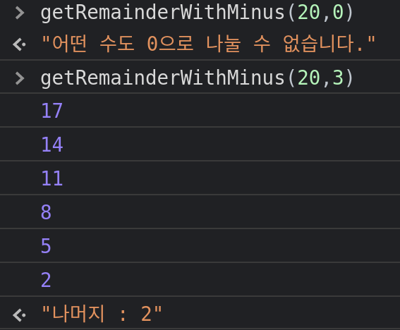

# 나눗셈(Division)

일반적으로, 어떤 두 값의 나눗셈<sup id="user">[[1]](#user-ref)</sup>을 통해 몫을 구하거나, 나머지 값을 구하고 싶을 땐 자바스크립트의 나눗셈 연산자(`/`)와 나머지 연산자(`%`)를 사용하면 간편하게 구할 수 있다.

그러나, 위 두 개의 연산자 없이 두 값을 나누고, 그 나머지 값을 반환하는 문제라면...

나눗셈은 뺄셈을 반복하는 것으로도 표현할 수 있다.
곱셈이 덧셈의 연장이라면, 나눗셈은 뺄셈의 연장이다.

아주 간단하게, `10`과 `2`의 나눗셈을 실행하면

```jsx
const division = 10 / 2; // 몫은 5, 나머지는 0
```

이 된다.

위 식의 의미를 뜯어보면,

1. `10`을 `2`씩 나누어보자!
2. 나누어보니, 한 묶음이 `2`인 묶음이 `5`개가 나온다!
3. 남는건 없다!

가 된다.

즉, 수식으로 다시 풀어보자면

```jsx
10 -2 -2 -2 -2 -2 = 0; // 10 /2 와 같다.
```

이렇게 나눗셈을 뺄셈으로 풀 수 있다.

# 나머지(Remainder)

그렇다면 나머지 연산자 `%` 와 나눗셈 연산자`/`를 사용하지 않고, 나머지를 구하는 방법은 아래와 같다.

1. `number1`라는 변수를 `number2`로 나누기 위해 매개변수를 선언한다.
2. 그리고, 나눗셈을 수행하는 수인 `number2`가 0일 경우, 어떤 수도 0으로 나눌 수 없다. 이 때의 조건을 선언한다.
3. 반복문을 사용하여, 나눗셈을 당하는 수인 `number1`을 `number2`로 뺄셈을 수행한다.
4. `number1`이 `number2`보다 값이 작아지면, 반복을 종료한다.
5. 그 때의 `number1` 값이 나머지 값이 된다.

```jsx
function getRemainderWithMinus(number1, number2) {
  if (number2 === 0) {
    return '어떤 수도 0으로 나눌 수 없습니다.';
  }
  while (number1 >= number2) {
    number1 = number1 - number2;
  }
  return '나머지 : ' + number1;
}
```

자바스크립트로 위와 같이 구현할 수 있다.

크롬 개발자 도구의 Console을 확인해보면,

<figure>

<figcaption>Fig 1. getRemainderWitMinus 실행 결과</figcaption>
</figure>

위와 같이 확인할 수 있다.

`while`반복문을 순환할 때 마다 `number1` 과 `number2`의 뺄셈을 반복하며,
더 이상 반복을 수행할 수 없을 때의 값이 나머지 값이 된다.

### Notes

<small id="user-ref"><sup>[[1]](#user)</sup><a href="https://ko.wikipedia.org/wiki/%EB%82%98%EB%88%97%EC%85%88" target="_blank" rel="noopener">나눗셈(Division)</a>은 수학에 곱셈의 역연산인 산술 연산이다. 때로는 빼기를 반복하는 것으로도 생각할 수 있다.</small>

### Reference

- <a href="https://ko.wikipedia.org/wiki/%EB%82%98%EB%88%97%EC%85%88" target="_blank" rel="noopener">나눗셈(Division)</a>
