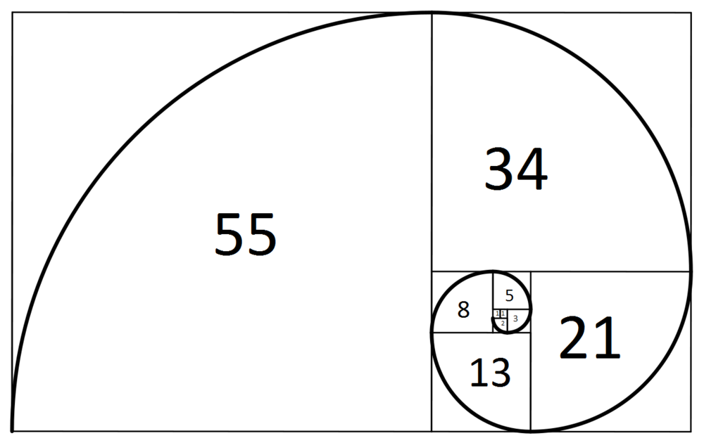
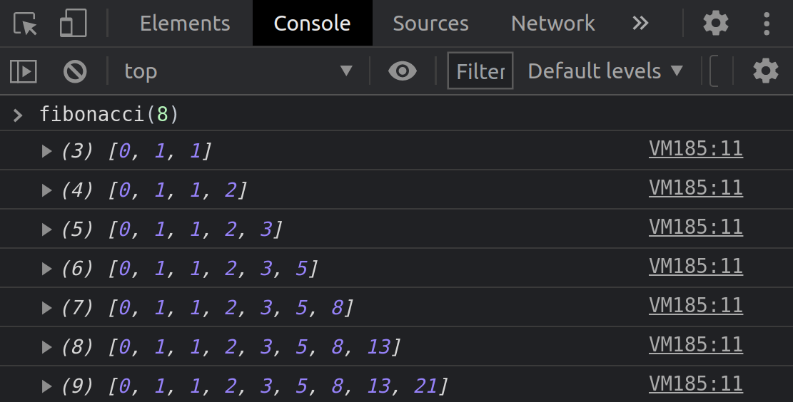

<figure>

<figcaption>Fig 1. 피보나치 수열</figcaption>
</figure>

# 피보나치 수열

<a href="https://ko.wikipedia.org/wiki/%ED%94%BC%EB%B3%B4%EB%82%98%EC%B9%98_%EC%88%98
" target="_blank" rel="noopener">피보나치 수(Fibonacci numbers)</a>을 구현하기 위해 피보나치 수열의 개념<sup id="user">[[1]](#user-ref)</sup>을 자바스크립트 환경에서 프로그래밍 언어로 구현해야 한다.

어떤 수를 입력받았을 때, 그 수의 자릿수(**0번째 자릿수 포함**) 만큼 피보나치 수의 배열을 출력하는 흐름으로 수도코드를 작성할 수 있다. 단, 피보나치 수의 첫번째 수와 두번째 수는 0과 1로 **고정**이며, 세번째 수부터 두번째 수와 첫번째 수의 덧셈으로 구성된다.

### 수도 코드

우리가 평소에 쓰는 자연어로 수도 코드를 작성하고, 이를 코딩으로 옮겼다.

```js
// 피보나치 수를 구하는 함수를 생성한다.
// 함수의 입력인자(parameter)는 '숫자' 이다.
// 결괏값을 선언하고, 초기값이 [0 , 1]인 배열을 할당한다.
// 입력인자가 0인 경우(피보나치 수의 0번째 자리)와 1인 경우를 나누어 결괏값에 그 값을 할당한다.
// ** 왜? 피보나치 수의 계산은 2번째 자리부터, 0번째 수와 1번째 수의 덧셈을 할 수 있기 때문에
// 2번째 자리부터, 입력인자에 할당된 숫자까지 1씩 증가하는 반복 연산을 수행한다.
// 반복이 순환될 때마다 출력되는 값을 배열인 결괏값의 마지막 요소로 추가한다.
// 결괏값을 출력한다.
```

### 결과

그렇다면, 수도 코드를 바탕으로 코딩을 수행해본다면 다음과 같이 작성할 수 있다.

```js
function fibonacci(number) {
  let result = [0, 1];
  if (number === 0) {
    console.log([0]);
  }
  if (number === 1) {
    console.log([0, 1]);
  }
  for (let i = 2; i <= number; i++) {
    result.push(result[i - 2] + result[i - 1]);
    console.log(result);
  }
}
```

웹 브라우저 **개발자 도구**를 통해 콘솔을 확인해보면

<figure>

<figcaption>Fig 2. fibhnacci(8) 실행 결과</figcaption>
</figure>

`fibonacci` 함수에 8을 입력 인자로 할당하면, 0번째 자리인 0을 포함해 총 9개의 요소를 가진 피보나치 수 배열을 출력한다.

코드를 보게되면, `for` 반복문이 순환할 때 마다, 그 결괏값을 배열의 마지막에 추가하는 것을 `result.push()`로 수행한다.

이는 `push` 메소드라 하여, <a href="https://developer.mozilla.org/ko/docs/Web/JavaScript/Reference/Global_Objects/Array/push" target="_blank" rel="noopener">`Array.push()`</a>와 같이 표현한다.
`push` 메소드는, 기존에 선언되어 값이 할당된 배열의 값을 변화시킬 수 있다. 즉, 배열을 **변화시킬 수 있는** <a href="https://poiemaweb.com/js-immutability" target="_blank" rel="noopener">Mutable Method</a> 이다.

### Notes

<small id="user-ref"><sup>[[1]](#user)</sup>피보나치 수(Fibonacci numbers)는 첫째 및 둘째 항이 1이며 그 뒤의 모든 항은 바로 앞 두 항의 합인 수열이다. 처음 여섯 항은 각각 1, 1, 2, 3, 5, 8이다. 편의상 0번째 항을 0으로 두기도 한다.</small>

### Reference

- <a href="https://ko.wikipedia.org/wiki/%ED%94%BC%EB%B3%B4%EB%82%98%EC%B9%98_%EC%88%98" target="_blank" rel="noopener">피보나치 수(Fibonacci numbers)</a>
- <a href="https://developer.mozilla.org/ko/docs/Web/JavaScript/Reference/Global_Objects/Array/push" target="_blank" rel="noopener">Array.push() MDN</a>
- <a href="https://poiemaweb.com/js-immutability" target="_blank" rel="noopener">Mutable value vs. Immutable value</a>
