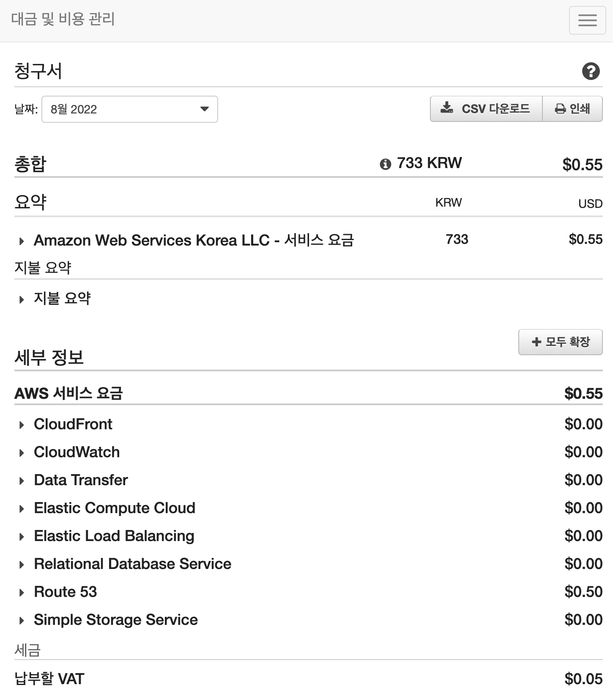
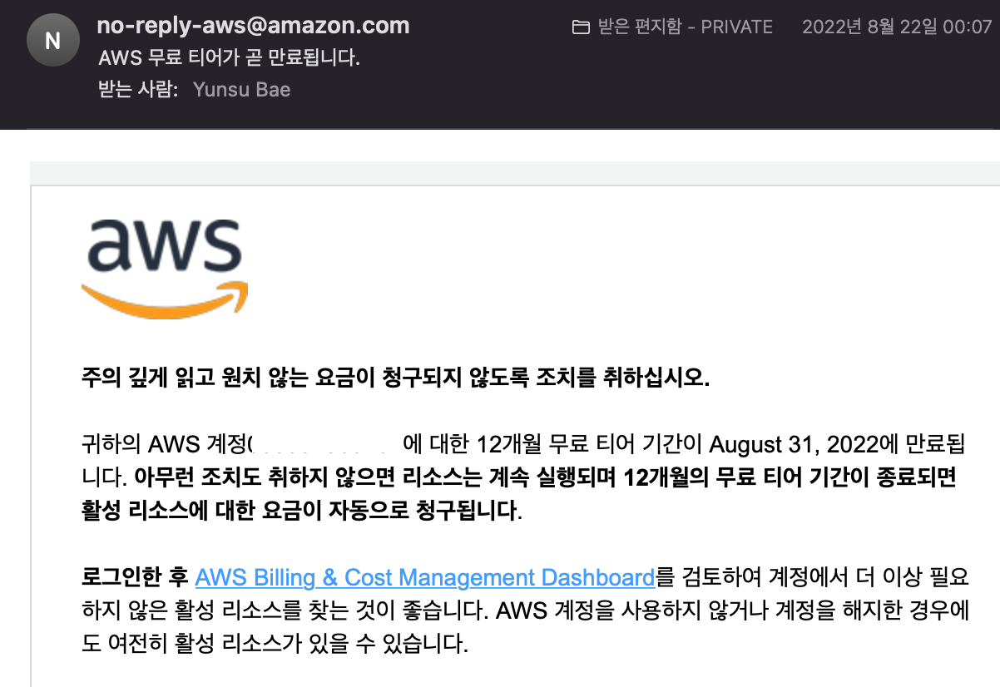
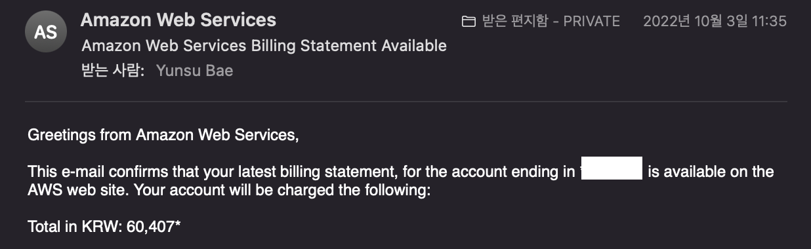
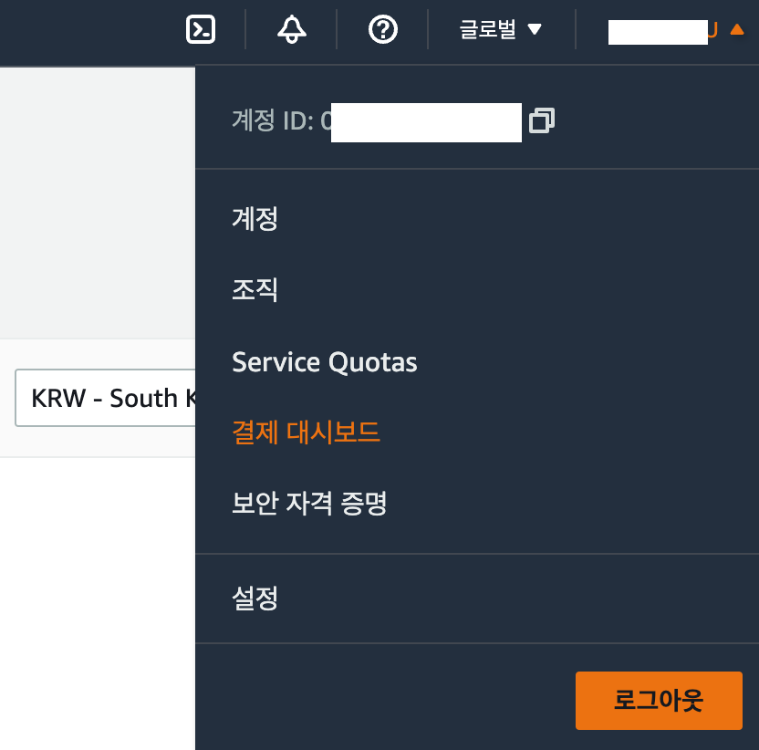
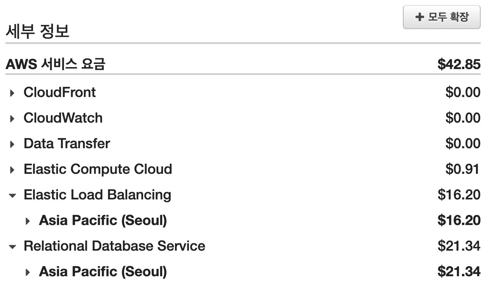
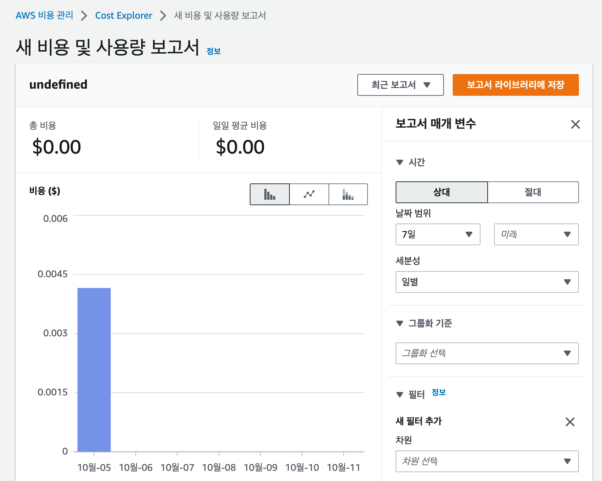

# 개요

작년 8월에 부트캠프를 수강하면서 AWS 계정을 생성했다.

생성한 계정에 부트캠프에서 진행한 두 가지의 프로젝트를 연결했었다.

사용한 AWS 서비스는 `S3` / `Route53` / `EC2` / `ELB`(Elastic Load Balancer) / `RDS` 였다.

프리 티어 기간 중에 발생했던 비용은 전혀 부담되지 않는 비용이었다.

<figure>

<figcaption>Fig 1. 프리 티어 기간 중 발생했던 월 비용</figcaption>
</figure>

그래서 AWS 에서 오는 메일은 크게 신경쓰지 않고 있었다. 사실 작년 말에 취업을 한 이후로 AWS 계정에 연결했던 프로젝트를 전혀 신경쓰지 못했다. 가장 중요한 AWS 프리 티어의 기간이 1년 이라는 것도 잊고 있었다.

그러던 중 최근에 메일 한 통을 받았다.

<figure>

<figcaption>Fig 2. 친절한 AWS...</figcaption>
</figure>

이 메일을 유심히 봤어야 했다. 대충 넘긴게 이제와서 생각해보면 바보같았다. 내 돈인데...

# AWS FREE TIER

잠시 다른 이야기로 빠져서, AWS FREE TIER 란 무엇일까?

AWS 프리 티어는 AWS 사용자에게 AWS 가 제공하는 서비스 별로 지정된 **한도** 내에서 무료로 AWS 서비스를 체험해보고 사용해볼 수 있는 기능을 제공한다.

프리 티어는 12개월 / 상시 무료 오퍼 / 단기 평가판 이라는 세 가지 유형이 있다.

나는 12개월 간 프리 티어가 활성화 되었던 것이다.

12개월 프리 티어가 활성화된 사용자는 자신이 AWS 서비스를 사용하면 사용자가 AWS 계정을 활성화한 날 부터 1년 간 지정된 한도 내에서 무료로 AWS 서비스를 사용할 수 있다.

만약 프리 티어 범위를 초과하는 사용량의 서비스가 존재한다면 그 사용량에 따라 **표준 서비스 요금**을 지불하게 된다.

# 프리 티어 기간 만료의 결과

돈이 빠져나갔다는 알림이 뜨기 전까진 몰랐다. AWS 프리 티어 만료 메일을 무시했던 결과는 꽤 아팠다.

프리 티어가 만료되었기 때문에 내가 사용한 AWS 서비스들을 **사용한 만큼 표준 서비스 요금**을 지불해야 했다.

<figure>

<figcaption>Fig 3. 프리 티어가 만료된 다음 월의 비용</figcaption>
</figure>

알람을 받고 메일을 확인하자 뭔가 잘못되었다는 것을 느꼈다. 오랜만에 AWS 콘솔에 로그인하여 영수증을 확인했다.

<figure>

<figcaption>Fig 4. AWS 결제 영수증</figcaption>
</figure>

너무 어질어질했다. 더 아팠던건 **환율**로 인해 **43 달러가 6 만원이 되었다**는 것이다.

한 편으론 억울하기도 했다. 하지만 그래도 내가 메일을 잘 확인했더라면 이런 일은 발생하지 않았을 것이다...

지나간 것은 지나간 대로 가게 냅두고, 얼른 비용이 나가지 않게 조치를 취했다.

AWS 를 통해 배포한 프로젝트를 중단하는 것은 조금 마음이 아팠지만, 지불해야하는 월 비용을 생각하자니 돈이 더 크게 다가왔다.

<figure>

<figcaption>Fig 5. 상세 지불 정보</figcaption>
</figure>

AWS 콘솔의 결제 대시보드를 통해 어떤 AWS 서비스가 어디에서 사용되었고 얼마만큼 지불해야하는지 상세하게 나와있어 비용이 발생하는 곳의 출처를 쉽게 확인할 수 있었다.

가장 비중이 큰 부분은 `RDS` 와 `ELB` 였다. 어떤 리전의 서비스인지도 잘 나와있어서 해당 리전의 해당 AWS 서비스로 이동하여 서비스를 즉시 삭제하거나 중단시켰다.

그렇게 급한 불을 껐다...

그 다음 날도 그 다음 날의 다음 날도 6 만원이 통장에서 빠져나갔다는 것이 자꾸 생각나서 AWS 콘솔에 들어가서 매일매일 비용이 얼마나 발생하는지 확인했다.

<figure>

<figcaption>Fig 6. 일별 비용 발생 정보</figcaption>
</figure>

다행히 서비스를 중단한 이후로 비용이 발생되지 않고 있다...

# 느낀 점

이번에 큰 돈을 지불하게 된 사태(?)를 겪으면서 느꼈던 점과 교훈은 꽤 여러가지였다.

내가 만들었던 프로젝트에 소홀했다는 것이다. 아무리 작년에 만들고 배포했던 프로젝트라 해도 가끔씩 서비스를 사용도 해보고 서버도 점검했어야 했다. 꾸준히 점검했다면 이런 사태는 없었을 것이고 오히려 프로젝트를 더 완성도 있게 가꿀 수 있었다.

내 프로젝트를 돈을 받고 대신 서버를 돌려주는 AWS 의 메일을 무시해선 안됐다. 프리 티어 기간이었던 지난 12개월은 메일이 와도 천 원도 안되는 비용이 발생했었고, 그에 따라 이번 달도 그렇겠지... 라는 마인드가 있었다.

프리 티어가 영원할 거라고 무의식적으로 생각했던 것 같다.

또 많은 개발자들이 자주 말했던 이른바 **서버비** 가 이런 식으로 발생하는 구나 라고 느꼈다. 다수의 사용자가 이용하는 서비스라면 그 비용이 정말 어마무시할 것 같다... 라는 생각이 들었다.
