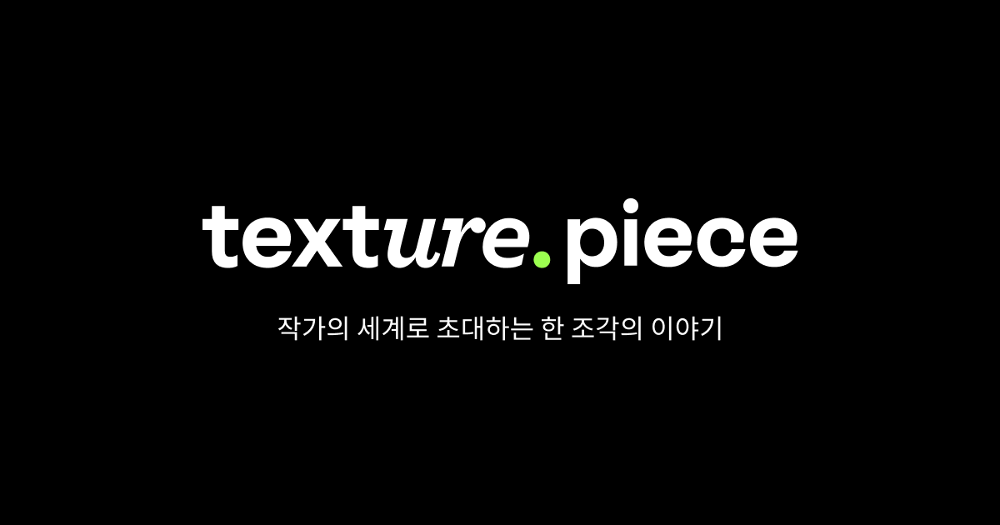

# 첫 개발자 커리어

개발자로서 첫 커리어를 2021년 11월 말에 시작했다.

어찌저찌 우당탕탕 긴 시간이었던 부트캠프를 수료하고 비교적 빠른 시간인 한 달 안에 작은 스타트업에 프론트 엔드 개발자로 취업에 성공했다.

부트캠프에선 웹에 대한 기술들을 위주로 배웠는데, 실무에선 배운 것을 포함하여 모바일 앱도 함께 개발해야 했다.

그러면서 자연스럽게 리액트 네이티브를 공부하며 실무에 적용하게 됐다. 처음엔 내가 배우지 않은 기술들을 사용해야 한다는 것에 거부감과 두려움이 있었지만, 리액트를 익혔던 상태였기 때문에 배우는 데에 어렵지 않았다.

리액트 네이티브와 Git 관련 업무 프로세스, 회사 적응 등 이것저것 정신없이 지내다보니 2021년이 지나갔다.

그렇게 2022년이 왔다.

# 본격적인 시작

재직 중인 스타트업은 작기도 작았지만 조금 특별(?)했던 점은 입사할 당시 개발팀의 인원이 5명 미만으로 굉장히 적었다.

프론트 엔드 개발자가 없었고, 나와 같이 입사한 동기와 함께 프론트 엔드 개발자로서 입사하게 되었다. 동기도 나와 동일하게 첫 개발자 커리어로 시작하여 처음엔 뚝딱거리는 부분이 많았다. 아무래도 시니어 프론트 엔드 개발자가 팀에 없다보니 그럴 수 밖에 없었던 것 같다.

한창 일 할 때도 그랬고 지금도 다시 생각해보면 프론트 엔드 개발자로서 배울 수 있는 선배가 있었다면 더 좋았을 것 같다는 생각이 들긴 한다. 그렇지만 2022년을 돌아보니 첫 개발자로서 일을 시작한 사수가 없는 주니어로서 경험한 것들이 굉장히 많았다.

<figure>

<figcaption>Fig 1. Texture</figcaption>
</figure>

개발자로서 첫 코딩을 현재 서비스 중인 앱의 백오피스로 시작했다. 익숙했던 리액트 프로젝트로 구성했고, 간단하게 서비스 중인 앱의 여러 지표들을 테이블로 보여주거나, 컨텐츠를 등록, 수정 및 삭제하기 위함인 백오피스였다.

백오피스를 만들면서 개발 팀과 어떻게 협업하는지 익히게 되었고, 2022년 1월부터 본격적으로 현재 서비스 중인 **텍스처** 앱의 유지보수를 중점적으로 업무를 수행했다.

# 유지보수

실제 고객들이 사용하고 있는 앱을 유지보수하여 수정된 기능을 처음 배포했을 땐 굉장히 떨렸다. 아직도 기억이 난다. 처음 텍스처 앱에 들어간 나의 코드는 앱의 각 기능 별 로깅(Logging) 을 위한 코드였다. 지금 와서 생각해보면 실제 사용자 입장에선 화면 상으로 확인할 수 없는 기능이었지만, 그래도 잘못 들어가서 앱이 뻗어버리면 어떡하지? 라면서 하나하나 조심스럽게 코드를 짰던 것 같다.

사실 다른 회사에서 주니어들이 어떤 업무를 주로 하는지 잘 모른다. 함께 부트캠프를 수료한 동기, 또는 먼저 수료한 선배의 말에 따르면 주니어의 업무는 대부분 현재 회사가 제공하는 서비스의 유지보수라고 들었다. 유지보수라 해서 처음엔 이미 있는 코드를 수정하는 건 크게 어렵지 않겠다. 라고.. 생각했었다.

지금은 이 생각이 180도 바뀌었다. 차라리 내가 짜는 코드가 더 편하고 시간도 덜 걸린다. 이미 짜여진 코드를 파악하고 이를 수정하는 건 정말 어려운 일이었다. 왜냐하면 이미 짜여진 로직을 먼저 코드를 보면서 파악해야하고, 코드의 한 부분을 수정하면 그로부터 파생될 다양한 사이드 이펙트를 고려해야했다. 그러다보니 자연스럽게 타인의 코드를 자주 접하게 되었다.

유지보수 업무를 수행하면서 주니어 개발자에게 유지보수 업무의 비중이 높다는 이유를 알게 되었다.

주니어 개발자로서 나 자신은 취업 전에 공부하면서 어느정도 나만의 코드를 짜는 습관(?)이 있었다. 또 같은 기능이더라도 내가 구현하는 방식과 다른 사람이 구현하는 방식이 다르다.

그렇지만 이 유지보수를 수행하면서 나보다 상급 개발자가 작성했던 이 코드를 계속 접하게 되었고, 이 로직에 새로운 기능을 추가하거나, 수정하거나 삭제하면서 점점 다른 사람의 코드를 파악하는 데에 시간이 줄어들었다. 또 기존에 내가 짜던 습관과 이미 짜여진 코드를 비교해보면서 효율적이고 가독성있는 코딩 방식을 알게 되었다.

이런 작은 부분들을 하나씩 알다 보니 어느새 2022년 상반기가 끝나가고 있었다.
