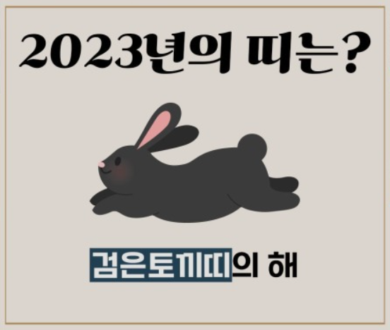
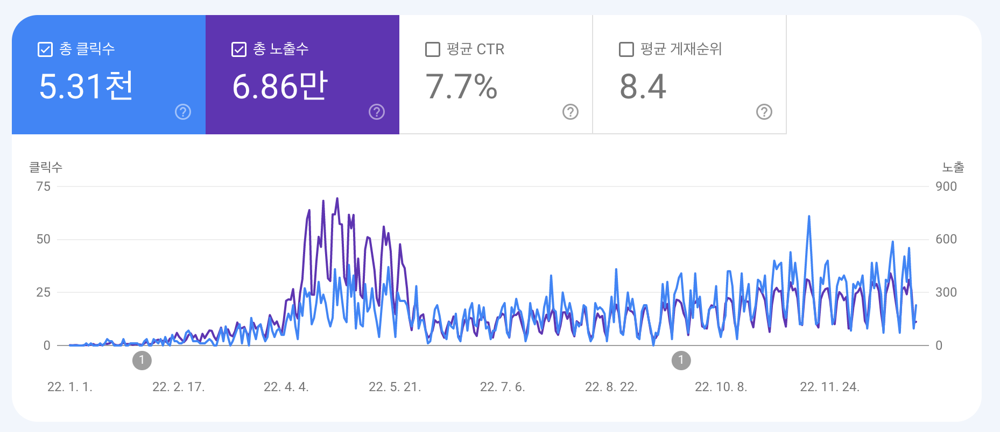

# 첫 개발자 커리어

개발자로서 첫 커리어를 2021년 11월 말에 시작했다.

어찌저찌 우당탕탕 긴 시간이었던 부트캠프를 수료하고 비교적 빠른 시간인 한 달 안에 작은 스타트업에 프론트 엔드 개발자로 취업에 성공했다.

부트캠프에선 웹에 대한 기술들을 위주로 배웠는데, 실무에선 배운 것을 포함하여 모바일 앱도 함께 개발해야 했다.

그러면서 자연스럽게 리액트 네이티브를 공부하며 실무에 적용하게 됐다. 처음엔 내가 배우지 않은 기술들을 사용해야 한다는 것에 거부감과 두려움이 있었지만, 리액트를 익혔던 상태였기 때문에 배우는 데에 어렵지 않았다.

리액트 네이티브와 Git 관련 업무 프로세스, 회사 적응 등 이것저것 정신없이 지내다보니 2021년이 지나갔다.

그렇게 2022년이 왔다.

# 본격적인 시작

재직 중인 스타트업은 작기도 작았지만 조금 특별(?)했던 점은 입사할 당시 개발팀의 인원이 5명 미만으로 굉장히 적었다.

프론트 엔드 개발자가 없었고, 나와 같이 입사한 동기와 함께 프론트 엔드 개발자로서 입사하게 되었다. 동기도 나와 동일하게 첫 개발자 커리어로 시작하여 처음엔 뚝딱거리는 부분이 많았다. 아무래도 시니어 프론트 엔드 개발자가 팀에 없다보니 그럴 수 밖에 없었던 것 같다.

한창 일 할 때도 그랬고 지금도 다시 생각해보면 프론트 엔드 개발자로서 배울 수 있는 선배가 있었다면 더 좋았을 것 같다는 생각이 들긴 한다. 그렇지만 2022년을 돌아보니 첫 개발자로서 일을 시작한 사수가 없는 주니어로서 경험한 것들이 굉장히 많았다.

<figure>

<figcaption>Fig 1. Texture</figcaption>
</figure>

개발자로서 첫 코딩을 현재 서비스 중인 앱의 백오피스로 시작했다. 익숙했던 리액트 프로젝트로 구성했고, 간단하게 서비스 중인 앱의 여러 지표들을 테이블로 보여주거나, 컨텐츠를 등록, 수정 및 삭제하기 위함인 백오피스였다.

백오피스를 만들면서 개발 팀과 어떻게 협업하는지 익히게 되었고, 2022년 1월부터 본격적으로 현재 서비스 중인 <a href="https://www.texture.kr/" target="_blank" rel="noopener">텍스처</a> 앱의 유지보수를 중점적으로 업무를 수행했다.

# 유지보수

실제 고객들이 사용하고 있는 앱을 유지보수하여 수정된 기능을 처음 배포했을 땐 굉장히 떨렸다. 아직도 기억이 난다. 처음 텍스처 앱에 들어간 나의 코드는 앱의 각 기능 별 로깅(Logging) 을 위한 코드였다. 지금 와서 생각해보면 실제 사용자 입장에선 화면 상으로 확인할 수 없는 기능이었지만, 그래도 잘못 들어가서 앱이 뻗어버리면 어떡하지? 라면서 하나하나 조심스럽게 코드를 짰던 것 같다.

사실 다른 회사에서 주니어들이 어떤 업무를 주로 하는지 잘 모른다. 함께 부트캠프를 수료한 동기, 또는 먼저 수료한 선배의 말에 따르면 주니어의 업무는 대부분 현재 회사가 제공하는 서비스의 유지보수라고 들었다. 유지보수라 해서 처음엔 이미 있는 코드를 수정하는 건 크게 어렵지 않겠다. 라고.. 생각했었다.

지금은 이 생각이 180도 바뀌었다. 차라리 내가 짜는 코드가 더 편하고 시간도 덜 걸린다. 이미 짜여진 코드를 파악하고 이를 수정하는 건 정말 어려운 일이었다. 왜냐하면 이미 짜여진 로직을 먼저 코드를 보면서 파악해야하고, 코드의 한 부분을 수정하면 그로부터 파생될 다양한 사이드 이펙트를 고려해야했다. 그러다보니 자연스럽게 타인의 코드를 자주 접하게 되었다.

유지보수 업무를 수행하면서 주니어 개발자에게 유지보수 업무의 비중이 높다는 이유를 알게 되었다.

주니어 개발자로서 나 자신은 취업 전에 공부하면서 어느정도 나만의 코드를 짜는 습관(?)이 있었다. 또 같은 기능이더라도 내가 구현하는 방식과 다른 사람이 구현하는 방식이 다르다.

그렇지만 이 유지보수를 수행하면서 나보다 상급 개발자가 작성했던 이 코드를 계속 접하게 되었고, 이 로직에 새로운 기능을 추가하거나, 수정하거나 삭제하면서 점점 다른 사람의 코드를 파악하는 데에 시간이 줄어들었다. 또 기존에 내가 짜던 습관과 이미 짜여진 코드를 비교해보면서 효율적이고 가독성있는 코딩 방식을 알게 되었다.

이런 작은 부분들을 하나씩 알다 보니 어느새 2022년 상반기가 끝나가고 있었다.

# TYPESCRIPT & NEXT.JS

2022년 중반 즈음 부터 회사에서 기존에 하던 유지보수 업무와 함께 작은 프로젝트 <a href="https://piece.texture.kr/covers/1" target="_blank" rel="noopener">Texture Piece</a>를 시작했다. 2022년 연말에 시작할 새로운 프로젝트 이전에 고객의 동향을 파악하고자 하는 목적으로 시작한 프로젝트였다.

<figure>

<figcaption>Fig 2. Texture Piece</figcaption>
</figure>

짧은 기간 진행하고 현재는 중단된 서비스이다. 지금까진 모바일 앱을 위주로 개발했다면 이 프로젝트는 `Next.js` 를 사용하여 개발했다. Next.js와 함께 `Typescript` 를 공부하여 적용했다.

자바스크립트로만 개발을 하다가 타입스크립트를 새로 배우는 과정이 처음엔 어려웠지만, 공부하다보니 금방 익힐 수 있었다. 타입스크립트로 개발을 하면서 느낀 점은 **너무나도 편하다.** 라는 것이다. 타입 또는 인터페이스 만 잘 정의해 두면 자동 완성은 물론이고 자바스크립트로 개발할 때 미처 놓쳤던 부분을 생각하지 못하고 배포했을 때 고객으로 부터 발생하는 런타임 에러들이 현저히 줄어들었다.

타입스크립트를 처음 배울 때 들었던 말인 **개발자가 편하기 위해 사용하는 언어** 라는 의미를 직접 개발을 하면서 느낄 수 있었다.

Next.js 또한 기존 리액트 웹과 다르게 **클라이언트 사이드 렌더링(CSR)** 과 **서버 사이드 렌더링(SSR)** 을 적절히 사용하여 페이지의 목적에 맞게끔 개발할 수 있었다.

기존에 사용하던 자바스크립트, 리액트 네이티브에서 벗어나 새로운 기술을 배워서 작은 프로젝트를 마무리 하여 배운 점이 많았던 2022년 중반이었다.

# 2022년의 마무리

2022년 10월 말이 되면서 새로운 프로젝트를 시작했다.

**모바일 웹 소설 플랫폼**이라는 목적을 가진 앱을 만드는 프로젝트였다. 기존 텍스처 앱보다 기능은 비교적 많지 않지만, 본격적으로 서비스에 **결제 프로세스**가 도입되었다.

아직 개발 중인 프로젝트이지만, 나는 이 프로젝트의 프론트 엔드를 **프로젝트 생성부터 배포까지** 경험하게 됐다. 기존에는 이미 만들어져 있는 프로젝트에 수정, 보완을 목적으로 나의 코드가 들어간 반면, 이번에는 직접 만들고 직접 출시까지 할 수 있어 개발 중인 현재 굉장히 애착이 있는 프로젝트이다.

이 프로젝트는 하이브리드 앱으로 구성되는데, 이번에도 이 하이브리드 앱 이라는 새로운 개념을 배워가며 프로젝트를 만들고 있어 여러가지로 많이 배우고 있다.

기본적으로 앱은 **리액트 네이티브 + 타입스크립트** 로 구성되고, 웹 페이지는 **Next.js + 타입스크립트**로 구성되어 이 웹 페이지를 `WebView` 로 앱 화면에 노출시킨다.

지금까지 개발하면서 느끼는 점은 앱 같은 경우 새로운 변경사항이 생기면 업데이트를 위해 새로 앱 스토어에 출시하거나, 코드 푸시를 통해 배포 중인 서비스에 적용할 수 있다. 그러나 하이브리드 앱이기 때문에 웹 페이지만 새로 배포하게 되면 즉각적인 수정사항을 앱에서도 빠르게 확인할 수 있어 편리하다고 느꼈다.

이와 함께 개발 중인 이 프로젝트의 백오피스를 함께 개발하고 있다.

백오피스는 웹 소설 플랫폼인 만큼 텍스트 에디터, 작품에 대한 정보, 배너, 정산 등 서비스의 핵심을 이루는 컨텐츠를 핸들링하기 위한 목적을 갖고 있다.

**Next.js + 타입스크립트 + MUI** 를 사용하여 개발하고 있으며, 이를 개발하며 다른 웹 사이트에서 흔하게 볼 수 있는 텍스트 에디터를 개발하기도 했다.

그렇게 2022년 연말을 바쁘게 보냈고, 2023년 초 서비스 런칭을 위해 바쁘게 개발하고 있다.

# 다가올 2023년

<figure>

<figcaption>Fig 3. 2023년은 검은 토끼의 해!</figcaption>
</figure>

그래서 개발자로서 온전한 1년을 보냈던 2022년을 돌아보면 크게 보면 딱히 한게 없어 보이기도 한다.

그렇지만 이 회고를 쓰면서 느낀 점은 여러가지 프로젝트를 수행했고, 그 프로젝트 안에서도 새로운 언어와 기술을 배우기도 하고, 프로젝트를 만들고 출시까지 하는 과정을 경험하며 나름 의미있는 1년을 보낸 것 같다.

다가올 2023년에는 성공적으로 이 프로젝트를 런칭하고, 또 다른 새로운 경험을 할 수 있을 지 기대가 된다. 아직 2년차 주니어 개발자이지만 개발하면서 느끼는 것은 모르는 것이 너무 많다. 여전히 구글에 의존하고 있다. 좀 더 배워서 업무적으로나 개인적으로 능력을 향상할 수 있는 검은 토끼의 해가 됐으면 좋겠다.

# 개인적인 2022 RECAP

지난 2022년 한 해 목표가 있었다.

1. 개인 프로젝트 적어도 하나는 만들기.
2. 블로그에 한 달에 한 번 포스팅 하기.

이 목표를 어찌저찌 달성했다!

### WHO-SEKAI

<figure>

<figcaption>Fig 4. WHO-SEKAI</figcaption>
</figure>

파이어베이스와 Next.js, Typescript, Chakra UI 를 활용한 서버리스 앱 <a href="https://who-sekai.vercel.app/ownsgks" target="_blank" rel="noopener">WHO-SEKAI</a>를 만들었다.

사용자 회원가입 및 로그인이 가능하여 다른 사람들도 사용이 가능한 서비스이지만, 현재는 나의 메모장 처럼 사용하고 있다.

### POSTING

```
2022년 1월 - 3개의 글
2022년 2월 - 5개의 글
2022년 3월 - 3개의 글
2022년 4월 - 4개의 글
2022년 5월 - 3개의 글
2022년 6월 - 4개의 글
2022년 7월 - 3개의 글
2022년 8월 - 6개의 글
2022년 9월 - 3개의 글
2022년 10월 - 3개의 글
2022년 11월 - 1개의 글
2022년 12월 - 3개의 글
```

<figure>


<figcaption>Fig 5. 2022년 블로그 지표</figcaption>
</figure>

총 41개의 포스팅으로 목표했던 1달 1포스팅을 초과달성 했다. 그렇지만 썩 만족스럽지 않다. 이 목표를 달성하는 데에만 눈이 팔려 단순한 에러 핸들링 글도 올리기도 했고, 코드만 띡 적어놓고 대충 쓴 글도 있었기 때문이다.

올 해에는 좀 더 많이 공부해서 나만의 언어로 쉽고 세심하게 풀어서 마음에 드는 글을 많이 쓰는 한 해가 됐으면 좋겠다!

긴 글 읽어주셔서 **너무너무너무너무** 감사드립니다!

방문해주신 모든 분들도 2023년 새해 복 많이 받으시고 건강하고 행복한 한 해 되세요! 🎉🎉🎉
