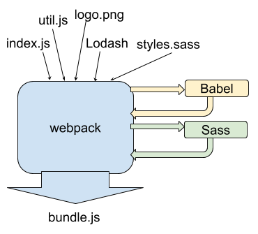

# 빌드

현대의 웹 앱은 정적 웹페이지와 AJAX 기술을 함께 사용하며, SPA(Single Page Application)으로 변모함에 따라 클라이언트 사이드의 규모가 커지게 되었다.

React와 같은 클라이언트 기술이 발전하면서, 단일 파일로 자바스크립트나 페이지를 만드는 작업은 고도화됐다.

고도화된 클라이언트 웹 앱은 수많은 모듈로 구성되어 있다. 이 모듈을 하나로 묶어주는 작업을 **번들링(Bundling)**이라 한다. 브라우저에서 자체적으로 해석이 불가능한 파일들을 브라우저가 해석할 수 있도록 만들어주는 작업이 수반된다.

이 과정을 `소프트웨어 빌드`로 통칭한다. 소스 코드를 실행 가능한 결과물로 변환하는 작업이다.

`Create React App` 등으로 생성한 React 프로젝트의 경우에는, `npm build` 명령어가 `package.json` 파일에 포함되어 있으며, 이는 모듈을 정적인 파일로 만들어주게 된다.

### 빌드 툴의 종류

- `webpack` : 모듈 번들러
- `babel` : JSX, Typescript 등 브라우저가 지원하지 않는 언어를 Javascript로 변환하는 컴파일러
- `ESLint` : Javascript Code Convention 문법 검사기
- `Sass`, `less` : CSS 전처리기

아래 이미지는 빌드 툴들이 하나의 파일로 번들링되는 과정이다.

<figure>

<figcaption>Fig 1. Build Process</figcaption>
</figure>

# SSR (Server Side Rendering)

<figure>

<figcaption>Fig 2. 서버 사이드 렌더링</figcaption>
</figure>

서버 측에서 웹 페이지를 렌더링한다.

브라우저가 서버의 URI로 `GET`요청을 보내면, 서버는 정해진 웹 페이지 파일을 브라우저로 전송한다. 서버에서 웹 페이지를 브라우저로 보내기 전에, 서버에서 완전히 렌더링이 되어있다.

웹 페이지의 내용에 데이터베이스 데이터가 필요한 경우, 서버는 데이터베이스의 데이터를 불러온 다음 웹 페이지를 완전히 렌더링 된 페이지로 변환한 후에 브라우저에 응답으로 보내게 된다.

사용자가 웹 페이지의 다른 경로로 이동하면, 브라우저가 다른 경로로 이동할 때마다 서버는 렌더링을 다시 수행한다.

# CSR (Client Side Rendering)

<figure>

<figcaption>Fig 3. 클라이언트 사이드 렌더링</figcaption>
</figure>

SSR의 반대 개념으로 여겨진다. CSR은 클라이언트에서 웹 페이지를 렌더링한다.

여기서 클라이언트는 웹 브라우저를 의미하며, 브라우저의 요청을 서버로 보내면 서버는 웹 페이지를 렌더링하는 대신 웹 페이지의 골격이 될 단일 페이지를 클라이언트에 보낸다.

서버는 웹 페이지와 함께 Javascript 파일을 보내고, 클라이언트가 웹 페이지를 받으면 함께 전달된 Javascript 파일로 브라우저에서 웹 페이지를 완전히 렌더링 된 페이지로 바꾼다.

웹 페이지에 필요한 내용이 데이터베이스에 저장된 데이터라면 브라우저는 데이터베이스에 저장된 데이터를 가져와서 웹 페이지에 렌더링해야 한다. 이를 위해 API가 사용된다. 렌더링하기위해 필요한 데이터를 API 요청으로 해소한다.

사용자가 브라우저의 다른 경로로 이동한다면 CSR은 서버가 웹 페이지를 다시 보내지 않는다.

브라우저는 브라우저가 요청한 경로에 따라 페이지를 다시 렌더링한다. 이 때 보이는 웹 페이지의 파일은 맨 처음 서버로부터 받은 웹 페이지 파일과 같다.

# SSR과 CSR의 차이점

SSR과 CSR의 주요 차이는 **페이지가 렌더링되는 위치**이다. SSR은 서버에서, CSR은 클라이언트에서 렌더링한다. CSR의 경우, 브라우저는 사용자가 다른 경로를 요청할 때마다 페이지를 새로고침하지 않고 동적으로 라우팅을 관리한다.

### SSR을 사용하는 경우

- **검색 엔진 최적화(SEO, Search Engine Optimization)**가 우선순위일 경우
- 랜딩 페이지 렌더링이 빠르게 필요한 경우
- 웹 페이지가 사용자와 상호작용이 적은 경우

### CSR을 사용하는 경우

- 검색 엔진 최적화가 우선순위가 아닌 경우
- 페이지가 사용자와 상호작용이 많은 경우
- 웹 애플리케이션을 제작하는 경우
