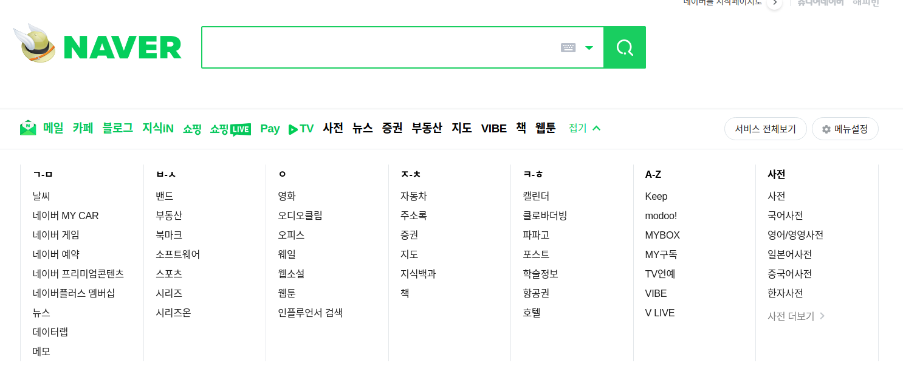

# Node.js

`Javascript`는 웹 브라우저 내에서 동적 상호작용을 위해 개발된 프로그래밍 언어이다.
이 `Javascript`를 웹 브라우저 외부에서도 사용하기 위해 특히, 서버 사이드 개발에 사용하기 위해 Node.js가 개발되었다.
Node.js는 구글 크롬과 안드로이드 브라우저에 탑재된 **V8 Javascript 엔진으로 개발된 Javascript 런타임 환경**이다.

---

## HTTP Module (Web Server)

`Node.js`는 HTTP 요청을 보내거나, 응답을 받을 수 있는 도구를 제공한다. 이를 `HTTP 모듈` 이라 하며, 이를 이용해 웹 서버를 만들 수 있다.

HTTP 모듈을 사용하기 위해, 아래와 같은 작업을 먼저 수행해야한다.

```js
const http = require('http'); // http 모듈을 가져옵니다
const PORT = 5000; // 웹 서버의 port를 설정합니다.
const ip = 'localhost'; // 127.0.0.1 === localhost입니다.

const server = http.createServer((request, response) => {
// 서버를 생성합니다.
// 로직을 구성합니다.
};
server.listen(PORT, ip, () => {   // 서버를 생성 후, 읽기 위한 작업입니다.
  console.log(`http server listen on ${ip}:${PORT}`);
});
```

위와 같이 작성하면 서버의 틀은 만든 것이다. 아직 클라이언트로 부터 받은 요청을 알맞게 응답하기 위한 메소드가 구현되어있지 않다. 웹 브라우저에서 요청받은 리소스를 알맞게 응답하기 위해, HTTP 모듈은 **CRUD**<sup id="user">[[1]](#user-ref)</sup>기능을 수행할 메소드를 사용해야 한다.
클라이언트의 요청에 따라 서버에서 적절한 응답을 하는 API, REST API 메소드를 사용한다.

### GET

홈 페이지 접근, 페이지 이동 및 데이터 조회 등 읽기(Read)를 위한 메소드이다.

### POST

새로운 글이나 데이터를 전송하는 메소드이다.

### DELETE

저장된 글이나 데이터를 삭제하는 메소드이다.

### PUT, PATCH

데이터를 전체적으로 수정하거나, 일부 수정하는 메소드이다.

---

## CORS

<a href="https://developer.mozilla.org/ko/docs/Web/HTTP/CORS" target="_blank" rel="noopener">CORS</a>(Cross Origin Resource Sharing)는 무엇일까?

본래, 웹에서 클라이언트와 서버 간의 리소스 공유는 같은 출처(Origin)에서만 리소스를 공유하도록 정책이 있었다. (SOP, Same Origin Policy)

다양한 출처로 리소스를 공유하는 것은 위험한 환경이기 때문이다.

_(우리가 접속하는 사이트들은 개발자 도구만 열어도 DOM이 어떻게 작성됐는지, 어떤 서버와 통신하는지 열람이 가능하다. 이는 악의를 가진 사용자가 개인 정보 탈취를 목적으로 그 페이지를 공격할 수 있다는 것이다.)_

하지만, 다른 출처에 있는 리소스를 가져오는 것은 꼭 필요하다. 가령, 포털 사이트에만 들어가도 날씨 정보, 뉴스, 주식 정보 등을 확인할 수 있다.

<figure>

<figcaption>Fig 1. 네이버 홈페이지 일부</figcaption>
<figcaption>우리가 네이버에서 날씨 정보를 요청하면 날씨 서버에서 응답을 보내고, 영화 정보를 요청하면 영화 서버에서 응답을 보낸다.</figcaption>
</figure>

이 정보들은 모두 하나의 서버, 하나의 출처에서 온 것이 아니다. 이처럼, 다양한 출처로부터 리소스를 응답받는 것은 이제 매우 당연해졌다.

그래서 웹 브라우저는 **클라이언트가 다양한 서버로부터 응답받는 리소스가 안전하다.**는 최소한의 보장을 하기로 했다.

클라이언트의 리소스 요청이 CORS 정책을 지킨 요청이라면, 출처가 달라도 리소스 응답을 허용한다는 것이다.

그리하여, 클라이언트가 어떤 리소스 요청을 보낼 때, 이 정책을 잘 지키고 보냈는지 미리 확인을 한다. 이를 `Preflight request`라 한다.

CORS의 구성은 아래와 같다.

```js
const defaultCorsHeader = {
  'Access-Control-Allow-Origin': '*',
  // 허용하는 출처를 지정합니다. '*'는 모든 출처를 허용합니다.
  'Access-Control-Allow-Methods': 'GET, POST, PUT, DELETE, OPTIONS',
  // 허용하는 메소드를 지정합니다.
  'Access-Control-Allow-Headers': 'Content-Type, Accept',
  // 응답 헤더를 지정합니다.
  'Access-Control-Max-Age': 10,
  // 얼마나 자주 Preflight request를 보낼 지를 정합니다.
};
```

위 개념들을 적용하여 HTTP 모듈을 사용해 POST를 구현해보았다.

```js
const http = require('http'); // http 모듈을 가져옵니다
const PORT = 5000; // 웹 서버의 port를 설정합니다.
const ip = 'localhost'; // 127.0.0.1 === localhost입니다.

const server = http.createServer((request, response) => {
  if (request.method === 'OPTIONS') {
    // Preflight request를 수행하는 메소드입니다.
    response.writeHead(200, defaultCorsHeader);
    // 서버가 허용하는 조건에 만족한다면, CORS 헤더를 클라이언트에게 응답합니다.
    response.end();
  }
  if (request.method === 'POST') {
    // POST 요청을 받은 경우
    let body = [];
    // POST는 새로운 글이나 데이터를 추가하는 일이기 때문에,
    // HTTP message에 BODY(payload)가 포함되어 있습니다.
    request
      .on('data', (chunk) => {
        // 바디 데이터를 핸들링하기 위해, on이라는 이벤트 리스너를 사용합니다.
        body.push(chunk);
        // 바디 데이터는 16진수로 이루어진 Buffer 형태입니다.
        // body 로 선언한 빈 배열에 바디 데이터를 push합니다.
      })
      .on('end', () => {
        body = Buffer.concat(body).toString();
        // 16진수인 바디 데이터를 String으로 변환합니다.
        response.writeHead(201, defaultCorsHeader);
        // 요청에 따른 응답을 보내기 위해, 응답 헤더를 작성합니다.
        response.end(body);
        // 변환한 바디 데이터를 헤더와 함께 응답 메세지로 보냅니다.
      });
  }
});
server.listen(PORT, ip, () => {
  // 서버를 생성 후, 읽기 위한 작업입니다.
  console.log(`http server listen on ${ip}:${PORT}`);
});

const defaultCorsHeader = {
  // CORS 헤더 양식입니다.
  'Access-Control-Allow-Origin': '*',
  'Access-Control-Allow-Methods': 'GET, POST, PUT, DELETE, OPTIONS',
  'Access-Control-Allow-Headers': 'Content-Type, Accept',
  'Access-Control-Max-Age': 10,
};
```

POST를 HTTP 모듈로 구현하기 위해, 바디 데이터를 핸들링 하는 것은 위에 보시는 것 처럼 다소 복잡하다. 그리고, 모든 요청마다 응답 헤더를 추가해야한다.

이런 귀찮은 작업을 개선하고, 코드의 직관성을 향상해 생산성을 높인 라이브러리를 우리는 사용할 수 있다.

JS에서 인기있는 프레임워크 4가지 (MongoDB, **Express**, React, Node) 중 하나인 `Express`이다.

---

### Notes

<small id="user-ref"><sup>[[1]](#user)</sup><a href="https://ko.wikipedia.org/wiki/CRUD" target="_blank" rel="noopener">CRUD</a>는 대부분의 컴퓨터 소프트웨어가 가지는 기본적인 데이터 처리 기능인 Create(생성), Read(읽기), Update(갱신), Delete(삭제)를 묶어서 일컫는 말이다. 사용자 인터페이스가 갖추어야 할 기능(정보의 참조/검색/갱신)을 가리키는 용어로서도 사용된다.</small>

### Reference

- <a href="https://developer.mozilla.org/ko/docs/Web/HTTP/CORS" target="_blank" rel="noopener">CORS</a>
- <a href="https://evan-moon.github.io/2020/05/21/about-cors/" target="_blank" rel="noopener">CORS는 왜 이렇게 우리를 힘들게 만들까?</a>
