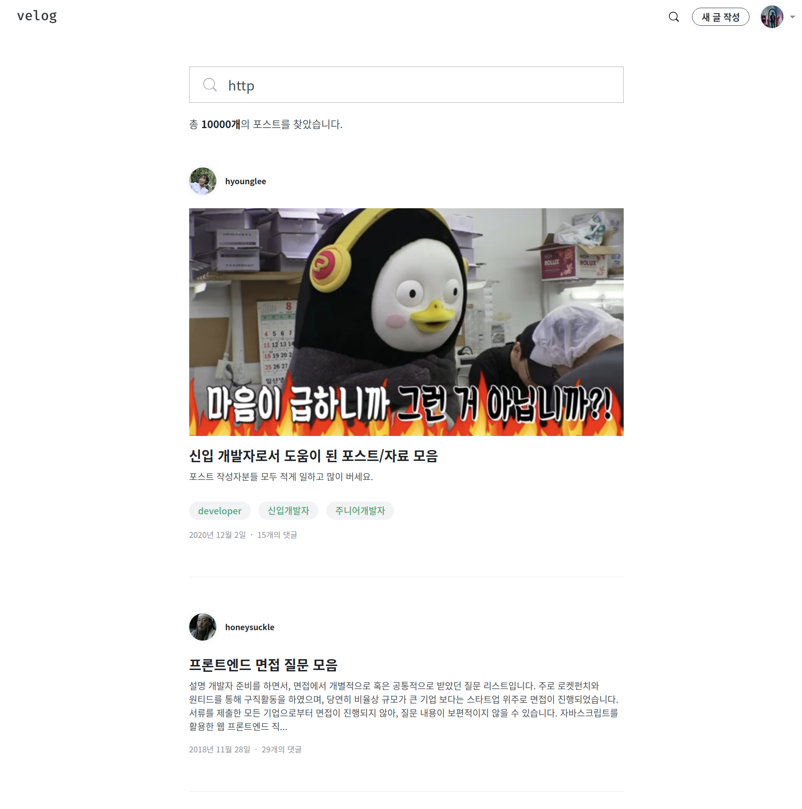
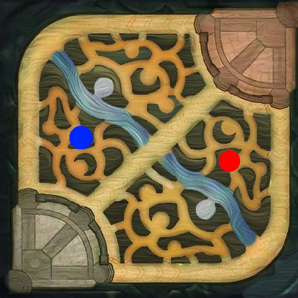

# HTTP

<a href="https://developer.mozilla.org/ko/docs/Web/HTTP/Overview" target="_blank" rel="noopener">HTTP</a>는 **HyperText Transfer Protocol**의 줄임말로, HTML과 같은 문서를 전송하기 위한 <a href="https://ko.wikipedia.org/wiki/OSI_%EB%AA%A8%ED%98%95" target="_blank" rel="noopener">OSI 7 계층</a>인 `Application Layer` 프로토콜이다. HTTP는 웹 브라우저와 웹 서버의 소통을 위해 디자인되었다.

## Architecture

**클라이언트**는 우리가 사용하는 PC, 모바일을 이용해 어떤 상호작용을 수행하는 영역이다.
상호작용 과정에서 회원 정보 조회, 결제, 검색 등 로컬에 저장되어있지 않은 데이터를 가져와야 한다. 즉 어떤 리소스를 요청해야한다.

그렇다면 이 리소스를 어딘가에서 제공을 받아야하는데, 제공을 하는(serving) 곳은 **서버**라고 부른다.

클라이언트가 필요한 리소스를 서버에 요청을 하고, 서버는 그 요청에 따른 리소스를 건네주기 위해 응답을 준다. 
즉 클라이언트가 어떤걸 주문하면, 서버는 그 주문에 맞는 리소스를 응답한다. 
이를 `2-tier` 아키텍처, **클라이언트-서버 아키텍처**라고 부른다.

`3-tier` 아키텍처는 `2-tier` 아키텍처에 데이터베이스가 추가된 형태이다. 리소스를 저장하는 공간을 서버에 저장하는 것이 아니라 따로 **데이터베이스**라는 곳에 저장하여 서버도 데이터베이스로 클라이언트에게 응답할 리소스를 요청하고, 데이터베이스는 서버로 그 리소스를 응답한다.

클라이언트와 서버간 통신을 위해선 먼저 정의된 형태로 요청과 응답을 수행해야 한다.

즉, 어떤 규정된 약속을 기반으로 통신을 수행해야하는데, 이를 HTTP 프로토콜이라 한다.
HTTP 프로토콜은 HTTP를 이용한 통신을 위한 규칙들이 담겨있는 통신 규약이다.

### API

클라이언트가 리소스를 요청할 때 HTTP 프로토콜로 요청하는데, 서버에 어떤 데이터들이 있는지 모르는데 어떻게 서버의 데이터를 받아와서 사용할 수 있을까..?

**API(Application Programming Interface)**[[1]](#user-ref)를 통해 수행할 수 있다.

서버는 클라이언트에게 리소스를 잘 활용할 수 있도록 어떤 가이드, 인터페이스를 제공해줘야 한다. 이를 API라고 부른다.

### URL & URI

**URL** 은 **Uniform Resource Locator**의 줄임말이다.

네트워크 상에서 웹 페이지, 이미지 등 파일이 위치한 정보를 나타낸다.
URL은 `Scheme`, `Hosts`, `URL-Path`로 구분된다.

`https://velog.io/@shitaikoto`

`velog` 주소를 예시로 들어보면,

`Scheme`은 통신 방식(프로토콜)이다. 위 예시로 보면 `https`가 `Scheme`이 된다.

`Hosts`는 웹 서버의 이름 또는 도메인, IP를 사용한다. 절대적인 주소라고 할 수 있다.
위 예시로 보면, `velog.io`가 `Hosts`가 된다.

`URL-Path`는 웹 서버 또는 도메인에서 지정한 루트 디렉토리로부터 시작하여 웹 페이지, 이미지 등 위치한 경로와 파일명을 나타낸다.

위 예시로 보면, `@shitaikoto`가 `URL-Path`가 된다.

즉, `Hosts`인 `velog.io(도메인)`이 루트 디렉토리가 되는 것이며, `Path`인 `@shitaikoto`는 루트 디렉토리 다양한 경로 중 하나가 된다.

**URI**는 `Uniform Resource Identifier`의 줄임말이다. `URI`는 `URL`의 구성요소 + `query`, `bookmark`를 포함한다.

`query`는 웹 서버에 보내는 추가적인 질문이다.

<figure>

<figcaption>Fig 1. URI 예시를 위한 페이지</figcaption>
<figcaption>https://velog.io/search?q=http</figcaption>
</figure>

`velog` 통합 검색에 `http`를 검색해보았다.
여기서 `velog.io`는 `Hosts`, `search`는 `URL-Path`가 된다.

URI의 구성 요소 중 하나인 `query`는 위처럼 `?` 물음표 뒤에 붙게 된다.

`http`라는 키워드로 검색한 결과를 나타낸다.

우리가 평소에 어떤 사이트 주소를 공유하기위해 복사 붙여넣기 하는 그 주소는 `URI`가 될 수 있고, `URL`가 될 수 있다.

**URI는 URL을 포함하는 상위 개념이다. `URL`은 `URI`라고 볼 수 있지만, `URI`는 `URL`이라고 볼 수 없다**. 구성 요소의 차이가 있기 때문이다.

### IP Address / Domain

우린 평소에 도메인 주소로 대부분의 웹 페이지를 접속한다.
옛날 PC 보급률이 낮았을 땐 네 덩이로 이루어진 IP주소로 웹 페이지에 접근했다.

그러나 PC보급률이 증가하고, 다양한 웹 페이지들이 생겨나면서 외우기 어려운 IP 주소 대신 사용할 주소가 필요했다.

무엇이든 **이름**이 있는 것이 좋은 것 같다.

**LOL(리그오브레전드)** 에서 정글러가 미드라이너에게 블루 버프를 줘야하는 상황을 가정해보았다.

<figure>

<figcaption>Fig 2. 리그오브레전드 블루 버프 골렘</figcaption>
<figcaption>정글러 A : 미드님, (-20,10) 좌표로 오셔서 버프 드세요.</figcaption>
</figure>

<figure>

<figcaption>Fig 3. 리그오브레전드 물음표 핑</figcaption>
<figcaption>미드라이너 B : 어디요? (무수한 미아 핑)</figcaption>
</figure>

미니맵이 없다면, 또는 블루 버프의 위치를 잘 모르는 사람이라면 위치 파악이 매우 어려울 것이다.

그러나 이 좌표에 **이름**이 있다면 누구나 위치를 쉽게 파악할 수 있다.

<figure>

<figcaption>Fig 4. 리그오브레전드 미니맵</figcaption>
<figcaption>정글러 A : 미드님 블루 ㄱㄱ</figcaption>
<figcaption>미드라이너 B : ㄳㄳ</figcaption>
</figure>

블루 버프의 정확한 좌표 위치를 모르더라도, 그 대략적 위치의 **이름**을 알고있기 때문에 누구나 접근할 수 있다.

다양한 웹 사이트들도 사용자를 위해 자신의 웹 사이트를 나타내는 도메인 이름을 비용을 지불하여 사용하고 있다.

그렇다면 구입한 도메인 이름과 웹 사이트의 IP 주소를 연동시켜야 사용자가 접속할 수 있다. 어떻게 매칭할까?

브라우저의 검색창에 도메인 이름을 입력하여 해당 사이트로 이동하기 위해 해당 **도메인 이름과 매칭된 IP주소**를 확인해야 한다.

네트워크는 이를 위한 서버가 존재한다. 이를 <a href="https://aws.amazon.com/ko/route53/what-is-dns/" target="_blank" rel="noopener">DNS(Domain Name System)</a>이라 한다.

**호스트의 도메인 이름을 IP주소로 변환하거나, IP 주소를 도메인 이름으로 변환하는 데이터베이스 시스템**이다.

예를 들어 브라우저의 검색창에 `naver.com` 를 입력하면, 이 요청은 DNS에서 IP주소를 찾는다. 그리고 이 IP주소에 해당하는 웹 서버로 요청을 전달하여 클라이언트와 서버가 통신할 수 있도록 만든다.

---

## HTTP Message

<a href="https://developer.mozilla.org/ko/docs/Web/HTTP/Messages" target="_blank" rel="noopener">HTTP Message</a>는 클라이언트 - 서버 간 데이터가 교환되는 방식이다.

클라이언트는 서버로 `HTTP Message`를 통해 리소스를 `요청(Requests)`하며, 서버는 클라이언트로 `HTTP Message`를 통해 `응답(Responses)`한다.

서버로부터 응답받은 `HTTP Message`의 `Header`에는 <a href="https://developer.mozilla.org/ko/docs/Web/HTTP/Status" target="_blank" rel="noopener">HTTP 상태 코드</a>가 포함되어 있는 경우가 있다.

이 상태 코드를 확인하는 것으로 리소스 요청에 있어 어떤 문제가 있는지 파악할 수 있다.

예를 들어 400번 대의 상태 코드를 응답받은 경우, 이는 클라이언트 측에서 발생한 에러이다. 그렇기 때문에 클라이언트 측에서 코드를 잘못 작성하지 않았는지 확인할 수 있다.

500번대의 상태 코드라면 서버 측에서 발생한 에러이기 때문에 리소스를 요청받은 서버에서 문제를 해결하는 것으로 에러를 핸들링할 수 있다.

---

## AJAX

<figure>

<figcaption>Fig 5. 네덜란드 축구 클럽 아약스</figcaption>
</figure>

<a href="https://ko.wikipedia.org/wiki/Ajax" target="_blank" rel="noopener">Ajax(Asynchronous JavaScript and XML, 에이잭스)</a>는 비동기적인 웹 애플리케이션의 제작을 위한 개발 기법의 하나이다.

**카카오톡**을 예시로 들어보았다. 우리가 누군가에게 카카오톡 메세지를 보냈다. 메세지를 보내고 창을 닫으면, 카카오톡 채팅 내역이 업데이트 된다.

이 때, 단순하게 한 명에게만 메세지를 보냈는데 지금까지 보냈던 모든 기록들이 다시 업데이트 된다면..? 사용자 경험 측면에서 메세지를 보내는 일은 굉장히 하기 귀찮은 일이 될 것이다.

하지만, 카카오톡은 하나의 **애플리케이션** 으로서 한 사람에게 카톡 메세지를 보내는 것으로 그 사람과의 대화 내역만 업데이트 될 뿐, 전체 페이지를 새로 업데이트하지 않는다.

즉, 사용자는 오랜 기다림 없이 쾌적하게 카카오톡을 사용할 수 있다.

이러한 관점을 웹에도 적용시켜, 웹 페이지가 아닌 **웹 애플리케이션**으로 기능하게 하는 것이 매우 중요해졌다.

서버와 자유롭게 통신하기 위해 **XMLHttpRequest(XHR)**[[2]](#user-ref)을 사용하고 `Javascript`와 **DOM**[[3]](#user-ref)을 이용해 연속적인 기능 동작을 구현하는 것을 AJAX 개념을 적용한 웹 개발이라 볼 수 있으며, AJAX를 통해 동적인 웹 앱을 개발할 수 있다.

### SSR / CSR

**SSR**은 **Server Side Rendering**의 줄임말이다. 웹 페이지를 브라우저에서 렌더링하는 대신에 **서버**에서 렌더링한다.

**CSR**은 **Client Side Rendering** 을 의미한다. 일반적으로 CSR은 SSR의 반대로 여겨진다. SSR이 서버 측에서 페이지를 렌더링한다면, CSR은 **클라이언트**에서 페이지를 렌더링한다.

브라우저의 요청을 서버로 보내면 서버는 웹 페이지를 렌더링하는 대신, 웹 페이지의 골격이 될 단일 페이지를 클라이언트에 보낸다. 이 때 서버는 웹 페이지와 함께 `JavaScript` 파일을 보낸다.

클라이언트가 웹 페이지를 받으면, 웹 페이지와 함께 전달된 `JavaScript` 파일은 브라우저에서 웹 페이지를 완전히 렌더링 된 페이지로 바꾼다.

**CSR**과 **SSR**의 주요 차이점은 **페이지가 렌더링되는 위치**이다.

SSR은 서버에서 페이지를 렌더링하고, CSR은 브라우저(클라이언트)에서 페이지를 렌더링한다.

브라우저는 사용자가 다른 경로를 요청할 때마다 페이지를 새로고침 하지 않고, 동적으로 라우팅을 관리한다.

인터랙티브한 웹 앱을 제작할 경우, CSR를 이용해 강력한 사용자 경험(빠른 동적 렌더링)을 제공할 수 있다.

웹 페이지가 사용자와 상호작용이 적은 경우, SSR을 사용할 수 있다. 또한, 웹 페이지의 첫 화면 렌더링이 빠르게 필요할 경우에도 단일 파일 용량이 작은 SSR이 적합하다.

---

### Notes

<small id="user-ref">[[1]](#user)<a href="https://ko.wikipedia.org/wiki/API" target="_blank" rel="noopener">API(Application Programming Interface 애플리케이션 프로그래밍 인터페이스, 응용 프로그램 프로그래밍 인터페이스)</a>는 응용 프로그램에서 사용할 수 있도록, 운영 체제나 프로그래밍 언어가 제공하는 기능을 제어할 수 있게 만든 인터페이스를 뜻한다. 주로 파일 제어, 창 제어, 화상 처리, 문자 제어 등을 위한 인터페이스를 제공한다.</small>

<small id="user-ref">[[2]](#user)XMLHttpRequest(XHR)은 AJAX 요청을 생성하는 JavaScript API입니다. XHR의 메서드로 브라우저와 서버간의 네트워크 요청을 전송할 수 있습니다.</small>

<small id="user-ref">[[3]](#user)문서 객체 모델(DOM, Document Object Model)은 XML이나 HTML 문서에 접근하기 위한 일종의 인터페이스입니다.
이 객체 모델은 문서 내의 모든 요소를 정의하고, 각각의 요소에 접근하는 방법을 제공합니다. 자바스크립트는 DOM을 이용해 새로운 HTML 요소나 속성을 추가, 수정, 제거 및 이벤트 추가 등 다양한 작업을 할 수 있습니다.</small>

### Reference

- <a href="https://ko.wikipedia.org/wiki/OSI_%EB%AA%A8%ED%98%95" target="_blank" rel="noopener">OSI 7 계층</a>
- <a href="https://developer.mozilla.org/ko/docs/Web/HTTP/Overview" target="_blank" rel="noopener">HTTP 개요 - MDN</a>
- <a href="https://aws.amazon.com/ko/route53/what-is-dns/" target="_blank" rel="noopener">DNS란? - AWS</a>
- <a href="https://developer.mozilla.org/ko/docs/Web/HTTP/Messages" target="_blank" rel="noopener">HTTP Message의 구조 - MDN</a>
- <a href="https://developer.mozilla.org/ko/docs/Web/HTTP/Status" target="_blank" rel="noopener">HTTP 상태 코드 - MDN</a>
- <a href="https://ko.wikipedia.org/wiki/Ajax" target="_blank" rel="noopener">Ajax란? - Wiki</a>
- <a href="http://tcpschool.com/ajax/ajax_intro_basic" target="_blank" rel="noopener">Ajax란? - TCPSchool</a>
