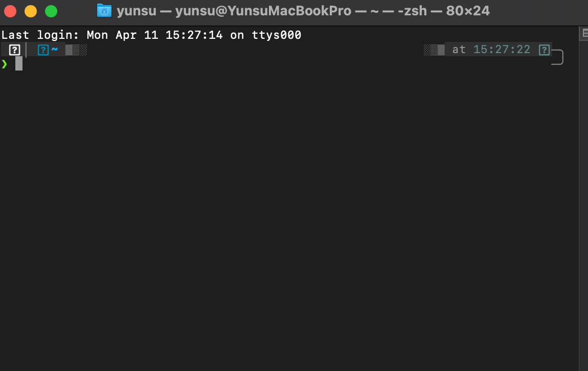
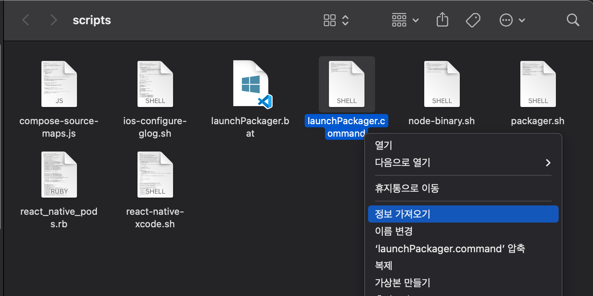
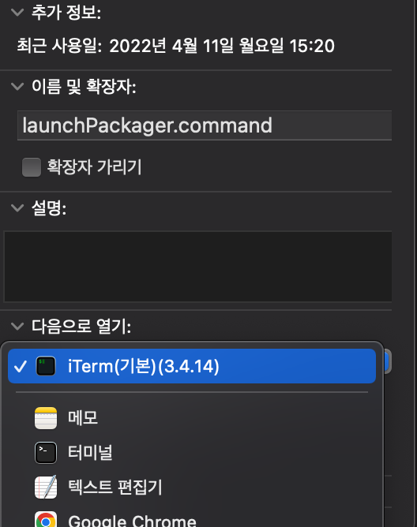
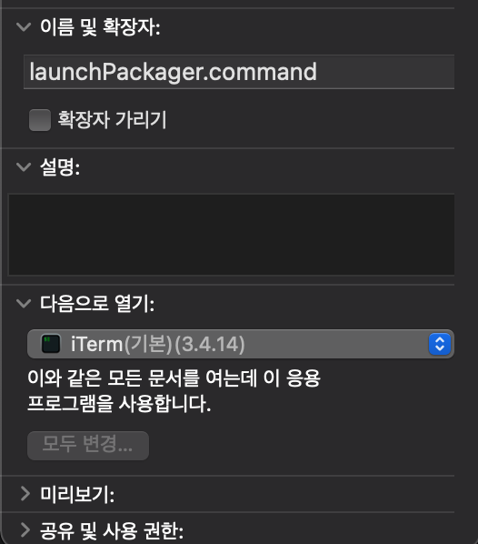
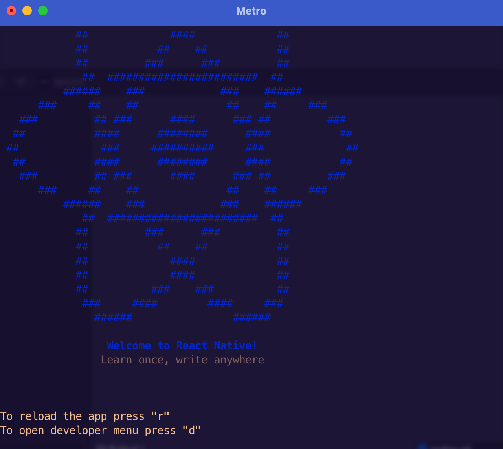

# 기본 터미널 vs iTerm

기본적으로 터미널을 통해 어떤 작업을 할 땐 `iTerm` 을 열고 iTerm으로 명령어를 실행하여 작업했다.

그러나, Xcode 를 통해 프로덕트를 빌드할 땐 iTerm으로 `Metro`가 열리지 않고 **macOS 기본 터미널 앱**으로 Metro가 실행되었다.

<figure>

<figcaption>Fig 1. macOS 기본 터미널 앱</figcaption>
</figure>

처음엔 원래 그런가보다 했는데, 점점 사용할 수록 **터미널이 분리된다는 것**이 많이 불편했고 무엇보다

> **_기본 터미널 앱은 iTerm보다 예쁘지 않아서_**

Metro 기본 실행 터미널을 iTerm으로 바꿔야겠다고 생각했다.

# 변경 방법

먼저 프로젝트 디렉토리로 이동하여 아래와 같은 파일을 찾는다.

> node_modules/react-native/scripts/**launchPackager.command**

파일을 **우클릭**하고 **정보 가져오기**를 선택한다.

<figure>

<figcaption>Fig 2. launchPackager.command 경로</figcaption>
</figure>

**다음으로 열기** 에서 기본 터미널 대신 **iTerm**을 선택한다. 선택 후, 하단의 **모두 변경**을 클릭한다.

<figure>

 
 

<figcaption>Fig 3. 실행하는 응용 프로그램을 iTerm으로 변경</figcaption>
</figure>

이제 `.command` 확장자를 가진 모든 파일은 iTerm으로 실행이 된다.

우리가 프로덕트를 빌드할 때 입력하는 명령어인 `react-native run-ios`는 `launchPackager.command`를 실행하여 Metro를 여는데, 이 파일의 내용은 터미널 상에서 파일에 적힌 CLI 명령어를 수행하는 것이다.

이 파일이 실행될 때 열리는 응용 프로그램이 macOS 기본 터미널로 설정되어있었기 때문에 iTerm이 Default 터미널 이었어도 macOS 기본 터미널로 Metro가 실행되었던 것이다.

# 변경 완료

<figure>

<figcaption>Fig 4. iTerm으로 실행되는 Metro</figcaption>
</figure>

그러나 iTerm 으로 변경된 후 **고려해야할 점**이 있다.

기존엔 터미널 앱이 실행되지 않았더라도 Metro가 실행되면 터미널 앱이 자동으로 실행되었다. iTerm으로 변경하면 **iTerm이 실행된 상태**에서 Metro를 실행해야 정상적으로 빌드가 수행된다.

### Reference

- <a href="https://stackoverflow.com/questions/37814803/how-to-get-react-native-run-ios-to-open-in-iterm-instead-of-terminal-on-a-macos" target="_blank" rel="noopener">How to get react-native run-ios to open in iTerm instead of Terminal on a macOS? - stackoverflow</a>
