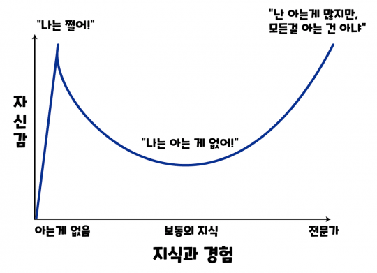
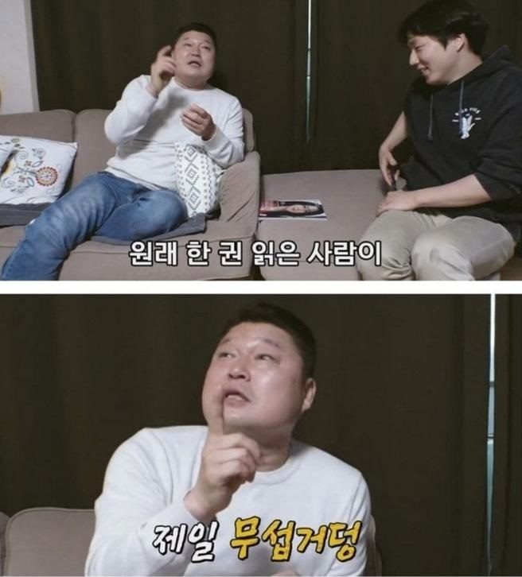

<figure>

<figcaption>와우!! 황금 특급 카드!!</figcaption>
</figure>

# 안녕하세요!

이번 글은 이전 글에서 언급했었던 개발자가 되고 싶은 이유에 대해 말씀드리려고 합니다.

개발자가 되기 위해 열심히 공부를 하고 있습니다. 아직은 초기라 경험이 많지도 않고, 지식이 많지도 않아 자신감과 의욕이 충만한(?) 상태입니다.

<figure>

<figcaption>더닝 크루거 곡선</figcaption>
<figcaption>지금의 제 위치는 x축을 막 시작하여 우매함의 봉우리로 향하고 있습니다...</figcaption>
</figure>

시간이 흐르면서, 지식과 경험이 쌓이며 자신감이 떨어지거나, 배움의 벽에 막혀 지칠 때가 반드시 올 것이라 생각합니다.

<figure>

<figcaption>얕은 지식이 화를 부를텐데!!</figcaption>
</figure>

**그 때!!** 제가 초기에 가졌던 마음가짐을 다시 한 번 돌아보면서 앞으로 겪을 많은 어려움을 효과적으로 극복하기 위해 이 글을 씁니다.

### 개발자를 왜?

게임, 시스템, 보안 개발자 등 다양한 종류의 개발자가 있습니다. 제가 지향하는 개발자는 웹 개발이고, 분류는 프론트 엔드입니다.

프론트 엔드 개발자가 되고싶은 이유는요!

1. 시각화
2. 주변 환경
3. 나의 성격
4. 기술에 대한 열망

이렇게 네 가지입니다.

간단히 요약한 이유에 조금 살을 붙이자면,,,

#### 1. 시각화

직접 현업을 경험해보진 못했지만, 웹 개발 분야는 화면에 보여지는 부분과 그렇지 않은 부분으로 나뉜다고 알고 있습니다.

<figure>

<figcaption>랩탑 밑에 겹겹이 쌓인 책이 포인트...</figcaption>
</figure>

보여지는 부분에서는 또 디자이너, 퍼블리셔, 프론트엔드로 나뉜다고 하는데요, 제 목표인 
' 프론트 엔드 개발자 (디자인 기능 포함) ' 가 된다면, 하얀 빈 페이지에 제 상상을 표출할 수 있기 때문입니다!

#### 2. 주변 환경

자유로운 분위기를 선호합니다. 회사마다 다르고, 어떤 사람과 함께인지에 따라 다르겠지만요!
제 사회 경험은 그리 길진 않습니다만, 기술영업으로 첫 커리어를 시작했습니다. 잦은 외근, 숫자가 곧 성과가 되는 경직된 분위기가 맞지 않았습니다.
자유롭고, _**구두를 매일같이 안신어도 되는**_ 그런 환경!

#### 3. 나의 성격

_내향성과 외향성 그 사이 어딘가..._
그런 성격입니다. 사람들과 교류하는 것, 이야기를 듣는 것을 좋아하지만! 모니터 앞에 앉아 키보드를 두드리는 것이 조금은 더 맞는 것 같습니다.
다양한 사람들을 만나는 것을 너무 좋아하지만, ~~하루 시간의 반 이상을 차지하면 지치는 것 같습니다...~~

#### 4. 기술에 대한 열망

_' 기술 배우면 굶어죽지 않는다. '_ 는 어른들의 말!

빠르게 변화하는 이 업계에서 끊임없이 고민하고, 공부하고, 기술을 쌓아 정량적으로 표출할 기술을 보유한 사람이 되고 싶습니다. 그 기술이 웹 개발이고, 그런 사람이 되기 위해 열심히 공부하고 있습니다!

이렇게 개발자가 되고싶은 이유를 정리했습니다!

다른 사람들에게 보여주기 위함 보다는, 시간이 지나 제가 다시 읽으며 마음가짐을 다잡기 위해 이 글을 작성했습니다.

감사합니다!
