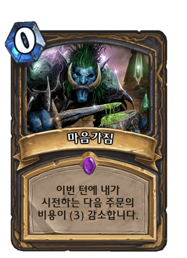

# 안녕하세요!

작년까지 취미로 웹 디자인에 대해 남는 시간이 생길 때마다 공부를 했는데요, 디자인이라는 영역이 공대생인 저에겐 불가침의 영역으로 인식됐습니다.
그러다가, 비교적 최근에 새로 만들어진 웹 사이트들을 보며 느낀 것이 있었습니다.

- 멋있다.
- 누가 만들었지?
- 나도 만들어보고 싶다!

네... 별 거 없었습니다. 개발 공부를 시작하게 된 계기입니다. 어떤 분들은 '디자인 중점적이면 웹디자인이나 웹퍼블리싱 쪽을 알아보는게 낫지 않아?' 라고 말씀하셨습니다.
작년까진 html, css를 틈틈히 공부했었지만, 공부를 하다보니 좀 더 배우고 싶은 게 뚜렷해지더라구요.
 

> 프론트 엔드 개발자인데, 디자인도 하고 싶어!

웹 퍼블리셔와는 약간 다른 것 같습니다. 디자인을 위주로 디자인에 맞는 동적 기능을 스크립트 또는 쿼리로 구현하는 것과 달리,
동적 기능 및 기능 간 상호작용을 구현할 수 있는 개발자와 더불어 디자인도 수행한다는 점이 차이라고 생각합니다.

그래서, 이러한 제 커리어 비전을 품고 웹 개발 공부를 시작했습니다!
지금은 배운 지 얼마 되지 않은 병아리가 되기 전 닭의 알(?) 상태지만요...

<figure>

<figcaption>Fig 1. "항상 대비하라." - 도적 격언</figcaption>
</figure>

### _마음가짐_

' _하스스톤_ ' 이라는 카드 게임에, ' **_마음가짐_** ' 이라는 카드가 있습니다.
마음가짐을 사용하면, 다음 주문의 비용이 감소하는 카드입니다.

어떤 목적을 수행하기 위한 단단한 마음가짐이 있다면, 목표 달성을 위한 행동에 망설임은 사라집니다.

이와 같은 마음가짐을 가슴 속에 새기고, 열심히 준비하고 대비하는 모습을 제 벨로그에 하나하나 기록해보겠습니다.
앞으로 꾸준히 포스팅되는 제 성장 일기 지켜봐주시구요! 다음 글은 개발자가 되고 싶은 이유를 들고 오겠습니다!

알을 깨고 나오는 그 날까지 잘 부탁드립니다!

긴 글 읽어주셔서 감사합니다.
