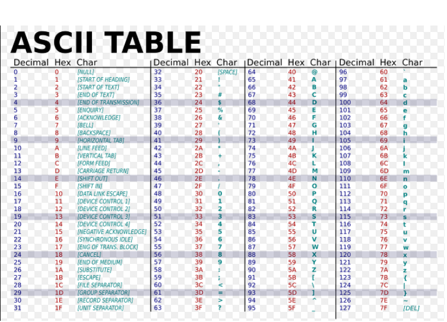
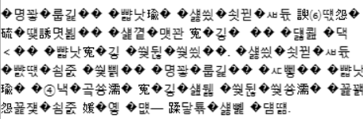

# 아스키 코드(ASCII CODE)

ASCII 문자<sup id="user">[[1]](#user-ref)</sup> 는 영문 알파벳을 사용하는 대표적인 문자 인코딩이다. 7 비트(bit)로 모든 영어 알파벳을 표현할 수 있다.

<figure>

<figcaption>Fig 1. ASCII TABLE</figcaption>
</figure>

52개의 영문 알파벳(대소문자)와 10개의 숫자, 32개의 특수문자 그리고 하나의 공백 문자를 표현한다.

0번부터 31번까지는 출력을 위해 필요한 명령어들이다.

아스키 코드의 장점은 매우 단순하고 간단하기 때문에 어느 시스템에도 적용이 가능하다. 그러나, **2바이트 이상의 문자열**은 표현할 수 없기 때문에 국제 표준은 **유니코드**가 되었다.

# 유니코드(Unicode)

유니코드(Unicode)는 유니코드 협회(Unicode Consortium)가 제정하는 전 세계의 모든 문자를 컴퓨터에서 일관되게 표현하고 다룰 수 있도록 설계된 **산업 표준**이다.

이 표준에는 ISO 10646 문자 집합, 문자 인코딩, 문자 정보 데이터베이스, 문자를 다루기 위한 알고리즘 등을 포함하고 있다.

유니코드 이전에는 같은 한글이 적힌 텍스트 파일이라도 표현하는 방법이 제각각이었다.

<figure>

<figcaption>Fig 2. 옛날에 자주 보던 뷁어</figcaption>
</figure>

텍스트 파일을 열 때 이런 소위 말하는 `뷁어`를 본 경우가 한 번쯤은 있다.

이런 텍스트 파일이 깨지는 현상은 그 텍스트 뷰어가 지원하지 않는 다른 **인코딩**<sup id="user">[[2]](#user-ref)</sup> 형식으로 텍스트가 저장되어있기 때문이다.

유니코드는 인코딩 방식에 따라 **UTF-8**과 **UTF-16**으로 나뉘어진다.

UTF는 (Universal Coded Character Set + Transformation Format)의 약자이며, 뒤에 붙는 숫자는 비트(bit)다.

### UTF - 8

UTF-8은 유니코드 한 문자를 나타내기 위해 1byte(8bits)에서 4byte(32bits)까지 사용한다.

예를 들어, `코` 라는 문자의 유니코드는 `U+CF54` (16진수, HEX)로 표현된다. 이 문자를 이진법(binary number)으로 표시하면 `1100-1111-0101-0100` 이 된다. 이 문자를 UTF-8로 표현하면 다음과 같이 3byte 의 결과로 표현된다.

```c
1110xxxx 10xxxxxx 10xxxxxx # x 안에 순서대로 값을 채워넣는다.
11101100 10111101 10010100
```

<br>

```js
let encoder = new TextEncoder()
// 입력인자가 없다면 기본 인코딩은 'utf-8'
encoder.encode('코')
// Uint8Array(3) [236, 189, 148]
// 3바이트이며, 배열의 각 요소는 바이트당 할당된 10진수
// 이 수들을 2진수로 바꾸면
;(236).toString(2)
// "11101100"
;(189).toString(2)
// "10111101"
;(148).toString(2)
// "10010100"
```

UTF-8은 1 byte에서 4 bytes까지의 가변 길이를 가지는 인코딩 방식이다. **네트워크를 통해 전송되는 텍스트는 주로 UTF-8**로 인코딩된다. 사용된 문자에 따라 더 작은 크기의 문자열을 표현할 수 있기 때문이다.

UTF-8은 ASCII 코드의 경우 1 byte, 크게 영어 외 글자는 2byte, 3byte, 보조 글자는 4byte를 차지한다. 이모지는 보조 글자에 해당하기 때문에 4byte가 필요하다.

**한글은 3byte**가 된다.

UTF-8은 UTF-16에 비해 바이트 순서를 따지지 않고 순서가 정해져 있다.

### UTF - 16

UTF-16은 유니코드 코드 대부분(U+0000부터 U+FFFF; BMP) 을 16 bits로 표현한다.

대부분에 속하지 않는 기타문자는 32 bit(4 bytes)로 표현하므로 UTF-16도 가변 길이라고 할 수 있으나, 대부분은 2 바이트로 표현한다.

UTF-16에서 한글은 2byte를 차지한다.

### Notes

<small id="user-ref"><sup>[[1]](#user)</sup>**아스키 코드(ASCII CODE)** : 미국정보교환표준부호(영어: **American Standard Code for Information Interchange**), 또는 줄여서 ASCII( /ˈæski/, 아스키)는 **영문 알파벳을 사용하는 대표적인 문자 인코딩**이다.</small>

<small id="user-ref"><sup>[[2]](#user)</sup>**인코딩(부호화)** : 인코딩이란 어떤 문자나 기호를 컴퓨터가 이용할 수 있는 신호로 만드는 것이다. 이 신호를 입력하는 인코딩과 문자를 해독하는 디코딩을 하기 위해서는 미리 정해진 기준을 바탕으로 입력과 해독이 처리되어야 한다. 이렇게 인코딩과 디코딩의 기준을 문자열 세트 또는 문자셋(charset)이라고 한다. 이 문자셋의 국제 표준이 **유니코드**이다.</small>
