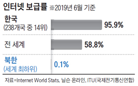
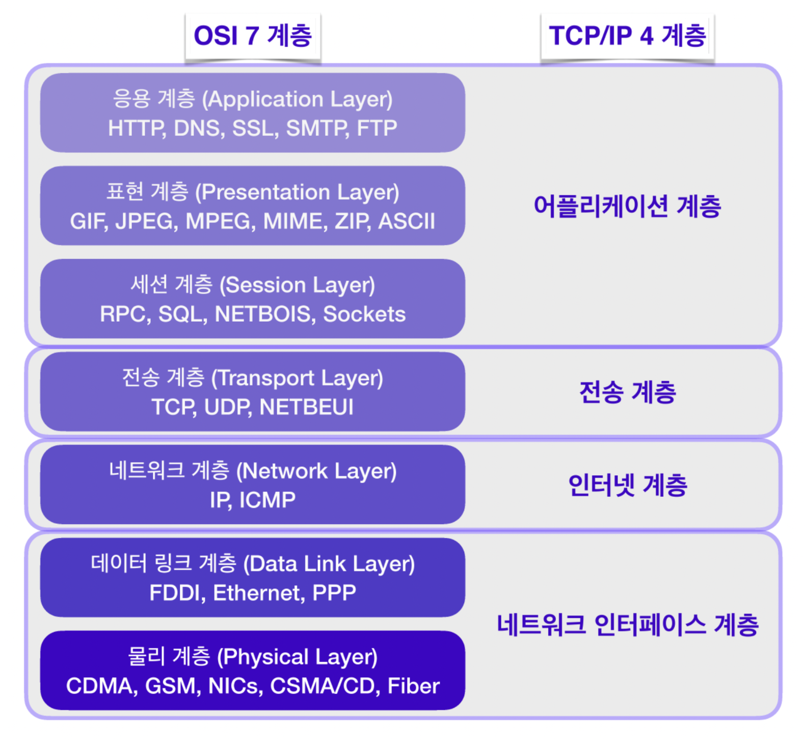
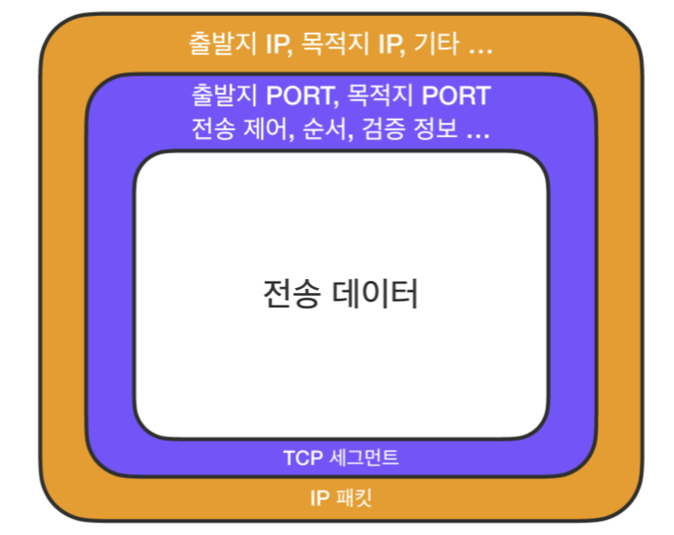
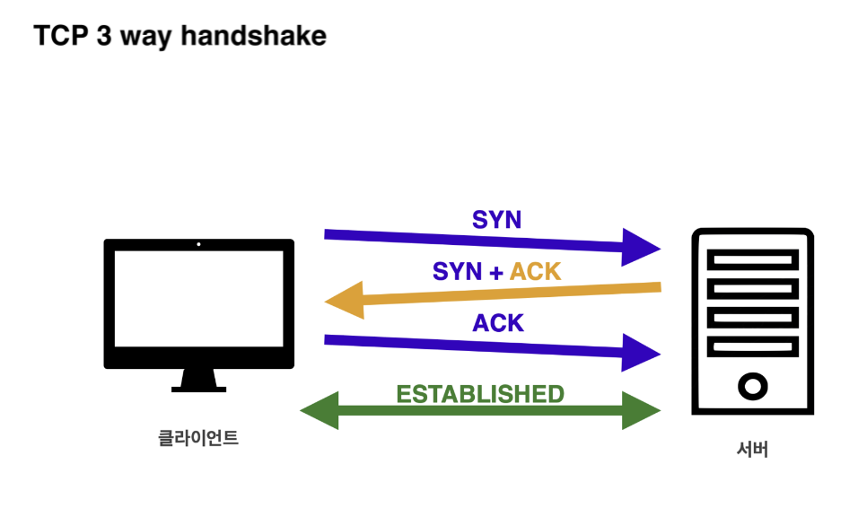

# IP(Internet Protocol)

우리나라만 해도 2019년 6월 기준 인터넷 보급률은 약 96% 이다. 전 세계 238개국 중 14위이다.

<figure>

<figcaption>Fig 1. 대한민국 인터넷 보급률</figcaption>
</figure>

전 세계 약 80억 인구 중, 약 50억 인구가 인터넷을 사용한다. 그 만큼 복잡한 인터넷 망 속에서 수많은 노드(서버 컴퓨터)를 지나 어떻게 출발지에서 목적지까지 데이터가 무사히 전달되도록 할까?

즉, 어떻게 클라이언트와 서버가 통신할 수 있을까?

IP 주소를 컴퓨터에 부여하는 것으로 통신할 수 있다. 여기서 **IP**는 복잡한 인터넷 망 속에서 클라이언트와 서버간 원활하게 통신할 수 있는 규칙을 의미한다.

IP는 지정한 IP 주소에 패킷(Packet)이라는 통신 단위로 데이터를 전달한다.

패킷은 **Pack**과 **Bucket**의 합성어로, 일종의 소포이다.

IP 패킷은 우체국 송장처럼 전송 데이터를 무사히 목적지까지 전송하기 위해 출발지 IP, 목적지 IP와 같은 정보가 포함되어 있다.

클라이언트에서 전송한 데이터가 무사히 서버에 전달되면 서버도 IP 패킷을 이용해 클라이언트에 응답한다. 정확한 출발지와 목적지를 패킷에 담는 것으로 파악할 수 있기 때문에 IP 프로토콜은 적절한 통신 방법이다. 그러나, 한계가 있다.

### IP의 한계

- 비연결성
  - 패킷을 받을 대성이 없거나, 서비스 불능 상태여도 패킷을 전송
- 비신뢰성
  - 전송 과정에서 중간에 패킷이 사라질 수 있음
  - 패킷의 순서를 보장할 수 없음

패킷을 받을 대상이 없거나 서비스 불능 상태인 경우, 클라이언트는 서버의 상태를 파악할 수 없다. 목적지의 서버가 불능 상태일 수 있고, 중간에 있는 서버에서 장애가 발생해 패킷이 중간에 손실되더라도 클라이언트는 이를 파악할 수 없다.

또한, 전달하는 데이터의 용량이 큰 경우 이를 패킷 단위로 나눠 전달하게 된다. 이 패킷들은 전달 과정에서 각각 다른 노드를 통해 전달될 수 있다. 이는 곧 목적지인 서버에서 데이터를 받을 때 의도치 않은 순서로 도착할 수 있다.

이와 같은 한계를 어떻게 보완할 수 있을까?

# TCP / UDP

<figure>

<figcaption>Fig 2. OSI 7 Layers</figcaption>
</figure>

IP는 OSI 7계층에서 네트워크 계층에 위치해있고, TCP/IP 4계층에선 인터넷 계층에 위치하고 있다. OSI 7계층의 네트워크 계층보다 높은 계층에 전송 계층이 있다. 그 위에 TCP와 UDP가 존재한다. 이 TCP와 UDP 프로토콜로 IP 계층의 한계를 보완할 수 있다.

### TCP

TCP 프로토콜을 사용하는 경우 네트워크에서 데이터를 송수신할 수 있도록 IP 패킷을 사용하기 전에, TCP 데이터를 소켓에 담는다. 여기서 소켓(Socket)은 **네트워크 환경에 연결할 수 있게 만들어진 연결부** 이다.

그리하여 데이터는 소켓에 먼저 담기고 그 데이터를 IP 패킷에 담아 LAN 카드와 같은 물리적 계층을 지나기 위해 이더넷 프레임워크에 포함하여 서버로 전송한다.

<figure>

<figcaption>Fig 3. TCP</figcaption>
</figure>

전송 데이터는 TCP 데이터가 담긴 소켓(TCP 세그먼트)에 담기고, 그 데이터가 IP 패킷에 담겨 전송된다.

TCP 세그먼트에는 IP 패킷의 출발지 IP와 목적지 IP 정보를 보완할 수 있는 출발지 PORT, 목적지 PORT, 전송 제어, 순서 등의 정보를 포함하고 있다.

이 정보가 IP 패킷과 함께 전송되기 때문에 IP의 한계를 보완할 수 있다.

TCP는 전송 제어 프로토콜(Transmission Control Protocol)이다. IP 의 한계였던 데이터 전달과 순서를 보증 및 보장하고, TCP 3 way Handshake를 통한 연결 지향적 프로토콜로 신뢰성 있는 프로토콜이다.

### TCP 3 WAY Handshake

TCP는 노드들 간 논리적인 접속을 성립하기 위해, **3 way handshake**를 사용하는 연결 지향 프로토콜이다.

#### 연결 방식

<figure>

<figcaption>Fig 4. 3 Way Handshake</figcaption>
</figure>

1. 클라이언트는 서버에 접속을 요청하는 SYN(Syncronize) 패킷을 보낸다.
2. 서버는 SYN 패킷을 받고, 클라이언트에게 접속 요청을 수락한다는 ACK(Acknowledgment)와 SYN가 설정된 패킷을 발송한다.
3. 클라이언트가 서버에게 ACK 요청을 보낸다. 이후로 클라이언트와 서버간의 연결이 성립된다.
4. 데이터를 전송한다.

여기서 만약 서버가 꺼져있다면 클라이언트가 SYN을 보내고 서버에서 받는 SYN + ACK 응답이 없다. 즉, 데이터를 보내지 않는다.

만약 연결이 성립되어 클라이언트가 데이터를 전송하면, 서버도 이에 따른 응답을 보낸다. 이로써, IP 의 한계인 **비연결성**을 보완할 수 있다.

만약 패킷이 순서대로 도착하지 않는다면 TCP 세그먼트에 있는 정보를 토대로 다시 패킷 전송을 요청한다.

예를 들어 클라이언트가 패킷 1, 2, 3의 순서로 보냈다. 서버가 패킷 1, 3, 2의 순서로 받은 경우, 패킷 2 부터 전송할 것을 재요청한다. 이를 통해 IP 의 한계인 비신뢰성을 보완할 수 있다.

### UDP

UDP는 사용자 데이터그램 프로토콜(User Datagram Protocol)이다.

UDP는 IP에 PORT, 체크섬 필드 정보만 추가된 TCP 보다 단순한 프로토콜이다.

체크섬(checksum)은 중복 검사의 한 형태로, 오류 정정을 통해 공간(전자 통신)이나 시간(기억 장치) 속에서 송신된 자료의 무결성을 보호하는 단순한 방법이다.

TCP와 비교하여 3 way handshake를 사용하지 않고 추가되는 것이 적기 때문에, 신뢰성은 낮지만 빠른 속도를 보장한다.

HTTP3는 UDP를 사용하며 이미 다양한 기능이 구현된 TCP보다 커스터마이징이 가능하다는 장점이 있다. 그러나, 3 way handshake를 사용하지 않기 때문에 데이터 전달과 순서를 보증 및 보장하지 않는다.

그래서 **TCP는 신뢰성이 더 요구될 때, UDP는 서비스의 연속성(ex. 실시간 스트리밍)이 더 요구될 때 사용된다.**

TCP와 UDP를 정리하자면 다음과 같다.

| TCP                   | UDP                     |
| --------------------- | ----------------------- |
| 연결지향 프로토콜     | 비 연결지향 프로토콜    |
| 전송 순서 보장        | 전송 순서 보장 X        |
| 데이터 수신 여부 확인 | 데이터 수신 여부 확인 X |
| 신뢰성 높음           | 신뢰성 낮음             |
| 속도 느림             | 속도 빠름               |

# HTTP

HTTP는 1991년에 처음 HTTP/0.9라는 이름으로 세상에 나왔다. 그 땐 `GET` 메서드만 지원했고, HTTP 헤더는 없었다. 1996년 HTTP/1.0으로 업그레이드되면서 POST 등 메서드가 추가됐고, 헤더가 추가됐다.

1997년 HTTP/1.1이 출시되며, 현재까지도 이 버전을 주로 사용하고 있다. 2015년 HTTP/2 가 출시됐고, HTTP/1.1에 성능이 개선된 버전이다.

HTTP/1.1과 HTTP/2는 TCP 기반이며, HTTP/3은 UDP 기반 프로토콜이다.

### HTTP 특징

HTTP의 구조는 **클라이언트 - 서버 구조** 이다. 클라이언트가 서버에 Request 요청을 보내고, 서버는 클라이언트에게 Response 응답을 보낸다. HTTP는 **서버가 클라이언트의 상태를 보존하지 않는 무상태(Stateless) 프로토콜**이다.

서버가 클라이언트의 상태를 보존하지 않는다는 것은 클라이언트가 반복적인 요청을 보낼 때에도 이미 보낸 요청을 반복해서 보내야 한다는 것이다.

**무상태성의 장점**으로는 서버가 클라이언트의 상태를 보존하지 않으므로, 서버를 확장하기 용이하다. 서버가 클라이언트의 상태를 보존하는 경우, 서버를 확장할 때에도 그 상태를 같이 포함해야하기 때문에 확장이 어렵다.

예를 들어 클라이언트 A의 요청을 서버 1이 기억하는 경우, 서버 2는 응답할 수 없다. 오직 서버 1만 클라이언트 A의 요청에 응답해야 한다. 만약, 서버 1에 장애가 생긴다면 클라이언트 A는 처음부터 다시 서버에 요청해야 한다. 만약 무상태 프로토콜이라면 클라이언트가 데이터를 요청할 때 필요한 데이터들을 다 담아서 보내기 때문에 꼭 서버 1이 아니더라도 아무 서버나 호출해도 된다. 즉, 장애가 발생해도 다른 서버가 대체할 수 있다. 그렇기 때문에 확장에 용이하다.

반면 **단점**으로는 클라이언트가 이미 전송한 요청을 반복적으로 추가적인 데이터를 전송해야 한다는 것이다.

무상태성은 장단점이 있지만, 서버측에서 보면 매력적이다. 그러나 한계가 있다. 로그인이 필요없는 단순한 서비스 소개, 랜딩 페이지 같은 경우엔 무상태로 설계할 수 있다.

만약 로그인이 필요한 서비스라면 유저의 상태를 유지해야 한다. 이 때, HTTP 프로토콜을 사용하는 것과 함께 상태를 유지하기 위해 브라우저 쿠키, 서버 세션, 토큰 등을 이용해 상태를 유지해야 한다.

HTTP는 무상태성과 함께 **비연결성**을 가진다. HTTP 1.0 기준으로, HTTP는 연결을 유지하지 않는 모델이다. 비 연결성을 가지는 HTTP에서는 실제로 요청을 주고 받을 때만 연결을 유지하고 응답을 주고나면 TCP/IP 연결을 끊는다. 이를 통해 최소한의 자원으로 서버 유지를 가능하게 한다.

트래픽이 많지 않고 빠른 응답을 제공할 수 있는 경우, 비연결성의 특징은 효율적으로 작동한다. 예를 들어 한 시간 동안 수천명이 서비스를 사용해도, 실제 서버에서는 초당 처리 요청갯수는 수십개에 불과하다.

하지만 트래픽이 많고, 큰 규모의 서비스를 운영할 때에는 비연결성은 한계를 보인다. 웹 브라우저로 사이트를 요청하면 HTML 뿐만 아니라 자바스크립트, css, 추가 이미지 등 수 많은 자원이 함께 다운로드된다. HTTP 초기엔 HTML을 요청하고, 응답하는 과정에서 연결과 종료를 수행했다. 그 다음 자바스크립트를 응답하는 과정에서 연결과 종료를 수행했고, 이미지 등 미디어 데이터를 응답하는 과정에서 연결과 종료를 반복했다.

결과적으로 클라이언트와 서버 간 데이터 전송하는 데에 많은 시간이 소요됐다. 해당 자원들을 각각 보낼때마다 연결을 끊고 다시 연결하고를 반복하는 것은 비효율적이기 때문에 지금은 **HTTP 지속 연결(Persistent Connections)**로 문제를 해결한다.

HTTP 지속 연결에서는 TCP/IP 연결과 종료 과정 사이에 HTML 요청 및 응답, 자바스크립트 요청 및 응답, 이미지 요청 및 응답 을 모두 수행한 후에 연결을 종료한다. 즉, 데이터 전송에서 기존 방식보다 더 짧은 시간이 소요된다.
