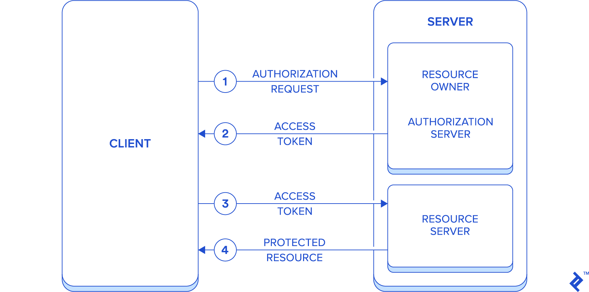

# TOKEN

## CSRF

**CSRF(Cross Site Request Forgery)**

CSRF는 다른 사이트(Cross Site)에서 유저가 보내는 요청(Request)를 조작(Forgery)하는 것이다.

예를 들어, 이메일을 받았는데 그 이메일에 첨부된 링크를 눌렀다. 그 링크를 누르면 그 링크가 은행 계좌로 요청을 보내어 의도하지 않은 돈이 출금되는 그런 사례가 있을 수 있다.

이런 공격이 생기게 된 이유는 해커가 직접 데이터를 접근할 수 없기 때문이다. 직접 데이터에 접근할 수 있었다면 굳이 나에게 링크를 보낼 필요가 없기 때문이다.

해커가 **직접 데이터에 접근할 수 없는 이유**는 다른 사이트이기 때문에 Response에 직접 접근할 수 없는 것이다.

CSRF 공격을 위한 조건은 아래와 같다.

##### 쿠키를 사용한 로그인

- 유저가 로그인했을 때 쿠키로 어떤 유저인지 알 수 있어야 한다.

##### 예측할 수 있는 요청 Parameter를 가지고 있어야 한다.

- Request에 해커가 모를 수 있는 정보가 담겨선 안된다. 만약 은행 출금 관련 공격인 경우 해커가 유저의 계좌 비밀번호를 모른다면 공격은 성공할 수 없다.

#### CSRF를 막는 방법

##### CSRF 토큰 사용하기

- 서버측에서 CSRF 공격에 보호하기 위한 문자열을 유저의 브라우저와 웹 앱에만 제공한다. 그리고 이 조합으로 생성된 요청에만 성공적으로 요청을 완료하는 방식이다.

##### Same-Site cookie 사용하기

- 같은 도메인에서만 세션/쿠키를 사용하도록 만들어서 같은 도메인에서 온 요청이 아니면 응답하지 않는 방식이다. 이는 외부 하이퍼링크를 누르더라도 도메인이 다르기 때문에 요청이 거절된다.

## Token-based Authentication(JWT)

**토큰 기반 인증을 사용하는 이유**

세션 기반 인증 방식은 서버 또는 DB에 유저 정보를 담는 방식이다. 서버에서는 민감하거나 제한된 정보를 요청할 때마다 유저에게 정보를 줘도 괜찮은지 확인한다. 매번 요청할 때마다 위 작업을 수행한다.

이런 반복 작업은 서버 또는 DB에 부담을 주게 된다. 그래서 클라이언트에게 이 부담을 넘기기 위해 고안되었다.

**Token**은 클라이언트가 갖고있고, 클라이언트가 서버에게 토큰을 보여주는 것으로 일종의 놀이공원 입장 티켓과 유사하다.

토큰은 유저 정보를 암호화한 상태로 담을 수 있고, 암호화했기 때문에 클라이언트에 담아도 문제가 없다. 토큰 저장 방식으로는 **JWT**를 널리 사용하고 있다.

### JWT

**JWT(Json Web Token)**은 Json 포맷으로 사용자에 대한 속성을 저장하는 **웹 토큰** 이다.

JWT의 구조는 아래와 같다.

```json
aaaaaa.bbbbbb.cccccc
```

세 덩어리로 나눌 수 있는데 각 덩어리는 앞에서부터 **Header**, **Payload**, **Signature** 이다.

##### 1. Header

- 어떤 종류의 토큰인지
- 어떤 알고리즘으로 암호화할 지 적혀있다.
- `{"alg":"HS256", "typ":"JWT"}`

##### 2. Payload

- 유저의 정보
- 어떤 정보에 접근이 가능한지에 대한 권한
- 기타 필요한 정보
- `{"sub":"some Information","name":"john","iat":151623391}`

##### 3. Signature

- Header와 Payload를 base64 인코딩한 값과 Salt 값의 조합으로 암호화된 값
  -- `HMACSHA256(base64UrlEncode(header) + "." + base64UrlEncode(payload), secret)`

### JWT 종류

1. Access Token
2. Refresh Token

Access Token은 유저의 이메일, 연락처, 사진 등 보호된 정보들에 접근 가능한 권한 부여에 사용된다. 클라이언트가 로그인할 때, 위 두가지 토큰을 모두 부여받지만 실제로 권한을 얻는 데 사용하는 토큰은 Access Token이다.

이 Access Token이 타인이 얻게됐을 때, 부여받은 권한으로 악의적인 요청을 서버에 보낼 수 있다. 이를 방지하기 위해 이 토큰엔 짧은 유효기간을 할당해 탈취되더라도 사용하기 어렵게끔 해야 한다.

이 토큰의 유효기간이 만료된다면 Refresh Token으로 새로운 Access Token을 발급받는다.

### JWT 절차

<figure>

<figcaption>Fig 1. JWT Process</figcaption>
</figure>

1. 클라이언트가 서버에 아이디와 비밀번호를 담아 로그인 요청을 보낸다.
2. 서버는 아이디와 비밀번호가 일치하는지 확인하고 클라이언트에게 보낼 JWT 토큰(Access, Refresh)을 생성한다.
3. JWT를 클라이언트에게 보내고 클라이언트는 이 토큰을 저장한다.
4. 클라이언트는 LocalStorage나 쿠키, 리액트의 State등 다양한 공간에 저장할 수 있다.
5. 클라이언트가 HTTP 헤더에 토큰을 담아 서버에게 GET 요청을 보낸다.
6. 서버는 JWT 토큰을 해독하고, 발급해준 토큰이 맞는지 판단이 된다면 그에 따른 응답을 보낸다.

### 토큰 기반 인증의 장점

##### 1. Statelessness & Scalability (무상태성과 확장성)

서버는 클라이언트에 대한 정보를 저장할 필요가 없다. 토큰 해독이 되는지만 판단하면 된다. 서버와 DB에 부담을 덜게 된다.

클라이언트는 새로운 요청을 보낼 때마다 토큰을 헤더에 포함하면 된다.

서버가 나뉘어 있어도 하나의 토큰만으로 여러 서버에서 인증을 받을 수 있다.

##### 2. 안정성

암호화된 키와 토큰을 노출할 필요가 없기 때문에 안전하다.

##### 3. 어디서나 생성 가능

토큰을 확인하는 서버가 꼭 토큰을 만들지 않아도 된다. 토큰만 생성하는 서버를 만들거나, 다른 회사에 토큰 관련 작업을 맡길 수 있다.

##### 4. 권한 부여 용이

토큰의 내용물 안에 어떤 정보에 접근 가능한지 정해줄 수 있다. 예를 들어, 서비스의 사진과 연락처 사용 권한을 부여하는 방법, 사진만 부여하는 방법 등 이다.
