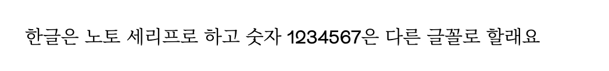

# 개요

프론트 엔드 개발을 하다 보면 하나의 태그에 묶여 있는 텍스트에 조건부로 글꼴이나 글꼴 크기, 굵기를 달리 해야 하는 경우가 있다.

```html
<div>한글은 노토 세리프로 하고 숫자 1234567은 다른 글꼴로 할래요</div>
```

위의 예를 들면 하나의 `div` 안에 텍스트가 들어 있고, 한글은 노토 세리프, 숫자는 다른 글꼴로 해야 하는 경우이다.

이는 `@font-face` 지시어를 활용하여 구현할 수 있다.

# @font-face

`@font-face` 의 속성 중 **unicode range** 속성을 사용하여 구현할 수 있다.

`unicode-range` 속성은 글꼴에서 유니코드의 범위를 지정하여 그 범위에 해당하는 폰트만 지정한 속성을 적용한다.

자주 사용되는 유니코드는 아래와 같다.

```
전체 : U+0020-007E

특수문자 : U+0020-002F, U+003A-0040, U+005B-0060, U+007B-007E

영문 : U+0041-005A(대문자), U+0061-007A(소문자)

숫자 : U+0030-0039
```

이 범위를 사용해 css 에 적용해보면 아래와 같이 적용할 수 있다.

```
@font-face {
	font-family: <a-remote-font-name>
	src: <source> [, <source>]*;
	[font-weight: <weight>];
	[font-style: <style>];
   }
```

<br>

- `<a-remote-font-name>` : font 속성에서 폰트명(font face)으로 지정될 이름을 설정한다.
- `<source>` : 원격 폰트(remote font) 파일의 위치를 나타내는 URL 값을 지정하거나, 사용자 컴퓨터에 설치된 폰트명을 local("Font Name")형식으로 지정하는 속성이다.
- `<weight>` : 폰트의 굵기(font weight) 값.
- `<style>` : 폰트 스타일(font style) 값.

개요에 말한 예시를 위 코드에 적용해보면 아래와 같다.

```css
@font-face {
  font-family: 'NotoSerifKR';
  src: url('/fonts/NotoSerifKR-Light.otf') format('opentype');
  font-style: 400;
}
@font-face {
  font-family: 'NotoSerifKR';
  src: url('/fonts/RebondGrotesque-Regular.otf') format('opentype');
  font-style: 400;
  unicode-range: U+0030-0039;
}
```

위 코드를 풀어보자면 아래와 같다.

첫 번째 `font-face` 는 기본적인 글꼴을 정한다. 기본 값으로 노토 세리프를 지정해준 것이다.

두 번째 `font-face` 는 `unicode-range` 가 `U+0030-0039` 인 텍스트, 즉 숫자 텍스트 만 `RebondGrotesque-Regular` 폰트로 바꾸는 것이다.

이를 개요에 이야기한 예시에 적용해보면 아래와 같다.

```html
<div class="demo">
  한글은 노토 세리프로 하고 숫자 1234567은 다른 글꼴로 할래요
</div>
```

```css
.demo {
  font-family: 'NotoSerifKR';
}
```

위와 같이 적용하면 한글 텍스트는 노토 세리프, 숫자 텍스트는 `RebondGrotesque-Regular` 로 바뀔 것이다.

<figure>

<figcaption>Fig 1. 조건부 폰트 속성이 적용된 div 태그</figcaption>
</figure>

### Reference

- <a href="https://jineecode.tistory.com/104" target="\_blank" rel="noopener">참고한 블로그</a>
