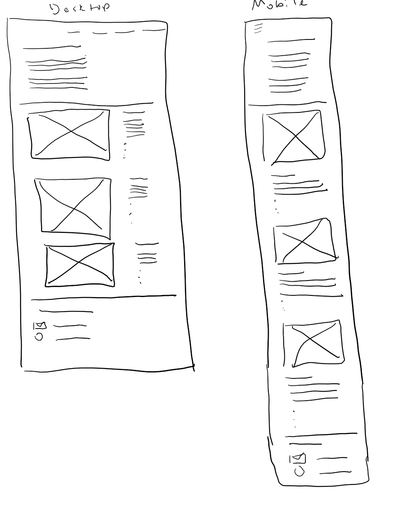

# 와이어프레임 (Wireframe)

웹 또는 앱을 개발할 때, 레이아웃의 뼈대를 그리는 단계를 와이어프레임<sup id="user">[[1]](#user-ref)</sup>이라 한다.

이 레이아웃을 기반으로 HTML로 구조를 잡고, HTML 태그에 CSS를 적용해 시각화를 수행한다.

이 와이어프레임은 직접 손으로 노트에 스케치하듯 그릴 수 있고, 파워포인트로 만들 수 있고, `Figma`를 통해 만드는 등 정해진 방법은 없다.

<figure>

<figcaption>Fig 1. 와이어프레임</figcaption>
<figcaption>왕도는 없다!</figcaption>
</figure>

### CSS 선택자(Selector)

CSS엔 여러가지 셀렉터가 있지만, 후손 셀렉터와 자식 셀렉터와의 차이를 잘 구분해야 한다.

이름 그대로, 후손 셀렉터는 부모의 자식, 손자, 증손자,,, 등 모든 요소를 포함한다.
반면에 자식 셀렉터는 부모의 자식, 단 하나의 셀렉터이다.

```html
<div class="container">
  <header>
    <h1>title</h1>
  </header>
  <ul>
    <li>list</li>
    <li>list</li>
  </ul>
</div>
```

위의 예시로 보면 `container`라는 클래스의 `div`의 자식은 `header` , `ul`이 된다.
후손은 `h1`,`li`가 된다.<br>
들여쓰기로 쉽게 확인할 수 있다. `h1`의 부모는 `header`이며, `h1`은 `div`에게 손자가 된다.

만약 CSS로 `li`의 배경색을 지정하고자 할 땐, 자식 선택자가 아닌 후손 선택자로 지정해야 한다.

```css
.container li {
  background-color: #000;
}
```

`header`의 여백을 주고자할 땐, 자식 선택자를 지정해야 한다.

```css
.container > header {
  margin: 50px;
}
```

이와 같이 후손 선택자와 자식 선택자의 차이는 `' '` 공백과 `>` 화살표로 구분할 수 있다.

### Flex Box

웹 페이지의 화면을 늘렸다 줄였다 할 때마다 블록들의 구성이 페이지의 사이즈에 맞게 자리잡는, 반응형 웹을 만들기 위해 CSS의 `flex` 속성이 필요하다.

```html
<ul class="container">
  <li>box 1</li>
  <li>box 2</li>
  <li>box 3</li>
</ul>
```

부모 요소에 `display:flex`를 선언하면 부모 요소 내 모든 item들은 `flex item`이 되어 부모 요소의 크기와 위치에 따라 자신의 위치를 변경할 수 있다.

```css
.container {
  display: flex;
}
```

디폴트 정렬 방향은 가로 방향이며, 정렬 방향을 세로로 변경하려면,

```css
.container {
  display: flex;
  flex-direction: column;
}
```

`flex-direction`속성을 추가한다.
그리고 요소들의 정렬, 즉 `li`들을 가운데 정렬할 지, 박스의 맨 위로 보낼지, 간격을 동일하게 배치할 것인지 등을 정렬할 수 있다.

```css
.container {
  display: flex;
  flex-direction: column;
  justify-content: center;
  // flex-direction 방향에 따라 정렬(column이면 세로축 기준 정렬)
  align-items: stretch;
  // flex-direction 방향의 반대쪽(column이면 가로축 기준 정렬)
}
```

이 외에 자식 요소에 `flex`속성을 할당해 가로 세로 크기 비율을 조절할 수 있다.

### Notes

<small id="user-ref"><sup>[[1]](#user)</sup>페이지 회로도 또는 화면 청사진이라고도하는 웹 사이트 <a href="https://en.wikipedia.org/wiki/Website_wireframe" target="_blank" rel="noopener">와이어프레임(Wireframe)</a>은 웹 사이트의 골격 프레임 워크를 나타내는 시각적 가이드이다. 와이어 프레임은 특정 목적을 가장 잘 달성하기 위한 요소를 배열하여 만들어진다</small>

### Reference

- <a href="https://en.wikipedia.org/wiki/Website_wireframe" target="_blank" rel="noopener">와이어프레임(Wireframe)</a>
- <a href="https://youtu.be/qm0IfG1GyZU" target="_blank" rel="noopener">Flex Box 가이드 영상</a>
