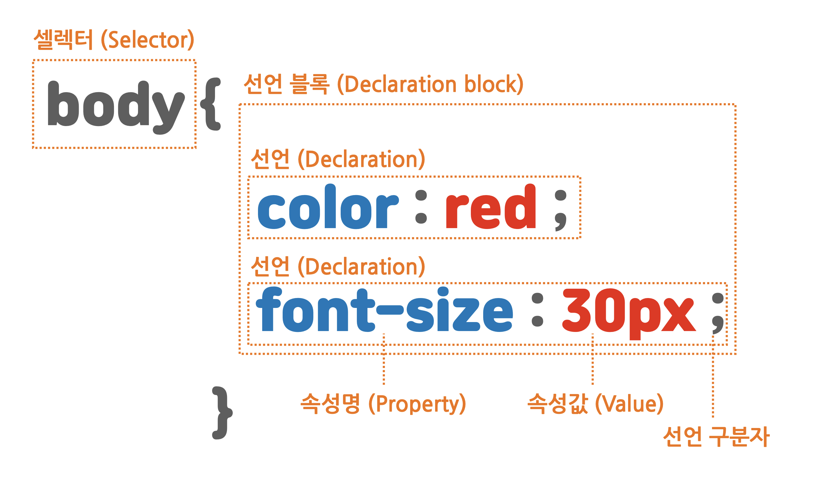
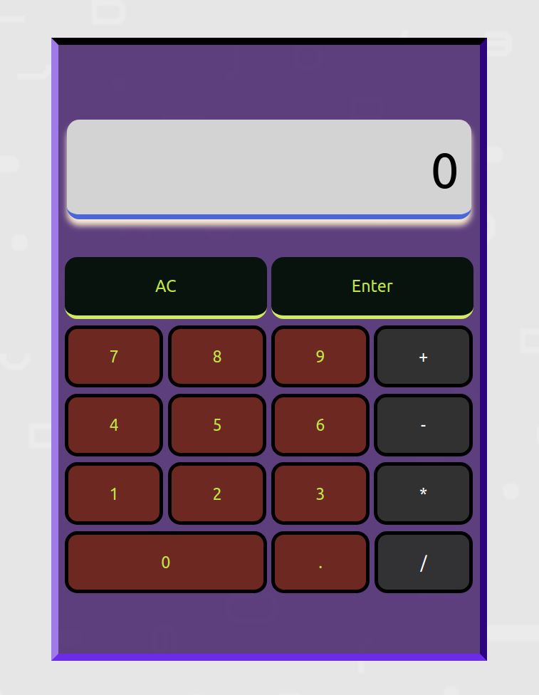

# CSS

**종속형 시트** 또는 <a href="https://ko.wikipedia.org/wiki/CSS" target="_blank" rel="noopener">_캐스케이딩 스타일 시트(Cascading Style Sheets, CSS)_</a>는 마크업 언어가 실제 표시되는 방법을 기술하는 스타일 시트 언어로, HTML과 XHTML에 주로 쓰이며, XML에서도 사용할 수 있다.

W3C의 표준이며, 레이아웃과 스타일을 정의할 때의 자유도가 높다.

예를 들어, HTML로 구현한 header 섹션의 배경 색을 바꾸고 싶다거나, 글자 색 또는 크기를 바꾸고 싶다거나, 마우스 커서로 클릭할 때 어떤 애니메이션을 연출하고 싶을 때 CSS로 구현할 수 있다.

<figure>

<figcaption>Fig 1. CSS는 정말 어려운 것...</figcaption>
</figure>

<figure>

<figcaption>Fig 2. CSS의 구성요소</figcaption>
</figure>

**셀렉터(선택자)**는 기존에 우리가 HTML로 선언한 요소의 이름이다. 이 요소를 꾸미기 위해 해당 요소를 선택한 것이다.

**선언 블록({ })**엔 변화를 줄 방법들을 표기한다.
그 방법을 **선언**이라 하며, 선택 요소를 꾸밀 방법인 **속성명(property)**와 **속성값(value)**로 구분한다.

복수의 선언이라면, 세미콜론(;)으로 구분할 수 있다.
위 그림에선 색상과 글자 크기라는 속성명이 명시되어 있다.

### 자주 사용되는 속성

CSS는 몇가지 자주 사용되는 속성이 있다. 그 빈도는 모든 웹페이지의 요소요소마다 사용될 수 있다.

#### background

선택자의 배경을 지정할 수 있다.

```css
header {
  background-color: darkgray;
}
```

프리셋으로 설정된 색을 지정할 수 있고, `#fff` (흰색) 과 같이 HTML <a href="https://html-color-codes.info/Korean/" target="_blank" rel="noopener">_색상 코드_</a>를 사용할 수 있다.

```css
header {
  background-color: #aaa;
}
section {
  background-image: url(11.jpg);
}
```

`background-image` 속성으로 배경에 이미지도 삽입할 수 있다.

삽입한 이미지의 크기 또는 지정한 선택자의 크기에 따라 이미지는 반복되어 나타낼 수도 있고, 반복하지 않음, 또는 위치를 지정할 수 있다.

```css
header {
  background-color: #aaa;
}
section {
  background-image: url(11.jpg);
}
footer {
  background: url(11.jpg) no-repeat center;
}
```

#### width, height

영역의 가로 길이와 세로 길이를 의미한다.
해당 속성은 텍스트로 취급되는 요소(text, img 등)엔 적용되지 않는다.

```css
header {
  background-color: #aaa;
  width: 100%;
  height: 100px;
}
section {
  background-image: url(11.jpg);
  width: 1000px;
  height: 400px;
}
footer {
  background: url(11.jpg) no-repeat center;
  width: 100%;
  height: 300px;
}
```

#### margin, padding

`margin`은 바깥 여백, `padding`은 안쪽 여백을 의미한다.
지정하는 방식에 따라 상하좌우 개별적으로 지정할 수 있다.

`margin : auto` 를 통해 지정한 블록을 화면의 가운데로 정렬할 수 있다.

이 외에도, 텍스트 정렬, 블록 테두리, 배경 색 그래디언트, 마우스 커서 상호작용 등이 있다.

### 계산기

앞서 첫째 주에 배웠던 `Javascript` 기초를 바탕으로, `HTML`과 `CSS`를 섞어 계산기를 만들어 보았다.

HTML 문서엔 각 계산기의 버튼 별 역할을 수행할 `div`를 설정하고,
CSS로는 계산기의 스타일(배경 색, 글자 크기 등)을 설정, 추가적으로 마우스 커서 상호작용도 구현했다.

동적인 계산기능 구현을 위해, `Javascript`로 각 기능별 역할을 정의했다.

<figure>

<figcaption>Fig 3. 계산기...?</figcaption>
</figure>

미적 감각이 떨어지는 것 같다...

만들어보면서 느꼈던 점은, 기능 구현은 기본! 사용자로 하여금 더 친숙하고 완성도 있게 다가가기 위해선 디자인적 요소가 굉장히 중요하단 것을 깨달았다.

이것저것 더 만져보면서 완성도있는 결과물을 만들도록 노력해야겠다.

### Reference

- <a href="https://ko.wikipedia.org/wiki/CSS" target="_blank" rel="noopener">캐스케이딩 스타일 시트(Cascading Style Sheets, CSS)란?</a>
- <a href="https://html-color-codes.info/Korean/" target="_blank" rel="noopener">HTML 색상 코드</a>
