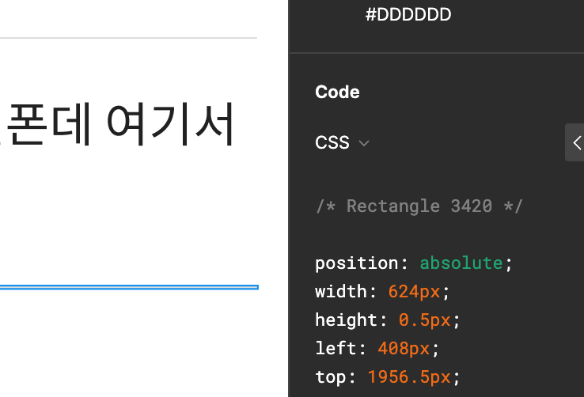
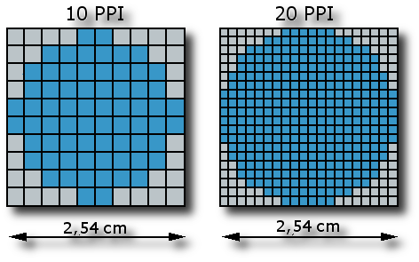
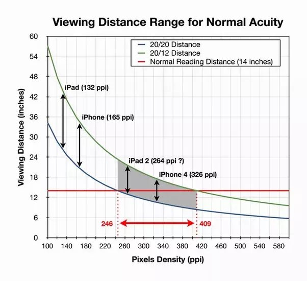
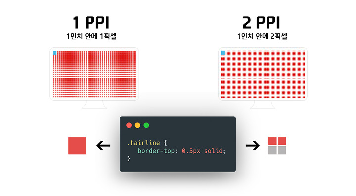

# 1px 보다 얇게 부탁드립니다.

프론트 엔드 개발자로 일을 하면서 기획 팀, 디자인 팀 등 다양한 팀과 협업을 한다.

협업 과정에서 사소한 갈등이 발생할 수 있는데, 예를 들면 다음과 같다.

디자인 팀에서 개발 팀으로 넘어온 피그마 디자인으로 개발을 수행해야 하는데, 박스의 외곽선이 1px이 미만일 때, 0.5px일 때가 왕왕 있다.

<figure>

</figure>

<br>

# 불가능

다소 난감한 경우이다. 대부분의 웹 브라우저는 1px 미만의 얇은 선을 그리는 것은 불가능하다. (파이어폭스 브라우저는 예외라고 함.) 그러나 이 디자인 시안을 받고 다짜고짜 안된다 하는 것은 또 그렇다.

디자인 팀 입장에서는 이 선 하나 그리는게 그렇게 어려운 일인가 생각이 들기도 할 것이고, 프로덕트의 톤앤 매너 자체가 얇은 선을 사용하는 것을 선호하는 경우도 있을 것이다. 또한 이런 디자인 하나하나 디자이너의 철학이 녹아들어있을 것이기 때문에 무작정 거부할 순 없다.

왜 브라우저는 1px 보다 얇은 선을 그리지 못할까?

# 픽셀 밀도(Pixel Density)

이유는 픽셀 밀도 때문이다.

<figure>

</figure>

픽셀 밀도란, 1 인치 영역에 **물리적으로** 표현 가능한 픽셀 수를 의미한다. 데스크탑 모니터, 스마트폰, 태블릿 등 디지털 기기 화면의 픽셀 밀도는 PPI(Pixel Per Inch) 단위로 측정한다. 즉, 디지털 기기가 지원하는 픽셀 농도에 따라 최소 표현 가능한 픽셀 개수가 변경된다.

<figure>

</figure>

위 그림을 예로 들면 1 PPI 의 화면에서는 최소 픽셀 갯수가 1개이다.

1px 보다 얇은 선을 화면에 그리려면 최소한 2 PPI 를 지원하는 디지털 기기여야 한다. 이는 <a href="https://ko.wikipedia.org/wiki/%EB%A0%88%ED%8B%B0%EB%82%98_%EB%94%94%EC%8A%A4%ED%94%8C%EB%A0%88%EC%9D%B4" target="\_blank" rel="noopener">레티나 디스플레이</a> 또는 고해상도 디스플레이로 불리는 화면에서 가능하다. 2 PPI 부터 1 인치 안에 표현 가능한 픽셀 수가 나뉘어지기 때문이다.

<figure>

</figure>

쉽게 말해 1 PPI 는 1 인치 안에 1 픽셀이 그려지며, 2 PPI 는 1 인치 안에 2 픽셀이 그려진다. 즉, 1 PPI 에서 0.5px 은 1px 로 보여지며, 2 PPI 에서는 0.5px로 얇게 표현된다.

그래서 우리는 무작정 디자이너에게 안된다고 말하지 말고, 위와 같은 근거를 들어 이야기해줘야 한다.

- 픽셀 밀도에 따라 1px 미만의 선을 그릴 수 없을 수도 있다.
- 모바일 환경과 달리 데스크탑 환경의 대부분은 1 PPI 밀도가 사용된다.
- 디자인 보다 디자인이 구현될 환경을 먼저 이해해야 한다.

# 가능하다.

그럼에도 불구하고 적용해야할 때가 있다. 안된다고만 이야기하는 건 옳은 개발자가 아닐 수 있다. **이런 사소한 것도 못한다고?** 라고 속으로 생각할 수 있고, 앞으로의 협업에서 갈등이 발생할 수 있다.

픽셀의 수치를 조절하는 것으로는 불가능 하지만 그 외에도 다양한 방법이 있다.

1. 스케일링(scale) 활용
2. 불투명도(opacity) 활용

### 스케일링 활용

css엔 `transform` 속성이 존재한다. 1px 의 박스를 그리고 그 박스를 세로로 축소하면 화면에 그려낼 수 있다.

예를 들어 1px을 0.5px 로 보이도록 하려면 아래와 같이 사용할 수 있다.

```html
<div class="demo">
  0.5px
  <div class="line w0_5" role="presentation"></div>
</div>
```

```css
.line {
  width: 200px;
  margin-bottom: 50px;
  border-bottom: 1px solid;
}

.w0_5 {
  transform: scaleY(0.5); /* 1px × 0.5 = 0.5px */
}
```

위 방법의 장점은 사용법이 매우 간단하다. 단순히 세로로 축소한 것이다.

단점으로는 선을 그리기 위한 불필요한 마크업이 추가된다. 그리고 실제 크기는 1px과 동일하며, 단지 반투명하게 표시하는 착시를 이용하는 방법이다.

이를 보완하는 방법으로는 표현(presentation)임을 `role` 속성을 사용하여 명시한다. 그리고 의미를 갖지 않으므로 가상 요소(`::before` , `::after`)를 사용하여 표현한다.

### 불투명도 활용

css 의 `opacity`를 활용한 방법이다. 실제로는 1px 이지만 선을 뿌옇거나 흐리게 표현하여 크기를 작거나 멀리 있는 것처럼 착시를 일으키는 방법이다. 색이 진한 사물은 앞으로 돌출되어 보여 더 커보이고, 색이 연한 사물은 더 작아보이는 착시를 이용한 방법이다.

```html
<div class="demo">
  0.5px
  <div class="line w0_5" role="presentation"></div>
</div>
```

```css
.line {
  width: 200px;
  margin-bottom: 50px;
  border-bottom: 1px solid;
}

.w0_5 {
  opacity: 0.5;
}
```

이 방법도 위와 동일하게 사용하기 매우 간단하다는 장점이 있다. 그러나 위와 같이 착시를 이용한 트릭이라는 단점이 있다. 보완 방법도 위와 동일하게 표현(presentation)임을 `role` 속성을 사용하여 명시한다. 그리고 의미를 갖지 않으므로 가상 요소(`::before` , `::after`)를 사용하여 표현한다.

이 외에도 선형 그래디언트(Linear Gradient)를 활용하여 반은 투명, 반은 색을 채워 그려내는 방법도 있고, css 의 `box-shadow` 를 이용해 그림자의 위치와 `blur` , `spread` 등을 활용한 방법도 있다.

이 방법들은 화면에 그려지는 선이 실제 1 px 보다 얇은 선이지만 각각 단점이 있다.

나는 프로덕트에 첫 번째 방법을 사용하여 1픽셀 보다 얇은 선을 구현했다.

### Reference

- <a href="https://brunch.co.kr/@euid/6" target="\_blank" rel="noopener">참고한 블로그</a>
- <a href="https://ko.wikipedia.org/wiki/%EB%A0%88%ED%8B%B0%EB%82%98_%EB%94%94%EC%8A%A4%ED%94%8C%EB%A0%88%EC%9D%B4" target="\_blank" rel="noopener">레티나 디스플레이</a>
