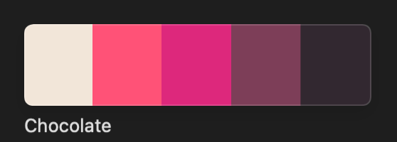

앞으로 혼자 공부를 해오면서, 또 일을 해오면서 내가 마음에 들었던 색 배합을 조합하여 포스팅을 해보려고 한다. 디자인적인 감각은 사실 많이 떨어지지만 하다보면 또 늘지 않을까..? 싶기도 하기 때문에 !!!

# 체리초콜릿

<figure>

<figcaption>체리초콜릿</figcaption>
</figure>

블로그 다크 모드의 배색에 사용한 배색이다.

다크 모드이지만, 그렇다고 너무 어둡지 않고 적당한 밝기가 있으며 따뜻한 느낌으로 색을 조합하고 싶었다. 여러가지 색을 맞춰보면서 현재 블로그의 다크 모드가 만들어졌고, 만들고 보니 뭔가 `체리초콜릿` 같은 느낌을 받아서 **내 멋대로** 이름을 지었다.

## 베이스 컬러 (기조색) #`322830`

베이스 컬러는 배색 색상 중 면적이 넓어 기조색을 메인 컬러로 표현한다. 색의 수가 적은 배색에선 베이스 컬러가 전체의 인상을 지탱한다.

<figure>

<figcaption>Hex Color <b>#322830</b></figcaption>
</figure>

블로그의 배경 색에 사용된 색이며, 가장 넓은 면적을 차지하는 색이다. 이 색을 고르는 데에 정말 시간이 오래 걸렸다...💦

다크 모드이면서 또 너무 어둡지도 않고, 그렇다고 다크 모드인데 밝아서 눈을 찌푸려선 안되기 때문에, 그리고 **초콜릿**의 느낌을 주기 위해 선택했다.

## 서브 컬러 (보완색) #`f2e6d9` #`7d3e58`

베이스 컬러와 조합해 이미지와 뉘앙스를 표현하는 보완적 역할을 한다. 서브 컬러라 해서 부차적이라는 의미가 있지만, 중요한 역할을 한다.

<figure>

<figcaption>Hex Color <b>#f2e6d9</b></figcaption>
</figure>

<figure>

<figcaption>Hex Color <b>#7d3e58</b></figcaption>
</figure>

블로그의 본문 텍스트의 색상과 백틱으로 처리한 코드 블럭을 표현할 때 사용한 색상이다. 배경 색 다음으로 가장 많이 보이는 색이며, 밝은 색은 초콜릿에 음각 또는 양각 처리 된 색을 표현하고자 했고, 어두운 핑크색은 초콜릿이지만 체리가 첨가되어 붉은 빛을 띄는 느낌을 주고자 선택했다.

## 악센트 컬러 (강조색) #`dd287c` #`ff5277`

다른 배색 색상에 비해 적게 사용하지만 전체를 끌어내거나, 하이라이트 효과로 주의를 끌어 변화를 주도하는 색이다. 베이스 컬러와 서브 컬러에 비해 콘트라스트가 높고 눈에 띄는 색을 보통 채용한다.

<figure>

<figcaption>Hex Color <b>#dd287c</b></figcaption>
</figure>

<figure>

<figcaption>Hex Color <b>#ff5277</b></figcaption>
</figure>

첫 번째 색은 블로그 포스트의 태그 영역의 텍스트 색상이다. 가장 적게 사용된 색이며, 포스트의 최상단에서 보이는 것으로 칙칙할 수 있는 다크 모드에서 최대한의 대비를 주어 이목을 끌고, 체리초콜릿의 느낌을 내는 색을 선택했다.

두 번째 색은 포스트의 하이퍼링크 텍스트 색상이다. 첫 번째 색상보다 사용되는 빈도수는 많지만, 페이지 전체로 보면 적다. 체리초콜릿과 비슷한 색상으로 통일감을 주면서 톤으로 변화를 주어 전체적인 분위기를 해치지 않고 정리하기 위한 색[[1]](#user-ref)을 선택했다.

### Notes

<small id="user-ref">[[1]](#user)**도미넌트 컬러 배색** : 비슷한 색상으로 통일감을 주고 톤으로 변화를 주는 배색</small>
