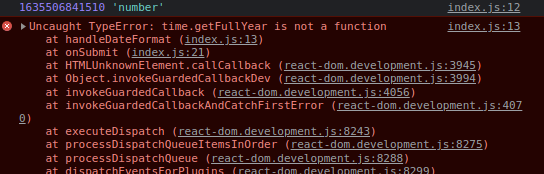
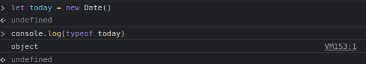

# 원인

`getFullYear()` 메소드를 실행하는 변수의 타입이 원인이었다.

```js
const [startDate, setStartDate] = useState(new Date())

const handleDateFormat = (time) => {
  console.log(time, typeof time)
  const year = time.getFullYear()
}

const onSubmit = (event) => {
  event.preventDefault()
  const newStartDate = handleDateFormat(startDate)
}
```

날짜를 선택하고 그 범위에 해당하는 리소스를 조회하기 위한 코드를 간략화했다.

글의 제목과 같은 오류를 맞닥뜨렸고, 구글링한 결과 원인은 `getFullYear()` 메소드가 실행되는 변수의 타입이었다.

<figure>

<figcaption>Fig 1. 오류 화면</figcaption>
</figure>

<figure>

<figcaption>Fig 2. Date 객체의 타입</figcaption>
</figure>

`new Date()` 로 만들어지는 날짜 객체의 타입은 `object`여야 하는데, `number`로 인식하여 `getFullYear()` 메소드가 실행되지 않은 것이었다.

### 해결 방법

```js
const [startDate, setStartDate] = useState(new Date())

const handleDateFormat = (time) => {
  console.log(time, typeof time)
  const year = time.getFullYear()
}

const onSubmit = (event) => {
  event.preventDefault()
  const newStartDate = handleDateFormat(new Date(startDate))
}
```

간단했다. 기존에 선언했던 `startDate` 변수에 할당한 값은 `Date` 객체이지만, 밀리세컨드로 바뀐 숫자가 콘솔에 찍혔다. 이 밀리세컨드를 `new Date()` 생성자의 `value`로 하여 생성하면 오류를 해결할 수 있었다.

타입의 중요성에 대해 더 생각해봐야 생각했고, 이 기회를 통해 타입스크립트도 배워보고 싶다고 생각했다.

### Reference

- <a href="https://stackoverflow.com/questions/4929382/javascript-getfullyear-is-not-a-function" target="_blank" rel="noopener">getFullYear() is not a function - stackoverflow</a>
