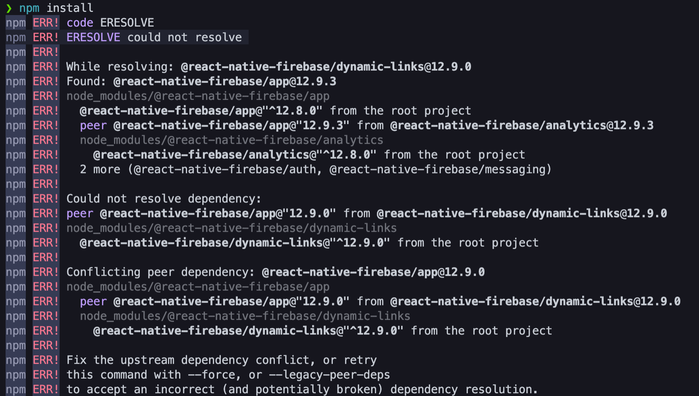

# 해결 방법

<figure>

<figcaption>Fig 1. 오류 상세</figcaption>
</figure>

`npm`과 `node` 버전을 업데이트 한 이후로, `npm install`을 하면 위와 같은 에러를 마주했다.

에러 메세지에 나타난 대로 커맨드라인 명령어를 수정하니 정상적으로 작동했다.

```cli
npm install --legacy-peer-deps
```

# 원인

프로젝트 디렉토리의 `node_modules`에 **@react-native-firebase/app@12.9.3**이 설치되어 있는데 `npm install` 을 입력하면 **@react-native-firebase/dynamic-links@^12.9.0**를 설치하게 되어 버전 충돌이 일어나서 위와 같은 에러가 발생했다.

**@react-native-firebase/dynamic-links@12.9.0** 이 설치되어야 에러가 발생하지 않는 듯 하다.
`package.json` 을 수정해도 될 것 같지만 (시도해보지 않았다.) 에러 메세지 상의 해결 방법이 두 가지 나와있어 그 중 하나로 해결했다.

알고 보니, `npm` 버전이 **7** 이상인 경우 **peer dependencies**<sup id="user">[[1]](#user-ref)</sup>가 있으면 설치가 되지 않는다. 이전 버전에선 **peer dependencies**가 있어도 **경고만 뜨고** 설치는 되었다. 그래서 `npm` 버전을 업데이트 한 후에 에러가 발생한 것이다.

## `--legacy-peer-deps` 와 `--force` 의 차이

두 가지 해결 방법의 차이가 무엇인지 궁금했다. 차이점은 아래와 같다.

- `--force`는 충돌을 우회한다.
- `--legacy-peer-deps`는 충돌을 무시한다.(`npm` 4-6버전과 비슷한 방식)

즉, `--force`는 `package-lock.json`에 몇 가지 다른 의존 버전들을 추가한다. `--legacy`는 `peerDependencies`가 맞지 않아도 무시하고 일단 설치한다.

### Notes

<small id="user-ref"><sup>[[1]](#user)</sup>**peerDependencies** : 일반적으로 dependency는 내가 만든 모듈에서 사용하는 패키지들을 지정하는 반면, `peerDependencies`는 반대로 내가 만든 모듈이 다른 모듈과 함께 동작할 수 있다는 **호환성**을 표시한 것이다.</small>

### Reference

- <a href="https://programmingsummaries.tistory.com/385" target="_blank" rel="noopener">package.json에 대하여</a>
- <a href="https://velog.io/@yonyas/Fix-the-upstream-dependency-conflict-installing-NPM-packages-%EC%97%90%EB%9F%AC-%ED%95%B4%EA%B2%B0%EA%B8%B0" target="_blank" rel="noopener">npm install ---force and ---legacy-peer-deps 차이점</a>
