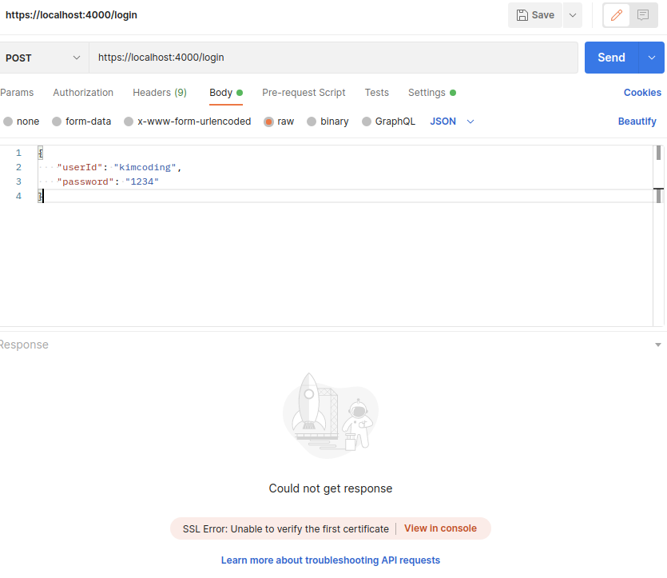
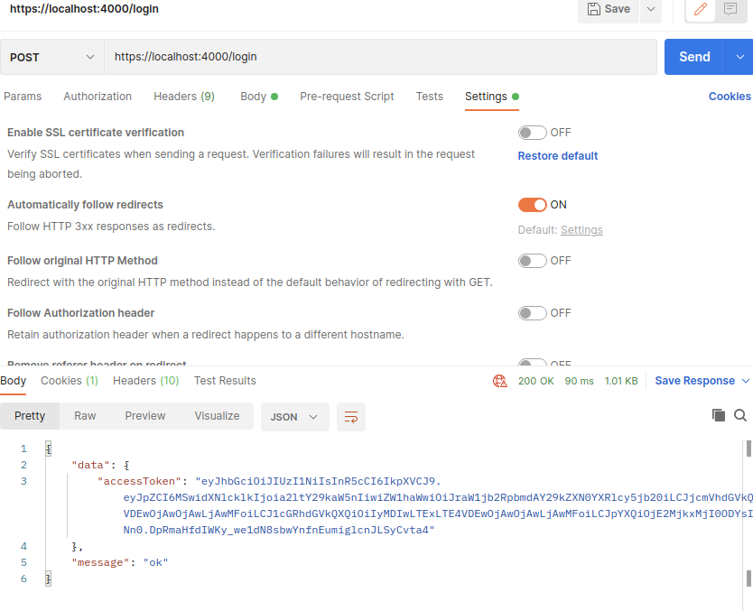

# 원인

<figure>

<figcaption>Fig 1. 오류 화면</figcaption>
</figure>

`POSTMAN`으로 서버 구현을 테스트할 때 HTTPS 응답을 받지 못하는 에러가 있었다.

**SSL Error: Unable to verify the first certificate**

`mkcert`로 생성한 키를 verify하지 못한다는 에러인 것 같다.

<figure>

<figcaption>Fig 2. 해결 화면</figcaption>
</figure>

`POSTMAN`의 Setting 탭으로 이동 후

**SSL certificate verification** 탭을 OFF로 전환한 다음 요청을 보내면 원활하게 응답을 받을 수 있다.
