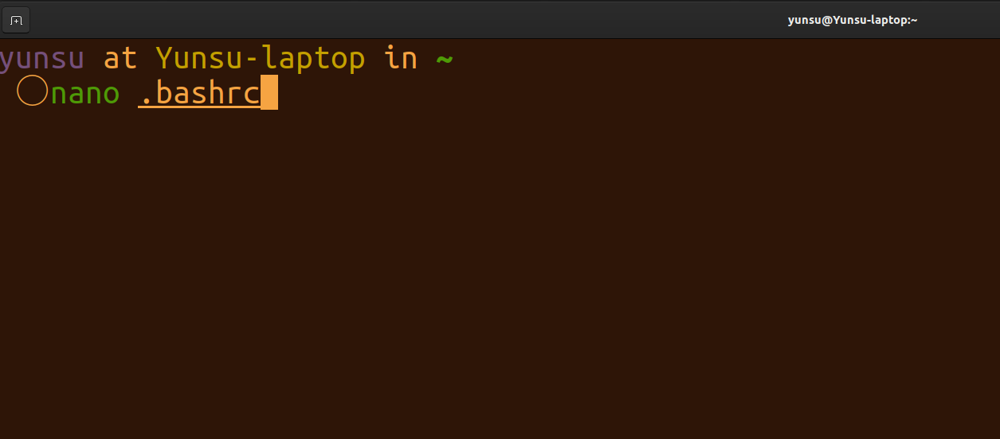
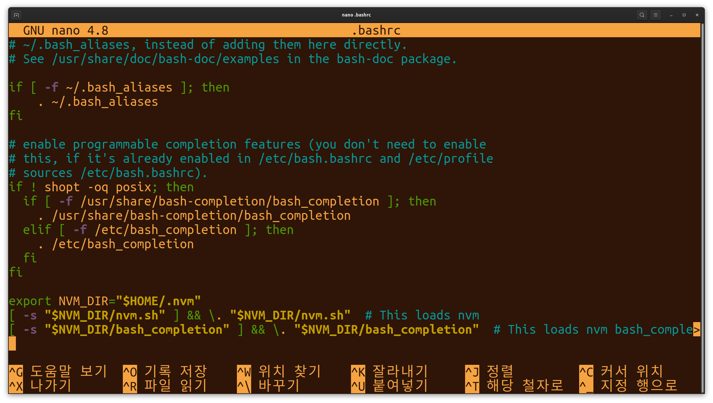
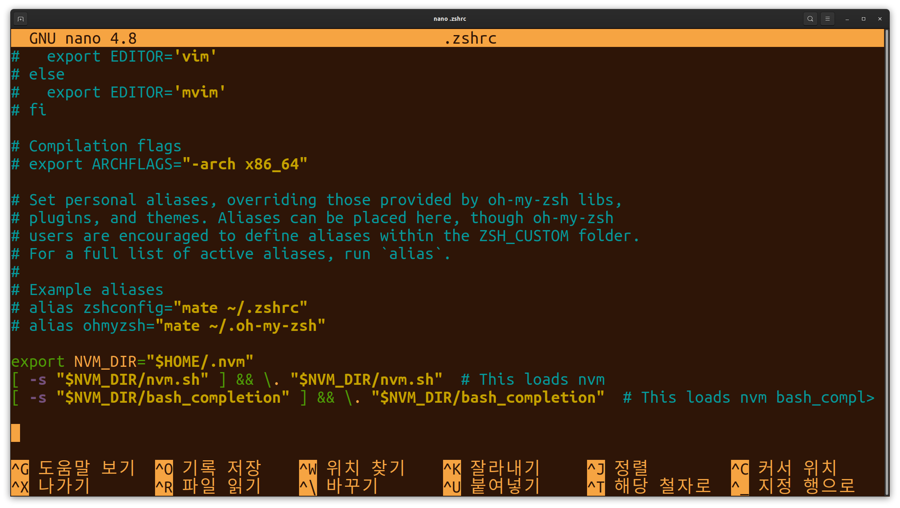
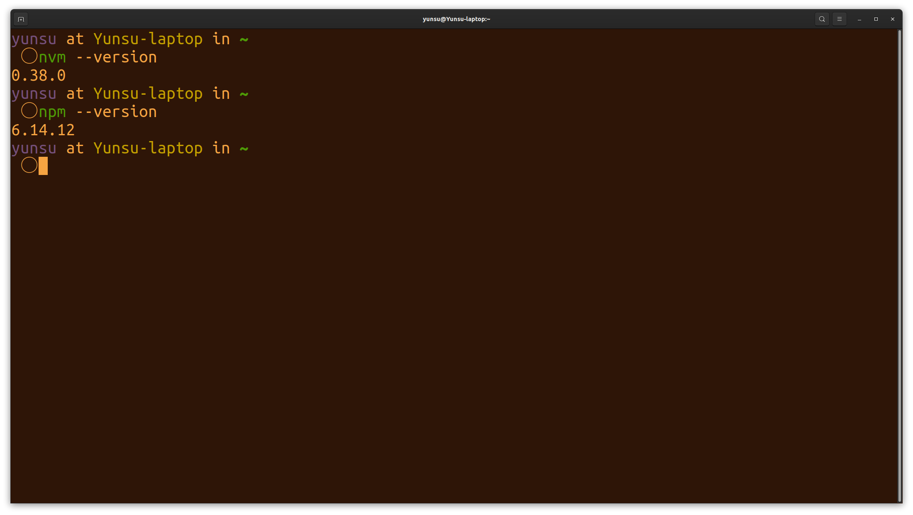

# 원인

아무것도 모르고 우분투 설치 가이드를 쫓아만 가다보니, 터미널의 쉘이 `bash`로 설치되어 있었다.
그 `bash`로 `nvm`도 설치하고, 코딩도 하고, 이것저것 많이 하다가 터미널 환경을 꾸며보고 싶단 생각을 하게 됐다.

<a href="https://github.com/ohmyzsh/ohmyzsh
" target="_blank" rel="noopener">_oh-my-zsh_</a> 라는 걸 알게 되었고, 쉘을 `zsh`로 당장 바꿔버렸다.

**띠용...** `nvm` 명령어 및 `npm` 명령어 등 노드 관련 명령어를 입력하면

```cli
zsh: command not found
```

와 같은 에러 메시지가 떴다...

구글링 결과, 원인은

**`bash` 쉘에서 설치된 `nvm`으로 `node`를 정상적으로 인식하지만, `zsh` 쉘에선 `node`를 인식하지 못하는 것 !**

`zsh` 쉘이 `node`가 설치된 경로를 알 수 있도록 변경했다.

### 해결 방법

먼저 `bash` 쉘에서 `nvm` 또는 `npm` 등을 설치했다면, `.bashrc` 를 통해 관련 경로를 확인할 수 있다.

<figure>

<figcaption>Fig 1. 해결 방법 1</figcaption>
</figure>

`nano` 에디터를 쓰고 있기 때문에, 위와 같이 터미널에 `nano .bashrc`를 입력 후

<figure>

<figcaption>Fig 2. 해결 방법 2</figcaption>
</figure>

`.bashrc`의 맨 아래를 보면,

```bash
export NVM_DIR="$HOME/.nvm"
[ -s "$NVM_DIR/nvm.sh" ] && \. "$NVM_DIR/nvm.sh"  # This loads nvm
[ -s "$NVM_DIR/bash_completion" ] && \. "$NVM_DIR/bash_completion"  # This loads nvm bash_completion>
```

이 부분을 확인할 수 있다.

**`bash` 쉘에서 `nvm`을 불러와 `node`를 인식하게 해주는 코드**이다.

이 코드를 `zsh` 쉘에도 적용을 해주면 끝!

위 코드를 복사해서

`nano .zshrc`를 입력하고 에디터에 진입한다.

<figure>

<figcaption>Fig 3. 해결 방법 3</figcaption>
</figure>

`.zshrc`의 맨 아랫 부분에 복사해놓은 코드를 붙여넣기 후, 저장 후 종료한다.

**터미널을 반드시 종료했다 켜고, `zsh` 쉘에서 `nvm` 및 `npm`의 버전을 확인한다.**

<figure>

<figcaption>Fig 4. 해결 방법 4</figcaption>
</figure>

정상적으로 버전을 확인할 수 있다.

### Reference

- <a href="https://github.com/ohmyzsh/ohmyzsh
  " target="_blank" rel="noopener">oh-my-zsh 설치 방법</a>
