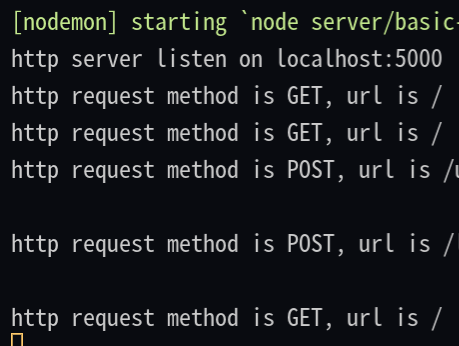

# Express.js

**Express.js**는 Node.js를 위한 빠르고 개방적인 간결한 웹 프레임워크다.

Node.js만을 사용한 경우, `HTTP` 요청, 쿠키 파싱, 세션 관리, 라우팅 등 위 같은 작업들은 동일한 코드를 지속적으로 작성해야한다. Express.js는 이러한 문제를 각종 라이브러리와 미들웨어를 통해 해결할 수 있고 동시에 웹 앱에서 `MVC` 패턴의 구조를 제공한다.

쉽게 말하자면, **Express.js는 Node.js를 사용하여 쉽게 서버를 구성할 수 있게 만든 클래스와 라이브러리의 집합**이다.

Express.js는 `Javascript`에서 인기있는 프레임워크 4가지(MongoDB, Express, React, Node) 중 하나에 속하는 프레임워크이다.
Node.js 환경에서 웹 서버 또는 API 서버를 제작하기 위해 사용되는 프레임워크 이다.

Node.js 환경에서 HTTP 모듈로만 사용하는 것은 코드의 가독성이 떨어지며, 구현하기 귀찮은 작업들이 다소 있기 때문이다.

그렇다면, Express.js는 HTTP 모듈로 구현하는 것과 어떤 차이가 있길래 Express.js가 JS의 인기 프레임워크가 됐을까?

첫 번째로, `Middleware`. **미들웨어 추가**가 편리하다.
두 번째로, **자체 라우터를 제공**한다.

## Middleware

**미들웨어**<sup id="user">[[1]](#user-ref)</sup>를 우리 일상에서 찾아보자면 **자동차 제작 공정**이 있다.

<figure>

<figcaption>Fig 1. 자동차 생산 제조 공정</figcaption>
<figcaption>프레스 - 차체조립 - 도장 - 의장조립 - 검사로 크게 나눌 수 있고, 모듈 세부적으로 들어가보면 주조 - 단조 - 소결 - 열처리 - 기계 가공 - 조립 등 나뉘어져 있다.</figcaption>
</figure>

**_완성차를 만들기 위한 일련의 흐름, 하나의 공정들을 미들웨어_**라고 생각할 수 있다.

한 마디로, 우리는 **온전한 서버를 구현하기 위해 그 서버에 필요한 여러 기능들을 미들웨어로 사용하고, 이 미들웨어의 작동은 항상 다음 미들웨어를 실행**한다.

- 모든 요청 / 응답에 대해 `CORS` 헤더를 붙여야 할 때 (반복적인 코드를 줄일 수 있다.)
- `POST`에 포함된 바디 데이터를 구조화할 때 (Node.js HTTP 모듈은 다소 복잡한 코드를 구성해야 했다.)
- 요청 헤더에 사용자 인증 정보가 담겨있는지 확인할 때

우리는 미들웨어를 사용할 수 있다.

### 모든 요청 / 응답에 대해 CORS 헤더를 붙일 때

작업 중인 디렉토리의 터미널에

```cli
$ npm install cors
```

를 입력해 설치하여 사용할 수 있다.

```js
const cors = require('cors')
// 설치한 cors 미들웨어를 가져옵니다.
...
app.use(cors())
// 모든 요청에 대해 CORS 헤더를 적용합니다.
```

위와 같이 반복적인 헤더 추가 작업을 거치지 않아 생산성을 향상할 수 있다.

### POST에 포함된 바디 데이터를 구조화할 때

`express.json()` 을 사용한다.
이 미들웨어의 기능은 수신 요청(`req`)를 `JSON` 페이로드로 구조화한다.
옵션 값을 어떻게 주는가에 따라 다양한 방법으로 사용할 수 있다.

사용해본 옵션은 아래와 같다.

|  옵션  |        기술        | 기본값 |
| :----: | :----------------: | :----: |
| strict | 배열과 객체만 허용 |  true  |

```js
const express = require('express')
const app = express();
const cors = require('cors');

app.use(cors());
app.use(express.json({strict: false}))
...
app.listen(5000);
```

위 처럼, 배열과 객체만 `JSON`으로 구조화 하는 것이 아니라, **false** 값으로 옵션을 주어 모든 타입의 데이터를 `JSON`으로 구조화를 했다.

### 요청 헤더에 사용자 인증 정보가 담겨있는지 확인할 때

이 미들웨어를 사용하면, 예를 들어 이미 로그인 한 사용자인 경우 다음 미들웨어를 실행하고,
아니라면 에러를 보내 회원 가입 페이지로 안내하거나, 로그인 페이지로 돌려보내거나, 접근을 차단할 수 있다.

```js
app.use((req,res,next) => {
	if(req.headers.token) {
		req.isLoggedIn = true;
		next()
	} else {
		res.status(400).send('invalid user')
	}
}
```

위 세 가지 예시에서 알 수 있는 부분은 미들웨어를 사용하는 데 그 안에 `next()`라는 다음 미들웨어를 실행하는 구문이 없다면, 그 미들웨어 함수 내에 `next()`가 내장되어있다는 것을 알 수 있다.

어떤 데이터를 `GET`으로 읽거나, `POST`로 추가하는 등 사용자가 어떤 작업을 수행하는지 실시간으로 판단하고자 할 때, 로그를 찍어 확인할 수 있다.

```js
const myLog = function (req, res, next) {
  let logText = 'http request method is ' + req.method + ', url is ' + req.url;
  console.log(logText);
  next();
};
app.use(myLogger);
```

<figure>

<figcaption>Fig 2. 로그 기록</figcaption>
</figure>

위와 같이 미들웨어 함수를 작성하고, `app.use()`로 실행하면 사용자의 요청 메소드와 요청 URL을 콘솔 창에서 확인할 수 있다.

위 로거(Logger)는 가장 단순한 미들웨어이며, 간단한 디버깅에 사용할 수 있다.

---

## Routing

**라우팅(Routing)**은 메소드와 URL로 분기점을 만드는 것이다.

클라이언트는 특정한 HTTP 요청 메소드(`GET`, `POST` 등)나 서버의 특정 URI 또는 경로로 HTTP 요청을 보낸다.
라우팅은 클라이언트 요청에 해당하는 **엔드포인트**와 **메소드**에 따라 서버가 응답하는 방법을 결정하는 것이다.

기존에 우리가 Node.js로 HTTP 모듈을 사용할 땐

```js
const requestHandler = (req, res) => {
  if (req.url === '/lower') {
    if (req.method === 'GET') {
      res.end(data);
    } else if (req.method === 'POST') {
      req.on('data', (req, res) => {
        // do something...
      });
    }
  }
};
```

위처럼 `if` 조건문을 사용해 구현할 수 있었다.

Express.js 에서 제공하는 라우터 기능을 사용하여 더 직관적인 코드를 작성할 수 있다.

```js
const router = express.Router();

router.get('/lower', (req, res) => {
  res.send(data);
});

router.post('/lower', (req, res) => {
  // do something
});
```

위 예시처럼 Route의 메소드 별, 경로 별로 핸들러 함수를 가질 수 있다.

```js
app.METHOD(PATH, HANDLER func);

```

핸들러 함수는 Route가 일치할 때 실행된다.

```js
const express = require('express');
const router = express.Router();

// middleware that is specific to this router
router.use(function timeLog(req, res, next) {
  console.log('Time: ', Date.now());
  next();
});
// define the home page route
router.get('/', function (req, res) {
  res.send('Birds home page');
});
// define the about route
router.get('/about', function (req, res) {
  res.send('About birds');
});

module.exports = router;
```

또한, 위처럼 `express.Router()`클래스를 사용해 경로 처리 모듈을 만들 수 있다.
`express.Router()`로 라우터 모듈을 생성하고, 그 안에 미들웨어 기능을 로드한다.

위 예시로 보면, 현재 시간을 console 창에 출력하는 미들웨어가 있고, `GET` 요청이 들어왔을 때, 그 경로에 따른 함수를 실행하는 미들웨어가 담겨져 있다.
이 라우터 모듈을 메인 앱에 마운트하여 재사용성이 증가된 라우터 모듈을 구현할 수 있다. 메인 앱의 목적은 각각 다를 것이고, 그 메인 앱의 루트 경로도 각각 다르기 때문이다.

---

### Notes

<small id="user-ref"><sup>[[1]](#user)</sup><a href="https://ko.wikipedia.org/wiki/%EB%AF%B8%EB%93%A4%EC%9B%A8%EC%96%B4" target="_blank" rel="noopener">미들웨어</a>는 양 쪽을 연결하여 데이터를 주고 받을 수 있도록 중간에서 매개 역할을 하는 소프트웨어, 네트워크를 통해서 연결된 여러 개의 컴퓨터에 있는 많은 프로세스들에게 어떤 서비스를 사용할 수 있도록 연결해 주는 소프트웨어를 말한다. 3계층 아키텍처에서 미들웨어가 존재한다. 웹 브라우저에서 데이터베이스로부터 데이터를 저장하거나 읽어올 수 있게 중간에 미들웨어가 존재하게 된다.</small>

### Reference

- <a href="https://ko.wikipedia.org/wiki/%EB%AF%B8%EB%93%A4%EC%9B%A8%EC%96%B4" target="_blank" rel="noopener">미들웨어란?</a>
