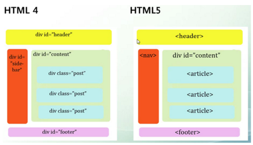

# HTML

HTML(HyperText Markup Language)는 웹 페이지의 뼈대를 구성하는 <a href="https://ko.wikipedia.org/wiki/%EB%A7%88%ED%81%AC%EC%97%85_%EC%96%B8%EC%96%B4" target="_blank" rel="noopener">_마크업 언어_</a>이다.

<figure>

</figure>

HTML은 새의 골격이 될 것이고, 그 골격을 바탕으로 꾸미는 작업을 수행한다. 이어 구성된 골격의 세세한 기능들이 서로 상호작용을 하여 비행할 수 있도록 JS로 숨을 불어넣는다.

### HTML5

우리가 지금 배우는 HTML은 HTML 5이다. 웹의 등장부터 지금까지 지속적으로 발전해온 **마크업 언어**이다.

최초의 HTML인 HTML 1.0은 **1991년** 유럽 입자 물리 연구소(CERN)의 물리학자이자 **웹의 아버지**로도 불리는 <a href="https://namu.wiki/w/%ED%8C%80%20%EB%B2%84%EB%84%88%EC%8A%A4%EB%A6%AC" target="_blank" rel="noopener">_팀 버너스 리_</a>가 **World Wide Web**을 발표하며 내놓은 버전이다.

초기엔 웹 개발에 많은 사람이 참여하지 않았고, 초기 버전으로 만들어진 웹 페이지는 단순 텍스트의 나열 이외에 할 수 있는 것이 많지 않았다.

수년의 시간이 흘러 인터넷이 대중화되고, 웹의 아버지<sup id="user">[[1]](#user-ref)</sup>와 다른 많은 사람들의 노력으로 HTML 2.0 으로의 버전업과 함께 표준화되었다.

이렇게 나날이 발전된 HTML은 4.01버전에서 웹의 표현을 위해 새롭게 지원되는 **Cascading Style Sheet(CSS)**를 도입했다. 이후, XHTML 1.0, XHTML 1.1 등을 거치고, **HTML 5**가 우리의 새로운 웹 표준으로 자리잡게 되었다.

현재도 HTML은 5.2, 5.3 등 발전하고 있다. 현재의 버전인 HTML 5에 안주하지 않고, **변화에 민감해야** 미래 지향적인 프론트 엔드 개발자가 될 수 있을 것 같다.

### Semantic Tag

HTML 4와 HTML 5의 차이는 시맨틱 태그가 가장 큰 차이다.

여기서 **시맨틱 태그(Semantic Tag)** 의
Semantic은 의미의, 의미론적인 이라는 뜻을 가진 단어이다. 즉, **어떤 의미를 가진 태그**이다.

HTML5 에서는 어떤 의미를 가진 태그를 이용해 개발자와 브라우저 간, 그리고 사용자 간 어떤 의도를 갖고 페이지를 구현했는지 알 수 있다.

이전 버전에서는 단순 `div` 태그에 `id` 또는 `class` 를 지정해 각각 기능 별 이름을 정했다.

그랬기 때문에, 문서를 분석할 때 정확한 식별이 어려웠다.
이와 같은 불편을 해소하자는 뜻으로 어떤 규약을 정했고, 그 규약을 우리는 시맨틱 태그로 이행하고 있다.

<figure>

<figcaption>Fig 1. HTML4와 HTML5의 차이</figcaption>
</figure>

HTML4로 만들어진 왼쪽은 대부분의 라인이 `div`로 시작된다. 오른쪽에 비해 가독성이 현저히 떨어진다!

```html
<!DOCTYPE html>
<html lang="en">
  <head>
    <meta charset="UTF-8" />
    <meta http-equiv="X-UA-Compatible" content="IE=edge" />
    <meta name="viewport" content="width=device-width, initial-scale=1.0" />
    <link rel="stylesheet" href="index.css" />
    <title>Document</title>
  </head>
  <body>
    <header>헤더</header>
    <section>
      <ul id="hi">
        <li>안녕하세요</li>
        <li>Hello World</li>
        <li>こんにちは</li>
      </ul>
    </section>
    <nav>내비게이터</nav>
    <footer>푸터</footer>
  </body>
</html>
```

<br>

<div class="overflow-table" markdown="block">

| 태그      | 설명                                                                                                               |
| :-------- | :----------------------------------------------------------------------------------------------------------------- |
| `header`  | 문서 또는 섹션의 머릿글 지정                                                                                       |
| `footer`  | 문서 또는 섹션의 바닥글 지정, 주로 저작권, 연락처 정보 등 삽입                                                     |
| `nav`     | 문서 연결 링크, 동일한 사이트 내의 문서 또는 다른 사이트의 문서로 연결하는 링크 모음                               |
| `article` | 블로그 포스트, 웹 사이트 내용, 댓글 등 독립적 웹 콘텐츠 항목, 즉 독립하여 재사용할 경우 하나의 컨텐츠가 될 수 있음 |

</div>

대표적으로 자주 쓰이는 시맨틱 태그는 위 태그들이며, 이외에도 <a href="https://www.w3schools.com/tags/default.asp" target="_blank" rel="noopener">_더 많은 태그들_</a>이 있다.

### Notes

<small id="user-ref"><sup>[[1]](#user)</sup> <a href="https://namu.wiki/w/%ED%8C%80%20%EB%B2%84%EB%84%88%EC%8A%A4%EB%A6%AC" target="_blank" rel="noopener">팀 버너스 리</a></small>

### Reference

- <a href="https://ko.wikipedia.org/wiki/%EB%A7%88%ED%81%AC%EC%97%85_%EC%96%B8%EC%96%B4" target="_blank" rel="noopener">마크업 언어란?</a>
- <a href="https://www.w3schools.com/tags/default.asp" target="_blank" rel="noopener">더 많은 시맨틱 태그들</a>
