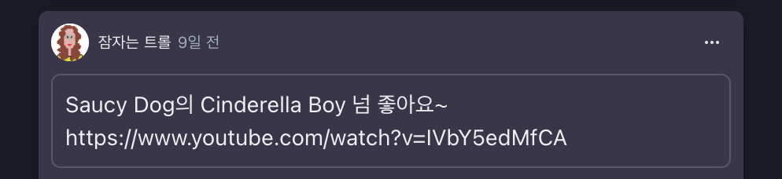
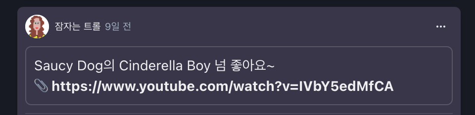

# 개요

혼자 만드는 <a href="https://who-sekai.vercel.app/ownsgks" target="_blank" rel="noopener">작은 프로젝트</a>가 있다.

일기처럼 남기고 싶은 말을 적을 수 있고, 다른 사람들이 댓글도 달 수 있는 단순한 목적의 프로젝트이다.

요즘 듣는 노래를 글로 남겨두려 유튜브 링크와 함께 글을 업로드했다. 사실 당연하게 유튜브 링크를 클릭하면 유튜브 페이지가 뜰 줄 알았는데, 단순 텍스트만 보여주었다.

<figure>

<figcaption>Fig 1. URL 포멧이지만 단순한 스트링 텍스트</figcaption>
</figure>

물론 텍스트만 보여주는 것으로 노래에 관심이 있는 사람들은 텍스트를 긁어서 브라우저에 붙여넣어 유튜브로 이동할 수 있겠지만, 이는 좋은 사용자 경험이 아닌 것 같고 그럴 사람들이 극히 적을 것 같아 오토 링킹을 해야겠다고 생각했다.

# 로직

업로드한 글의 전체 텍스트를 정규 표현식을 사용해 URL 포멧의 텍스트를 `<a>` 태그로 감싸는 것으로 변형하여 텍스트를 대체한다.

```tsx
const Message = function () {

  ...

  function autoLink(message: string) {
    const Rexp =
      /(\b(https?|ftp|file):\/\/([-A-Z0-9+&@#%?=~_|!:,.;]*)([-A-Z0-9+&@#%?/=~_|!:,.;]*)[-A-Z0-9+&@#/%=~_|])/gi;

    return message.replace(
      Rexp,
      "<div><a href='$1' target='_blank'>📎 $1</a></div>"
    );
  }

  ...


  return (
    <Text>
      {autoLink(message)}
    </Text>
  );
};
export default Message;
```

정규 표현식 로직은 다음과 같다. URL 포멧을 검증하기 위한 텍스트의 검증 범위를 먼저 설정한다. URL 포멧에 공백은 존재하지 않으므로 어절(단어) 단위로 묶어서 검증하기 위해 `\b` 로 어절 단위로 검증할 것으로 설정한다.

이제 검증해야할 건 URL 의 구조와 어절(단어)와 일치하는 가에 따른 정규 표현식을 작성한다.

URL 의 구조는 `프로토콜://호스트:포트번호/경로?쿼리` 로 구성되어 있다.

텍스트가 프로토콜 구조(**HTTP, HTTPS, FTP, FILE**)와 일치하는지 검증하기 위해 `(https?|ftp|file)` 로 나누어 설정하고 `:` 문자가 프로토콜 다음에 오는지 검증한다.

그 다음 `\/\/` 로 `:` 문자 다음에 `//` 가 오는지 검증한다.

이후 URL 의 호스트 부터 쿼리까지

```
([-A-Z0-9+&@#%?=~_|!:,.;]*)([-A-Z0-9+&@#%?/=~_|!:,.;]*)[-A-Z0-9+&@#/%=~_|])
```

로 범위를 나누어 검증한다.

모든 알파벳, 숫자, URL 에 사용되는 특수문자 그룹이다.

이후 정규표현식의 마지막 `Flag` 로 검증할 텍스트 전역에 위 정규표현식을 적용한다는 `gi` flag를 설정한다.

<a href="https://regexr.com/" target="_blank" rel="noopener">정규 표현식 테스트 서비스</a>를 통해 쉽게 확인할 수 있다.

이 정규 표현식을 자바스크립트 내장 함수인 `replace` 를 사용해 URL 포멧의 텍스트를 원하는 텍스트로 대치할 수 있다.

나는 URL 포멧 텍스트를

```html
<div>
  <a href="$1" target="_blank"> 📎 $1 </a>
</div>
```

로 대치했다.

여기서 `$1` 은 정규 표현식의 `( )` 로 구분했던 그룹의 순서이다. `$1` 은 가장 처음 그룹화 했던 소괄호이다.

즉, 가장 바깥 쪽의 모든 그룹을 감싸는 전체 그룹이다.

위 정규 표현식을 예로 들면 가장 바깥쪽의 괄호에 속하는 모든 정규 표현식에 만족하는 텍스트를 의미한다.

즉, URL 포멧 전체를 출력한다. 만약 `$2` 라면 두 번째 그룹에 속하는 정규 표현식에 만족하는 텍스트이다. 두 번째 그룹은 `(https?|ftp|file)` 이므로, https, ftp, file 중 하나가 출력될 것이다.

이제 대치된 텍스트를 보여주면 될까?

<br>

<figure>

<figcaption>Fig 2. 텍스트가 대치는 되었지만 대치된 텍스트 역시 플레인 텍스트이다.</figcaption>
</figure>

HTML 태그로 감싸 내보내주는 덴 성공했지만 이 역시도 플레인 텍스트다.

HTML 태그를 인식해 화면에 출력하기 위해선 `dangerouslySetInnerHTML` 를 적용해야 한다.

# dangerouslySetInnerHTML

`dangerouslySetInnerHTML` 은 브라우저 DOM 에 `innerHTML` 을 적용하기 위한 React 의 대체 메소드이다.

`innerHTML` 은 엘리먼트 내에 포함된 HTML 마크업을 직접 설정하거나 가져오는 메소드이다. 이를 적용하면 엘리먼트의 모든 자식 요소가 제거되며 `innerHTML` 에 적용한 HTML 요소들을 파싱하여 엘리먼트를 대체한다.

동적인 엘리먼트를 구현할 수 있다는 장점이 있지만 <a href="https://namu.wiki/w/XSS" target="_blank" rel="noopener">사이트 간 스크립팅(XSS: Cross Site Scripting) 공격</a>에 취약하다.

XSS 는 웹 앱의 취약점 중 하나로, 일반적인 사용자가 페이지에 악성 스크립트를 삽입할 수 있는 취약점이다.

이를 통해 악의적인 유저가 사용자의 쿠키, 세션 등을 탈취하거나 비정상적인 웹 앱의 기능을 수행할 수 있다. 이를 방지하기 위해 사용자의 입력 값을 검사해야 한다.

React가 만든 `dangerouslySetInnerHTML` 은 위와 같은 위험을 상기시키기 위해 `dangerouslySetInnerHTML` 로 이름이 지어졌으며, `__html` 키로 객체를 전달해야 한다.

`innerHTML` 와 `dangerouslySetInnerHTML` 의 큰 차이점은 `innerHTML` 은 DOM 노드가 수정되면 수정된 것을 알 수 없다.

반면 `dangerouslySetInnerHTML` 은 React 의 **Virtual DOM 과 실제 DOM을 비교**해 변경된 것이 있다면 리렌더링이 되도록 한다는 것이다.

이 방법을 통해 최종적으로 오토 링킹을 구현할 수 있다.

위 코드의 `<Text>` 영역을 아래와 같이 변경한다.

```jsx
<Text
  dangerouslySetInnerHTML={
    __html: autoLink(item.message)
  }
/>

// { __html: autoLink(item.message) } 를
// 중괄호로 한번 더 묶어야 한다.
```

<br>

<figure>

<figcaption>Fig 3. 링크를 클릭하면 새 탭에 링크가 열린다.</figcaption>
</figure>

위와 같이 오토 링킹을 구현할 수 있었다.

---

### Reference

- <a href="https://regexr.com/" target="_blank" rel="noopener">RegExr - 정규 표현식 테스트 서비스</a>
- <a href="https://namu.wiki/w/XSS" target="_blank" rel="noopener">XSS - 나무위키</a>
