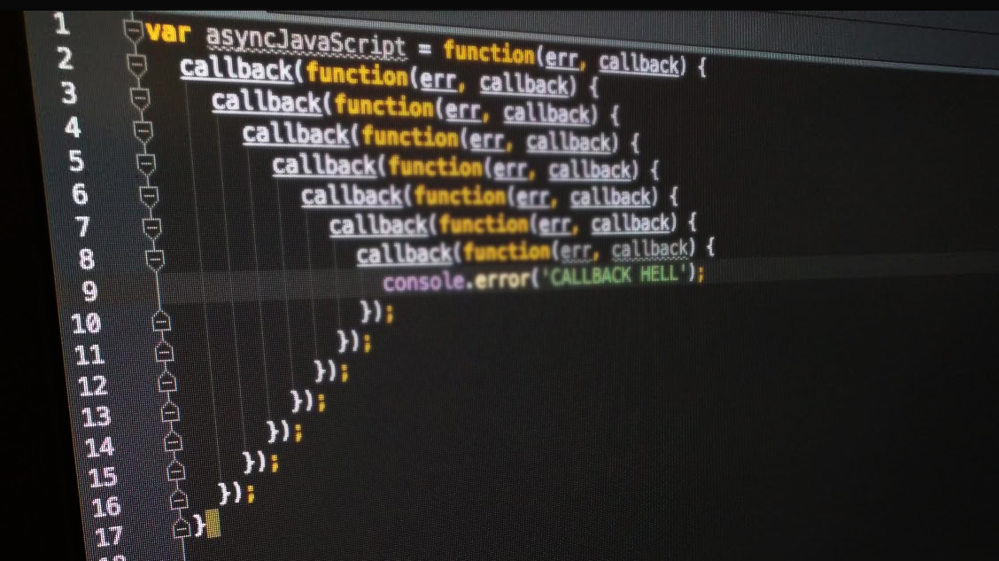

# Callback

2를 요소로 가진 길이가 4인 배열이 있다.

```js
let arr = [2, 2, 2, 2];
```

이 배열에 2를 곱한 값, 즉 각 요소에 2를 곱한 값을 반환할 땐 우리는 배열의 메소드 중 `map`또는 `forEach`를 사용할 수 있다.

```js
let squareArr = arr.map((el) => el * 2);
console.log(squareArr); // [4, 4, 4, 4]
```

`map` 메소드는 인자로 함수 `(el) => el * 2` 를 받는다.
이 함수는 `el`이라는 입력인자를 받아, 배열의 각 요소 `el`에 2를 곱한 값을 반환한다.

이처럼 **고차함수의 인자로 전달되는 함수를 콜백(Callback) 함수**라고 부른다.
콜백 함수를 인자로 받은 함수를 `Caller` 함수라고 하며, `map`은 각 요소에 2를 곱하는 콜백 함수의 `Caller`가 된다.

```js
const printString = (string, callback) => {
  setTimeout(() => {
    console.log(string);
    callback();
  }, 1000);
};
```

`printString`이라는 함수를 만들고 인자로 `string`과 `callback`함수를 받는다.
이 함수는 `setTimeout`이라는 Web API를 사용해 `1000ms (1sec)` 후 입력 인자로 받아온 `string`을 반환하고,
`callback`함수를 실행한다.

```js
const printAll = () => {
  printString('a', () => {
    printString('b', () => {
      printString('c', () => {});
    });
  });
};
printAll();
```

`printAll`이라는 함수는 실행하게 되면 `printString` 함수를 실행하고, `callback` 함수로 들어온 `printString` 함수를 실행하고, 그 다음 `callback`으로 들어온 `printString`함수를 실행한다.

결과는 `string` 으로 들어온
`a`,`b`,`c` 가 1초 간격으로 `console`창에 표기된다.

위 아주 간단한 예시인 `callback`함수도 마지막 부분에 `})`가 다수 반복되는데, 실제 현업에서 `callback`을 사용한다면 어떨까?

아마 다음과 같이 가독성이 매우 떨어지는 이른바 `callback hell`을 마주할 것같다.

<figure>

<figcaption>Fig 1. 콜백 지옥</figcaption>
</figure>

이러한 불편함을 개선하기 위해 **Promise**를 사용할 수 있다.

# Promise

자바스크립트는 비동기 처리를 위해 콜백 함수를 사용하나, 전통적인 콜백 패턴은 콜백 지옥으로 인해 가독성이 나쁘고 비동기 처리 중 발생한 에러 처리가 곤란하다. 또한, 여러 개의 비동기 처리를 한 번에 처리하는 데도 한계가 있다.

**ES6**에선 비동기 처리를 위한 또 다른 패턴으로 `Promise`를 도입했다.

**`Promise`는 전통적인 콜백 패턴이 가진 단점을 보완하며 비동기 처리 시점을 명확하게 표현할 수 있다는 장점이 있다.**

`Promise`는 `callback chain`을 핸들링할 수 있는 하나의 `Class`이다.
`Promise`는 `resolve`와 `reject`로 함수를 실행하거나, 에러를 핸들링할 수 있다.

```js
const printString = (string) => {
  return new Promise((resolve, reject) => {
    setTimeout(() => {
      console.log(string);
      resolve();
    }, 1000);
  });
};
```

위 함수는 `string`을 입력인자로 받고 `Promise` class를 반환한다.
`setTimeout`은 위와 동일하며, `callback`을 실행하는 대신 `resolve`를 실행한다.

```js
const printAll = () => {
  printString('a')
    .then(() => {
      return printString('b');
    })
    .then(() => {
      return printString('c');
    });
};
printAll();
```

위 함수는 `a`라는 `string`을 입력인자로 받고 `Promise`를 생성한다.
이후 다음 작업으로 `.then`을 사용하는데, 이 결과로 위와 같이 `b`를 입력인자로 넣은 `Promise`를 리턴한다.
`callback`과 동일하게 동작하지만 더 가시성이 있다는 장점이 있다.

`Promise`는 `.then`으로 다음 작업을 이어나갈 수 있으며,
에러 핸들링은 `reject`를 실행하여 `.catch`로 관리할 수 있다.

`Promise` 또한 `.then`의 연속적인 사용으로 `Promise Hell`을 유발할 수 있다.
이를 `Promise` 클래스를 미리 선언하고, 결과에 `return` 하는 방식으로 가시성을 향상할 수 있다.

# Async / Await

`Promise`를 조금 더 간편하게 사용하기 위해 `ES7` 부터 새롭게 도입된 `Async`가 있다.
`Promise`를 리턴하는 함수는 동일하며, 어떤 비동기 함수들을 실행할 때 동기적으로 실행하는 것처럼 보이는 코드를 작성할 수 있다.

비동기 함수를 실행할 때 함수의 선언 전에 `async`를 앞에 붙이고,
`.then`을 수행하는 대신 앞에 `await`을 붙여 사용할 수 있다.

```js
const printString = (string) => {
  return new Promise((resolve, reject) => {
    setTimeout(() => {
      console.log(string);
      resolve();
    }, 1000);
  });
};
```

```js
const printAll = async () => {
  await printString('a');
  await printString('b');
  await printString('c');
};
```

`Promise`와 유사하지만 `await`을 사용해 훨씬 가독성이 뛰어난 함수를 만들 수 있다.
중요한 점은 함수의 선언 앞에 `async`를 꼭 붙여줘야 한다는 점, 그리고 `Promise`를 실행하는 단계마다 `await`로 구분해줘야 한다는 것이다.

### Reference

- 모던 자바스크립트 Deep Dive 도서
