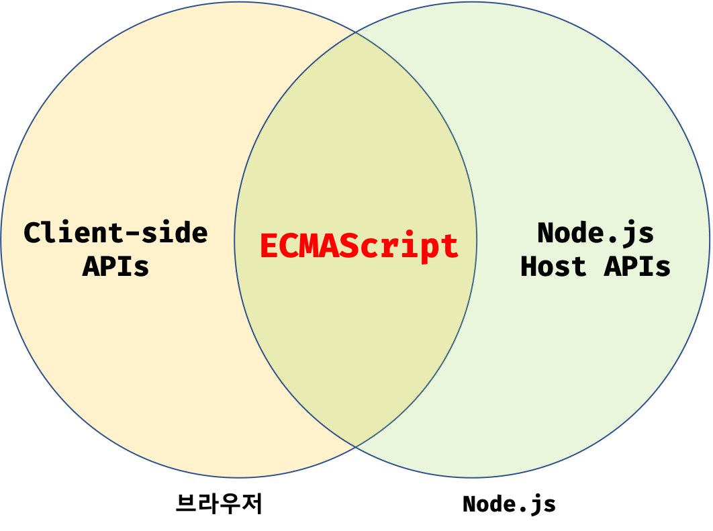

# ECMAScript

<a href="https://ko.wikipedia.org/wiki/ECMA%EC%8A%A4%ED%81%AC%EB%A6%BD%ED%8A%B8" target="_blank" rel="noopener">ECMAScript</a>는 자바스크립트의 표준 사양인 <a href="https://www.ecma-international.org/publications-and-standards/standards/ecma-262/" target="_blank" rel="noopener">ECMA-262</a>를 말한다. 프로그래밍 언어의 값, 타입, 객체와 프로퍼티, 함수 등 **핵심 문법을 규정**한다. 각 브라우저 제조사(구글, 모질라 등)는 **ECMAScript 사양을 준수해서 브라우저에 내장되는 자바스크립트 엔진을 구현**한다.

자바스크립트는 프로그래밍 언어이다. 즉, 자바스크립트의 토대가 되는 ECMAScript와 브라우저가 별도로 지원하는 <a href="https://developer.mozilla.org/ko/docs/Web/API" target="_blank" rel="noopener">클라이언트 사이드 Web API</a>, 즉 `DOM`, `Canvas`, `XMLHttpRequest`, `fetch` 등을 아우르는 개념이다.

<figure>

<figcaption>Fig 1. 자바스크립트와 ECMAScript의 관계</figcaption>
</figure>

한 마디로, ECMAScript보다 자바스크립트가 더 폭 넓은 개념인 것이다.

2020년 기준 최신의 ECMAScript의 버전은 `ES11` 이다. `ES6`이 출시된 2015년 부터 매년 `1` 씩 증가하는 버전 넘버링과 함께 크고 작은 기능들이 추가되어 공개되고 있다.

### ECMAScript 6

2015년에 공개된 ES6는 `let` , `const` , 화살표 함수, 클래스 등 범용 프로그래밍 언어로서 갖춰야할 기능들이 도입되는 큰 변화가 있었다. ES6 이후 버전은 비교적 작은 기능을 추가하는 것으로 지금까지 매년 공개되고 있다. 인터넷 익스플로러(IE)를 제외한 대부분의 모던 브라우저에서 ES6를 지원하고 있지만, 100% 지원하지는 않는다.(96% ~ 99% 지원) `Node.js`는 `v4` 부터 ES6을 지원한다.

최신의 ECMAScript 버전을 사용하거나, 사용한 기능이 특정 브라우저에서 지원하지 않는 등 인터넷 익스플로러나 구형 브라우저를 고려해야 하는 상황이라면, <a href="https://babeljs.io/" target="_blank" rel="noopener">바벨(Babel)</a>과 같은 트랜스파일러를 사용해 ES6 이상 버전으로 구현된 소스코드를 ES5 이하의 사양으로 다운그레이드 해야 한다.

바벨은 ECMAScript 6 이상의 코드를 이전 자바스크립트 엔진에서 실행할 수 있는 이전 버전과 호환되는 자바스크립트 버전으로 변환하는 데 주로 사용되는 무료 오픈 소스 자바스크립트 트랜스컴파일러이다.

### 자바스크립트와 ECMAScript의 차이점

자바스크립트는 **프로그래밍 언어로서 ECMAScript를 기반으로 추가적으로 브라우저가 별도로 지원하는 API가 포함**된다. ECMAScript는 **자바스크립트의 표준 사양이자 핵심 문법**이다.

### Reference

- <a href="https://ko.wikipedia.org/wiki/ECMA%EC%8A%A4%ED%81%AC%EB%A6%BD%ED%8A%B8" target="_blank" rel="noopener">ECMAScript - Wiki</a>
- <a href="https://www.ecma-international.org/publications-and-standards/standards/ecma-262/" target="_blank" rel="noopener">ECMA-262</a>
- <a href="https://developer.mozilla.org/ko/docs/Web/API" target="_blank" rel="noopener">Web API - MDN</a>
- <a href="https://babeljs.io/" target="_blank" rel="noopener">바벨(Babel)</a>
