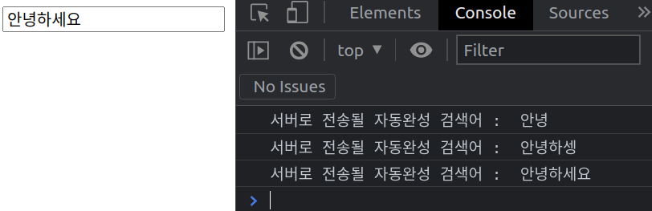
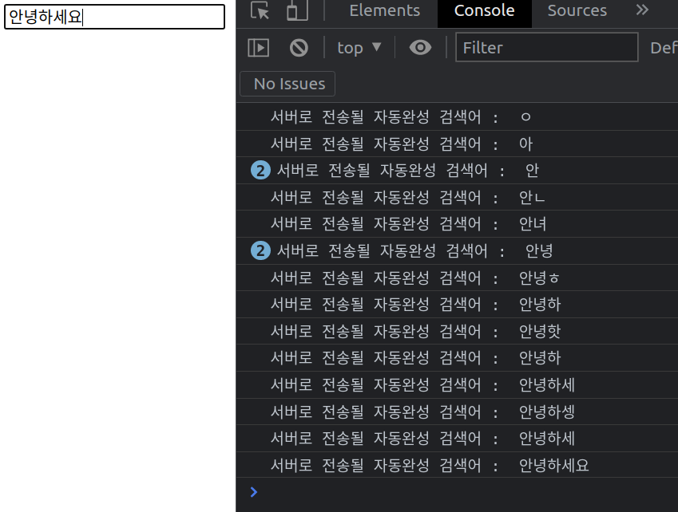
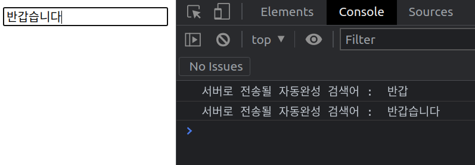
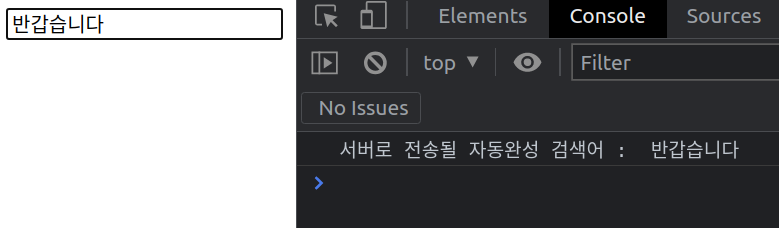

# 스로틀링과 디바운싱

스로틀링과 디바운싱은 라이브러리가 아니고, 효율적인 프로그래밍을 위한 프로그래밍 기법이다.

## 스로틀링 (Throttling)

스로틀링은 마지막 함수가 호출되고, 미리 정해둔 시간이 지나기 전에 호출할 때 재차 호출되지 않도록 하는 것이다.

즉, 정해둔 시간을 간격으로 주기적으로 함수가 반복 실행이 되는 것이다.

주로 페이지 스크롤링 이벤트에서 사용된다.
또한, 자동완성 검색을 위해 스로틀링도 사용할 수 있다.

예를 들면, 유저의 타이핑이 끝났을 때 자동완성 결과를 보여주는 것이 아닌 유저가 타이핑하는 도중에도 자동완성 결과를 보여줄 때 사용할 수 있다.

```js
let timer
document.querySelector('#input').addEventListener('input', function (e) {
  if (!timer) {
    timer = setTimeout(function () {
      timer = null
      console.log('서버로 전송될 자동완성 검색어 : ', e.target.value)
    }, 500)
  }
})
```

<br>
이제 유저가 검색어 입력창에 타이핑을 할 때, 타이핑할 때마다 서버로 요청이 가지 않고 타이핑 이벤트가 발생한 시점부터 500ms, 즉 0.5초 간격으로 서버에 요청을 보내게 된다.

<figure>

<figcaption>Fig 1. 스로틀링 적용</figcaption>
</figure>

유저가 타이핑하는 도중에도 서버로 그 타이핑 값을 요청하여 결과를 보여주어야할 때, 스로틀링을 사용하게 되면 위 예시를 예로 들자면

`안녕`
`안녕하셍`
`안녕하세요`

이 세 단어를 서버로 요청을 보내게 된다.

스로틀링을 사용하지 않는다면

<figure>

<figcaption>Fig 2. 스로틀링 미적용</figcaption>
</figure>

위와 같이 타이핑할 때마다 입력되는 모든 값을 서버로 요청을 보내게 되므로, 비효율적일뿐더러 서버에 부하를 준다.

스로틀링으로 효과적인 검색어 자동완성 기능을 수행할 수 있다.

## 디바운싱 (Debouncing)

디바운싱은 반복적으로 호출되는 함수들 중에서 마지막 함수만 호출하도록 하는 것이다.

마지막 함수만 호출하도록 하는 경우, 이벤트가 발생할 때마다 이전 이벤트들을 모두 지우고 새로운 이벤트를 호출하는 방식으로 작동하게 된다.

즉, 이벤트가 발생할 때마다 이전 이벤트들에 적용됐던 타이머들을 모두 지우고 새로운 타이머가 0초부터 시작된다.

주로 검색어 자동완성, 페이지 리사이징 이벤트에서 사용된다.

위에서 유저가 타이핑하는 도중에도 자동완성 결과를 보여주고싶을 때 스로틀링을 사용했다.

그러나, 유저가 타이핑을 마친 마지막 결과를 보여주고싶을 때 디바운싱을 사용할 수 있다.

```js
let timer
document.querySelector('#input').addEventListener('input', function (e) {
  if (timer) {
    clearTimeout(timer)
  }
  timer = setTimeout(function () {
    console.log('서버로 전송될 자동완성 검색어 : ', e.target.value)
  }, 200)
})
```

<br>
이제 유저의 타이핑 이벤트가 발생하고, 0.2초 후에 서버로 요청이 가게 된다.

<figure>

<figcaption>Fig 3. 디바운싱 적용</figcaption>
</figure>

만약, 유저가

`반갑` 을 입력하고 조금 쉬고
`습니다`를 연달아 입력한 경우, 위와 같은 결과가 나오게 된다.

유저가 연속적인 타이핑으로 `반갑습니다`를 입력한 경우,

<figure>

<figcaption>Fig 4. 디바운싱 미적용</figcaption>
</figure>

위와 같은 결과를 확인할 수 있다.

스로틀링과 디바운싱 중 어떤 프로그래밍 기법을 사용하느냐는 개발하는 서비스에서 유저가 어떤 흐름대로 서비스를 이용할 지 다양한 경우를 생각하고, 이에 맞는 방식으로 선택하여 적용하면 될 것 같다.
