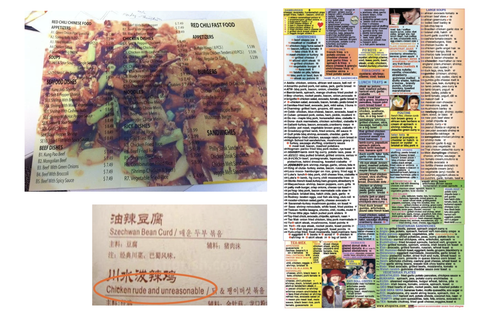
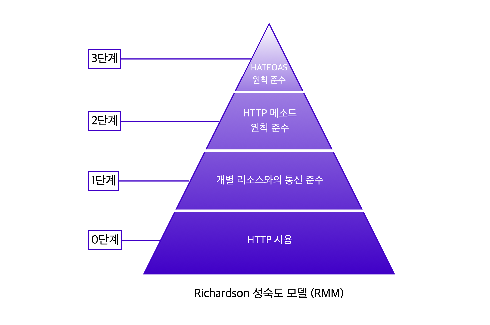

# REST API

웹 앱에서는 HTTP 메소드를 이용해 서버와 통신한다. `GET`을 통해 웹 페이지나 데이터를 요청하고, `POST`로 새로은 데이터를 전송하거나 `DELETE`로 데이터를 삭제한다. 이처럼 클라이언트와 서버가 HTTP 통신을 할 때는 어떤 요청을 보내고 받느냐에 따라 메소드 사용이 달라진다.

이런 메소드 사용은 규칙이 존재한다. 클라이언트와 서버 간 요청과 응답에서 **제대로 보내고 받을 수 있는** 일종의 규약이 존재한다.

REST API에서 REST는 **Representational State Transfer** 의 약자로, <a href="https://en.wikipedia.org/wiki/Roy_Fielding" target="_blank" rel="noopener">로이 필딩</a>의 박사학위 논문에서 웹(HTTP)의 장점을 최대한 활용할 수 있는 아키텍처로 처음 소개되었다.

<figure>

<figcaption>Fig 1. 알아보기 어려운 메뉴판</figcaption>
</figure>

클라이언트와 서버 간 데이터와 리소스를 요청할 때, 요청에 따른 응답을 전달하기 위한 일종의 **메뉴판**이 필요하다. 이 메뉴판을 보고 클라이언트는 식당에서 식사를 주문하듯 서버에 요청한다. 이에 대한 응답을 메뉴판에 있는 사진이나 음식에 대한 설명처럼 다시 서버에서 클라이언트로 전송하게 된다.

즉, HTTP 프로토콜 기반으로 요청과 응답에 따라 리소스를 주고받기 위해 알아보기 쉽고 나이스하게 작성된 **메뉴판**이 필요하다. 이를 API가 수행해야하기 때문에, 클라이언트와 서버가 서로 잘 알아볼 수 있도록 작성하는 것이 중요하다.

### RESTful 하다는 것은?

- **리소스 중심의 올바른 엔드포인트** 작성
- **적절한 응답 상태 코드**
- **리소스에 대한 정보 기재**
- **CRUD에 적합한 HTTP 메소드 사용**

# 좋은 REST API를 디자인하는 방법

REST API를 작성할 때 지켜야할 몇 가지 규칙이 있다.

<a href="https://martinfowler.com/articles/richardsonMaturityModel.html" target="_blank" rel="noopener">레오나르드 리차드슨</a>은 REST API를 잘 적용하기 위한 4단계 모델을 만들었다. 리차드슨의 REST 성숙도 모델을 구조화하면 아래와 같다.

<figure>

<figcaption>Fig 2. 리차드슨 성숙도 모델(RMM)</figcaption>
</figure>

REST 성숙도 모델은 0단계부터 3단계로 나뉜다.

로이 필딩은 **이 모델의 모든 단계를 충족해야만 REST API**라고 부를 수 있다고 말했다. 그러나 실제로 3단계까지 지키기 어려우므로 2단계까지만 적용해도 나이스한 API 디자인이라 볼 수 있고, 이런 경우 **HTTP API**라고도 부른다.

### REST Maturity Model - Level 0 (RMM 0단계)

0단계에서는 단순 HTTP 프로토콜을 사용하기만 해도 된다. 그러나 이를 RESTful API라고 할 순 없고, 나이스한 REST API를 작성하기 위한 기본 단계이다.

0단계를 예로 들면 아래와 같다.

|      요청 내용      |             요청             |       응답        |
| :-----------------: | :--------------------------: | :---------------: |
| 예약 가능 시간 확인 | `POST /appointment HTTP/1.1` | `HTTP/1.1 200 OK` |
|  특정 시간에 예약   | `POST /appointment HTTP/1.1` | `HTTP/1.1 200 OK` |

위 예시는 HTTP 프로토콜을 사용하는 것을 확인할 수 있다. 단순히 HTTP 프로토콜을 사용하는 것이 REST API의 출발점이다.

RESTful 하지 않다고 볼 수 있는데, 이는 요청 내용은 서로 다른데 요청하는 HTTP 메세지가 동일하여 적절한 API가 아니다.

### REST Maturity Model - Level 1 (RMM 1단계)

1단계에서는 개별 리소스와의 통신을 준수해야한다.

즉, 모든 데이터나 자원은 개별 리소스에 맞는 엔드포인트를 사용해야 한다는 것과 요청받은 자원에 대한 정보를 응답으로 전달해야한다는 것이다.

0단계에서는 모든 요청에서 엔드포인트를 `/appointment`를 사용했는데, 1단계에서는 요청하는 리소스가 무엇인지에 따라 엔드포인트를 달리 구분하여 사용해야 한다.

|      요청 내용      |              요청               |       응답        |
| :-----------------: | :-----------------------------: | :---------------: |
| 예약 가능 시간 확인 | `POST /doctors/허준쌤 HTTP/1.1` | `HTTP/1.1 200 OK` |
|  특정 시간에 예약   |   `POST /slots/123 HTTP/1.1`    | `HTTP/1.1 200 OK` |

예약 가능한 시간 확인이라는 요청의 응답으로 받는 자원은 허준쌤의 예약 가능한 시간대이다. 때문에 요청 시 `/doctors/허준쌤` 이라는 엔드포인트를 사용했다. 또한 특정 시간에 예약하면 `slot`이라는 리소스의 `123`이라는 `id`를 가진 리소스가 변경되므로, 특정 시간 예약 요청에선 `/slots/123` 으로 실제 변경되는 리소스를 엔드포인트로 사용했다.

어떤 리소스를 변화시키는지 또는 어떤 응답이 제공되는지에 따라 각기 다른 엔드포인트를 사용하므로, 적절한 엔드포인트를 작성하는 것이 중요하다.

엔드포인트 작성 시에는 동사, HTTP 메소드, 어떤 행위에 대한 단어 사용은 지양하고 리소스에 집중해 `명사 형태의 단어`로 작성하는 것이 바람직하다.

요청에 따른 응답으로 리소스를 전달할 때에도 사용한 리소스에 대한 정보와 함께 리소스 사용에 대한 성공 / 실패 여부를 반환해야 한다. 예를 들면 만약 특정 시간에 예약을 한다는 요청을 보냈는데 해당 시간이 마감된 경우, 리소스 사용에 대한 실패 여부를 포함한 응답을 반환해야 한다.

|      요청 내용      |              요청               |                            응답                            |
| :-----------------: | :-----------------------------: | :--------------------------------------------------------: |
| 예약 가능 시간 확인 | `POST /doctors/허준쌤 HTTP/1.1` |                     `HTTP/1.1 200 OK`                      |
|  특정 시간에 예약   |   `POST /slots/123 HTTP/1.1`    | `HTTP/1.1 409 Conflict`   요청받은 리소스 + 실패 메세지 |

### REST Maturity Model - Level 2 (RMM 2단계)

2단계에선 CRUD에 맞게 적절한 HTTP 메소드를 사용하는 것에 중점을 둔다. 위 예시에서 예약 가능 시간 확인이라는 것은 예약 가능한 시간을 조회(READ)하는 행위이다. 그리고 특정 시간 예약이라는 행동은 예약을 생성(CREATE)하는 것과 같다. 즉, 조회(READ)하기 위해선 `GET` 메소드를 사용해야 한다. 그러나, `GET` 메소드는 `Body`가 없기 때문에 `query parameter`를 사용하여 리소스를 전달해야 한다.

예약 생성(CREATE)는 `POST` 메소드를 사용하는 것이 바람직하다. 2단계에선 `POST` 요청에 대한 응답이 어떻게 반환되는지도 중요하다.

생성을 하므로 새롭게 생성된 리소스를 보내주기 때문에, 응답 코드도 `201 Created` 로 명확하게 전달해야 한다. 그리고 관련 리소스를 클라이언트가 Location 헤더에 작성된 URI를 통해 확인할 수 있또록 해야 완벽한 REST 성숙도 2단계를 충족한 것이다.

|      요청 내용      |                         요청                         |                             응답                              |
| :-----------------: | :--------------------------------------------------: | :-----------------------------------------------------------: |
| 예약 가능 시간 확인 | `GET /doctors/허준쌤/slots?data=2021-10-10 HTTP/1.1` |                       `HTTP/1.1 200 OK`                       |
|  특정 시간에 예약   |              `POST /slots/123 HTTP/1.1`              | `HTTP/1.1 201 Created`   `Location: slots/123/appointment` |

HTTP 메소드를 사용할 때 규칙이 있다.

- `GET` 메소드는 오로지 조회(READ)의 목적이므로, 서버의 데이터를 변화시키지 않는 요청에 사용해야 한다.
- `POST`는 요청마다 새로운 리소스를 생성한다.
- `PUT`은 요청마다 같은 리소스를 반환한다. 매 요청마다 같은 리소스를 반환하는 특징을 <a href="https://developer.mozilla.org/en-US/docs/Glossary/Idempotent" target="_blank" rel="noopener">멱등</a>하다(idempotent)고 한다. 즉, 멱등성을 가지는 `PUT` 메소드는 `POST`와 구분하여 사용해야 한다.
- `PUT`은 교체의 용도로 사용한다.
- `PATCH`는 수정의 용도로 사용한다.

RMM 2단계까지 적용을 하면 대체적으로 RESTful한 API라고 여겨진다. 물론 로이 필딩은 3단계까지 만족하지 못하면 RESTful한 것이 아니라고 생각하여 2단계까지 적용된 경우 HTTP API라고 불러야 한다고 주장한다. 그렇지만 훌륭한 레퍼런스를 제공하는 API 설계 모범 사례도 RMM 3단계 까지 적용한 경우는 드물다. 따라서, 3단계까지 무조건적으로 모두 적용해야하는 것은 아니다.

### REST Maturity Model - Level 3 (RMM 3단계)

마지막 단계는 HATEOAS(Hypertest As The Engine Of Application State)라는 약어로 표현되는 하이퍼미디어 컨트롤을 적용한다. 3단계의 요청은 2단계와 같지만, 응답에는 리소스의 URI를 포함한 링크 요소를 삽입하여 작성한다는 것이 차이점이다.

응답에 포함되는 링크 요소는 응답을 받은 다음에 할 수 있는 다양한 액션을 위한 많은 하이퍼미디어 컨트롤을 포함한다.

예를 들면, 예약 가능 시간을 확인한 후에 그 시간대에 예약할 수 있는 링크를 삽입하거나, 특정 시간에 예약을 완료한 경우 그 예약을 다시 확인할 수 있도록 링크를 작성할 수 있다. 즉, 일차원적인 입력과 출력을 넘어서 클라이언트를 조금 더 배려(?)하여 새로운 기능에 접근할 수 있도록 하는 것이 3단계의 포인트이다.

이렇게 되면, 클라이언트 개발자들이 이 링크를 통해 조금 더 쉽고 효율적으로 리소스와 기능에 접근할 수 있게 하는 방아쇠가 될 수 있다.

리차드슨의 RMM을 통해 RESTful한 API를 작성하기 위한 규칙은 위와 같다. 이 규칙들을 통해 리소스 중심의 올바른 엔드포인트 작성, 적절한 응답 상태 코드와 리소스에 대한 정보 기재, CRUD에 적합한 HTTP 메소드 사용을 고려해야 RESTful한 API를 디자인할 수 있을 것 같다.

### Reference

- <a href="https://en.wikipedia.org/wiki/Roy_Fielding" target="_blank" rel="noopener">로이 필딩</a>
- <a href="https://martinfowler.com/articles/richardsonMaturityModel.html" target="_blank" rel="noopener">레오나르드 리차드슨의 리차드슨 성숙도 모델(RMM)</a>
- <a href="https://developer.mozilla.org/en-US/docs/Glossary/Idempotent" target="_blank" rel="noopener">멱등성(idempotent)</a>
- <a href="https://developer.mozilla.org/en-US/docs/Web/HTTP/Methods" target="_blank" rel="noopener">HTTP 요청 메소드</a>
- <a href="https://blog.restcase.com/5-basic-rest-api-design-guidelines/" target="_blank" rel="noopener">5가지 기본적인 REST API 설계 가이드</a>
