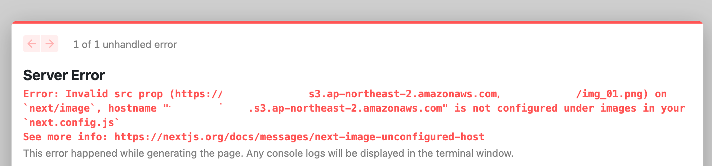

# 원인

이미지 주소를 사용한 이미지, 또는 외부에서 이미지 파일을 불러왔을 때 발생하는 에러이다.

<figure>

</figure>

# 해결

`next.config.js` 를 수정한 후 서버를 종료했다 다시 작동시킨다.

```js
module.exports = {
  reactStrictMode: true,
  images: {
    domains: ['xxxxxxxxxx.s3.ap-northeast-2.amazonaws.com']
    // 이곳에 에러메세지의 hostname 다음 따옴표에 오는 링크를 적으면 된다.
  }
};
```
