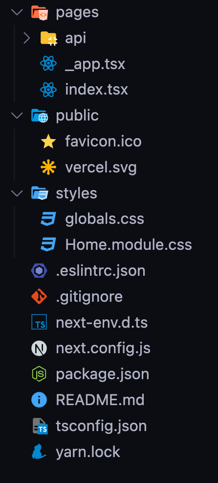
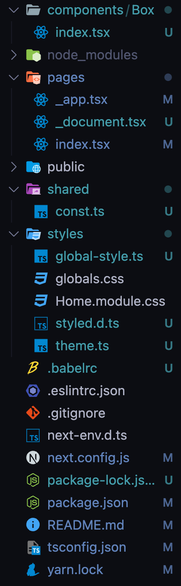
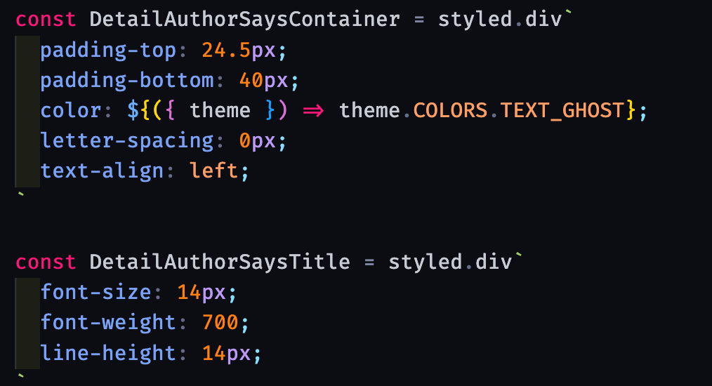

# 개요

Next.js + Typescript 와 Styled-components(CSS in JS) 를 사용하는 개발 환경을 구축하는 과정을 기록해두어 필요할 때 사용하고자 한다.

이 <a href="https://velog.io/@danmin20/Next.js-Typescript-Styled-component-%EC%89%BD%EA%B2%8C-%EA%B5%AC%EC%B6%95%ED%95%98%EA%B8%B0" target="_blank" rel="noopener">블로그</a>를 참고하여 작성했다.

# Create-Next-App

```cli
npx create-next-app@latest --ts
```

타입스크립트를 사용하는 Next.js 프로젝트를 생성한다.

<figure>

<figcaption>Fig 1. 최초 프로젝트 구조</figcaption>
</figure>

```cli
npx yarn add styled-components

npm i --save-dev @types/styled-components
npm install styled-reset
npm i @next/bundle-analyzer
```

styled-components와 타입 정의 요소를 설치한 후 목적에 따라 디렉토리를 구분한다.

<figure>

<figcaption>Fig 2. 수정된 프로젝트 구조</figcaption>
</figure>

`pages`는 Next.js에서 auto routing 되는 페이지들을 작성한다.

`components`에는 재활용 가능한 컴포넌트들을 작성한다.

`shared`에는 utils.ts와 `type`, `interface`와 `enum`들이 작성되는 `const.ts`를 작성한다.

`styles`에는 `styled-component`로 작성한 전역 스타일(+reset)과 미디어 쿼리를 포함한 테마 요소들, 그리고 인터페이스 정의를 위한 `styled.d.ts` 을 작성한다.

## `_app.tsx`

```tsx
import type { AppProps } from 'next/app'
import Head from 'next/head'
import { ThemeProvider } from 'styled-components'
import { GlobalStyle } from '../styles/global-style'
import { theme } from '../styles/theme'

function MyApp({ Component, pageProps }: AppProps) {
  return (
    <>
      <Head>
        <meta name='viewport' content='width=device-width, initial-scale=1' />
        <title>boilerplate</title>
      </Head>
      <GlobalStyle />
      <ThemeProvider theme={theme}>
        <Component {...pageProps} />
      </ThemeProvider>
    </>
  )
}

export default MyApp
```

`_app.tsx`는 서버로 요청이 들어왔을 때 가장 먼저 실행되는 컴포넌트로, 페이지에 적용할 공통 레이아웃의 역할을 수행한다.

즉, 모든 컴포넌트에 **공통적으로** 적용할 속성들을 관리하기 위한 파일이다.

이 파일에서 styled-components에서 제공하는 전역 스타일링을 적용할 수 있으며 ThemeProvider을 전역으로 적용하여 커스텀 테마를 적용할 수 있다.

## `_document.tsx`

```tsx
import Document, {
  Html,
  Head,
  Main,
  NextScript,
  DocumentContext,
} from 'next/document'
import { ServerStyleSheet } from 'styled-components'

class MyDocument extends Document {
  static async getInitialProps(ctx: DocumentContext) {
    const sheet = new ServerStyleSheet()
    const originalRenderPage = ctx.renderPage
    try {
      ctx.renderPage = () =>
        originalRenderPage({
          enhanceApp: (App) => (props) =>
            sheet.collectStyles(<App {...props} />),
        })

      const initialProps = await Document.getInitialProps(ctx)
      return {
        ...initialProps,
        styles: (
          <>
            {initialProps.styles}
            {sheet.getStyleElement()}
          </>
        ),
      }
    } finally {
      sheet.seal()
    }
  }

  render() {
    return (
      <Html>
        <Head>// 각종 메타 태그 및 웹 폰트</Head>
        <body>
          <Main />
          <NextScript />
        </body>
      </Html>
    )
  }
}

export default MyDocument
```

`_app.tsx` 파일은 프로젝트를 생성하면 자동으로 만들어지는데 `_document.tsx` 파일은 그렇지 않다.

`_document.tsx`는 `_app.tsx` **다음에** 실행된다.

페이지에 공통적으로 활용할 `<head>`(메타 태그, 웹 폰트 등)나 `<body>` 태그 안에 들어갈 내용들을 커스텀할때 활용한다. `_document.tsx` 는 오직 **서버에서만** 실행된다.

그래서 두 파일의 주요한 특징을 나눠보면 `_app.tsx`는 로직, 전역 스타일 등 컴포넌트에 공통적으로 사용할 데이터를 다룬다.

`_document.tsx`는 공통적으로 적용할 **HTML**을 마크업한다.

styled-components를 통해 페이지를 만들다 보면 페이지를 불러올 때 HTML 만 가져오고, 스타일이 적용되어있지 않다. 위 코드를 추가해줘야만 서버 사이드 렌더링 시 styled-components가 헤더에 주입된다. 즉 서버에서 미리 HTML을 마크업할 때 스타일까지 HTML 요소에 녹여내는 것이다.

이를 `_document.tsx`가 수행한다.

## `next.config.js`

```js
module.exports = {
  webpack: (config) => {
    config.module.rules.push({
      test: /\.svg$/,
      use: ['@svgr/webpack'],
    })
    return config
  },
}
```

`SVG` 포맷 이미지를 다루기 위해 webpack 로더를 추가한다.

## `.babelrc`

최초 서버 사이드에서 렌더링 이후 클라이언트 사이드 렌더링으로 라우팅을 하게 된다. 이 때 **서버에서 생성하는 해시값**과 **브라우저에서 생성하는 해시값**이 서로 달라 에러가 발생하게 된다.(Prop className did not match)

이를 방지하기 위해 styled-components 바벨 플러그인을 설치한다.

```cli
npm install --save-dev babel-plugin-styled-components
```

<br>

```js
{
    "presets": [
        "next/babel"
    ],
    "plugins": [
        [
            "babel-plugin-styled-components",
            {
                "fileName": true,
                "displayName": true,
                "pure": true
            }
        ]
    ]
}
```

`fileName` : 코드가 포함된 파일명을 알려줌

`displayName` : 클래스명에 해당 스타일 정보 추가

`pure` : 사용하지 않은 속성 제거

## `theme.ts`

`theme.ts` 에서는 전역으로 사용되는 CSS 요소, 테마, 미디어 쿼리 등을 작성한다.

```ts
import { DefaultTheme } from 'styled-components'

export const theme: DefaultTheme = {
  color: {
    purple: '#8661de',
    blue: '#00bac7',
  },
  boxShadow: {
    normal: '0 3px 8px 0 rgb(0 0 0 / 10%)',
    purple: '0 3px 8px 0 #d6c9ff',
    blue: '0 3px 8px 0 #b3e2e6',
  },
}

const customMediaQuery = (maxWidth: number): string =>
  `@media (max-width: ${maxWidth}px)`

export const MIXINS = {
  // flex
  flexBox: (direction = 'row', align = 'center', justify = 'center') => `
    display: flex;
    flex-direction: ${direction};
    align-items: ${align};
    justify-content: ${justify};
  `,

  // positions
  positionCenter: (type = 'absolute') => {
    if (type === 'absolute' || type === 'fixed')
      return `
        position: ${type};
        left: 50%;
        top: 50%;
        transform: translate(-50%, -50%);
      `
    return
  },
}

export const media = {
  custom: customMediaQuery,
  pc: customMediaQuery(1440),
  tablet: customMediaQuery(768),
  mobile: customMediaQuery(576),
}
```

반응형에 따라 컴포넌트의 UI가 달라지는 동작을 짧은 코드로 수행할 수 있고, `FlexBox` 도 미리 지정하여 전역으로 사용할 수 있다.

```tsx
...

const StyledSection = styled.section`
  width: 100%;
  ${({ theme }) => theme.MIXINS.flexBox('column')}
  @media ${({ theme }) => theme.media.pc} {
    margin-bottom: 80px;
  }
  @media ${({ theme }) => theme.media.mobile} {
    margin-bottom: 56px;
  }
`
```

위와 같이 미디어 쿼리를 변수에 따라 적용할 수 있고, `FlexBox` 도 간편하게 정의할 수 있다.

```css
 {
  display: flex;
  flex-direction: column;
  justify-content: center;
}
```

3줄 이상 차지하는 `FlexBox` 코드를 한 줄로 줄일 수 있다.

위 처럼 프로젝트를 시작하기 전에 환경을 구축해놓고 시작한다면 보다 쾌적하게 개발할 수 있을 것 같다.

# styled-components 익스텐션

지금까지 styled-components 를 사용해오며 느꼈던 불편함은 기존 CSS 처럼 자동완성이 되지 않고, 백틱에 일일히 스타일을 입력해야하는 것이었다.

불편함을 느꼈지만 이를 개선해보자 하는 생각 조차 없어서 부끄럽지만, styled-components를 사용한다면 꼭 필요한 익스텐션이 있다.

<figure>

<figcaption>Fig 3. vscode-styled-components</figcaption>
</figure>

<a href="https://marketplace.visualstudio.com/items?itemName=styled-components.vscode-styled-components" target="_blank" rel="noopener">vscode-styled-components</a> 이 익스텐션을 사용하면 styled-components 로 스타일을 작성할 때 기존의 css와 동일한 경험을 할 수 있다.

### References

- <a href="https://velog.io/@danmin20/Next.js-Typescript-Styled-component-%EC%89%BD%EA%B2%8C-%EA%B5%AC%EC%B6%95%ED%95%98%EA%B8%B0" target="_blank" rel="noopener">참고한 블로그 - Next.js + Typescript + Styled-components 쉽게 구축하기</a>
- <a href="https://merrily-code.tistory.com/154" target="_blank" rel="noopener">참고한 블로그 - `_document.tsx`와 `_app.tsx`</a>
- <a href="https://styled-components.com/docs/tooling" target="_blank" rel="noopener">styled-components babel-plugin</a>
- <a href="https://marketplace.visualstudio.com/items?itemName=styled-components.vscode-styled-components" target="_blank" rel="noopener">vscode-styled-components</a>
