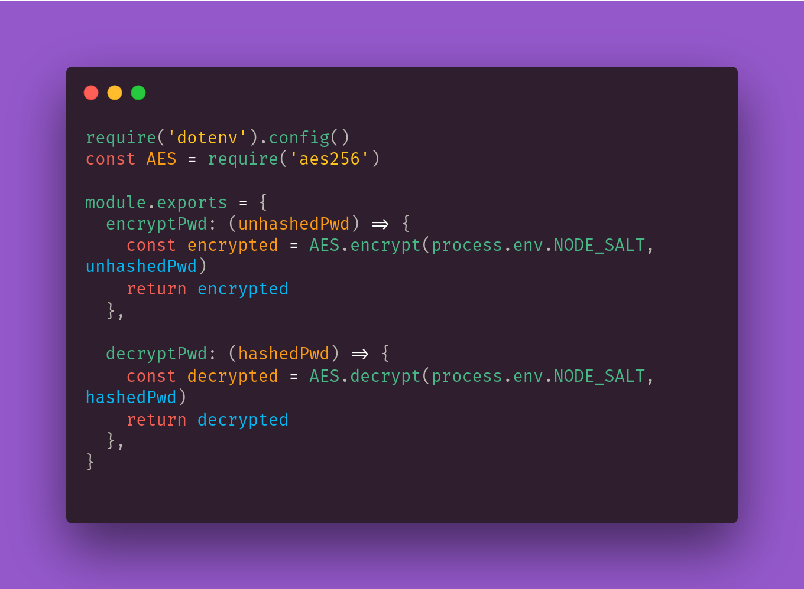
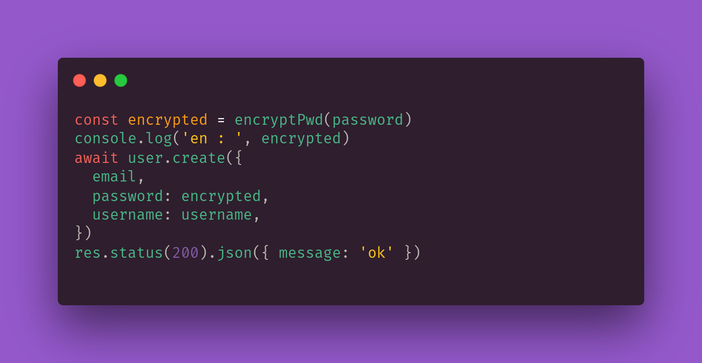
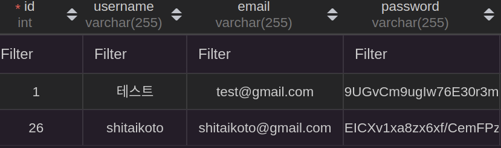
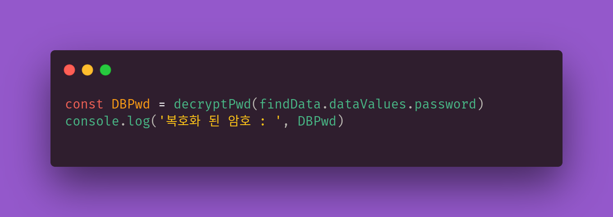
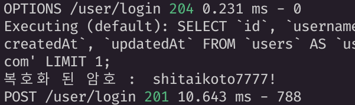

# 개요

유저가 회원가입할 때 입력한 정보를 DB에 저장할 때 아무 생각 없이 비밀번호 그대로 저장하면 될 줄 알았다.

그러나 생각을 해보니 서버의 데이터베이스가 털려버리거나, 백엔드 개발자가 악의를 품고 그 정보들을 공개해버릴 수 있겠다...는 위험한 생각이 들었다.

그렇기 때문에, 암호화된 비밀번호를 DB에 등록해야했다. 다양한 비밀번호 해싱 알고리즘이 있었지만, **AES 256 알고리즘**을 사용했다.

# AES-256

AES는 Advanced Encryption Standard 의 약자이다. 고급 암호화 표준인데, 암호화 및 복호화가 가능한 양방향 해싱 알고리즘이다.

뒤에 붙은 숫자로는 128, 192, 256 등이 오는데 이 숫자는 암호화 및 복호화에 사용되는 키의 길이를 의미한다.

## 양방향 해싱 알고리즘

해싱 알고리즘은 양방향과 단방향이 존재한다.

두 알고리즘의 차이는 **양방향 해싱 알고리즘은 암호화된 값을 다시 암호화 전으로 돌릴 수 있는 복호화가 가능**하고, 단방향 해싱 알고리즘은 복호화가 불가능하며 오직 암호화만 가능하다.

암호화 및 복호화는 다음과 같은 과정으로 이루어진다.

##### 암호화 <br>

`plain text => plain bytes => encrypt => encrypted bites => encrypted base64 text`

##### 복호화 <br>

암호화 과정을 반대로 수행한다.

<br>

AES-256 해싱 알고리즘은 양방향 해싱 알고리즘이며, 이를 수행하기 위해 필요한 값들이 있다.

먼저 사용자가 입력한 `plain text`가 있다. 이는 실제로 사용자가 회원가입 인풋 태그에 입력한 비밀번호 스트링 값이 된다.

두번째로 서버에서 지정한 `Salt` 값 이다.

### Salt

`Salt`는 말 그대로, 입력받은 스트링 값에 **소금을 치는 것**이다.

입력 받은 비밀번호를 그대로 해싱하는 것이 아니라, 서버에서 지정하여 유저는 알 수 없는 소금을 친 비밀번호를 해싱하는 개념이다.

그렇기 때문에 **이 소금은 외부로 절대 유출되어선 안되며, 쉽게 연상할 수 있는 소금이 되어선 안된다.**

# 구현

AES-256 모듈을 설치한다.

```cli
npm i aes256
```

다음에도 재사용할 수 있으므로 암호화 / 복호화 함수를 만든다.

<figure>

</figure>

이제 클라이언트에서 서버로 회원가입 요청이 들어올 때 `payload`에 담긴 비밀번호 `plain text`를 해싱하여 그 값을 DB에 저장한다.

<figure>

</figure>

<figure>

</figure>

유저의 회원가입 요청이 성공하면 DB에는 암호화된 비밀번호가 저장되는 것을 확인할 수 있다.

유저가 로그인할 때, 유저가 입력한 `plain text`와 DB에 저장된 해싱된 비밀번호는 다를 수 밖에 없다.

양방향 해싱 알고리즘인 AES-256은 DB에 저장된 해싱된 비밀번호를 **복호화**하여 유저가 입력한 `plain text`와 비교한다.

<figure>

</figure>

<figure>

</figure>

유저가 로그인할 때 입력한 비밀번호와 DB에 저장된 비밀번호와 일치하는지 판단하기 위해, DB에 저장된 비밀번호를 복호화하여 비교할 수 있다.

다음 프로젝트 땐 단방향 해싱 알고리즘을 사용하여 더 보안성을 향상시켜보고 싶다.

### Reference

- <a href="https://www.npmjs.com/package/aes256" target="_blank" rel="noopener">AES-256 모듈</a>
