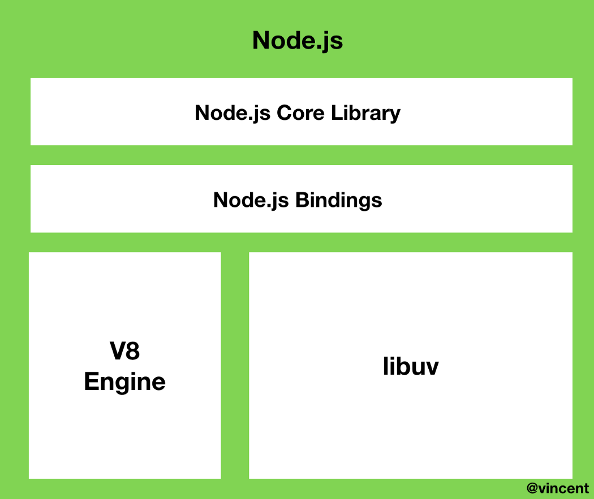
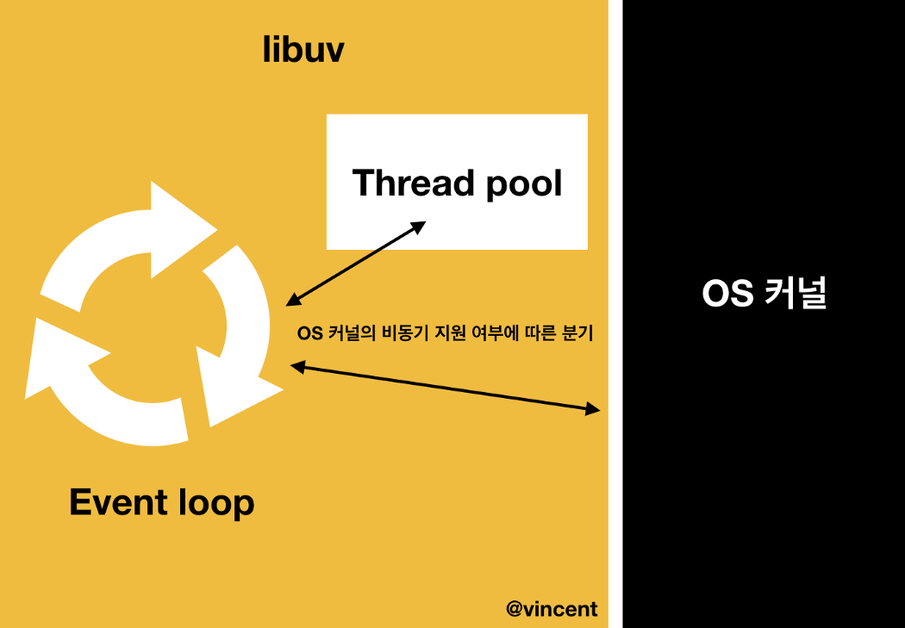
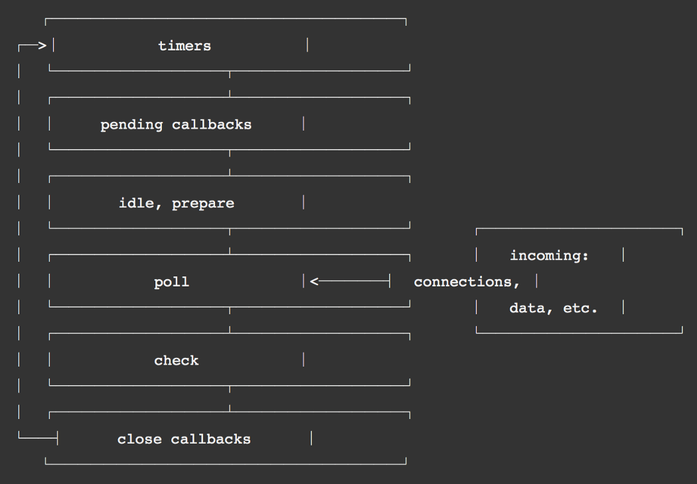

# Node.js란?

자바스크립트를 브라우저 밖에서도 실행할 수 있또록 하는 자바스크립트의 런타임이다.

Node.js는 **비동기(Asynchronous) 이벤트 주도(Event-Driven) 자바스크립트 런타임**으로써, Node.js는 **확장성 있는** 네트워크 애플리케이션을 만들 수 있도록 설계되었다.

Node.js의 동작 원리를 이해하기 전에 알아둬야할 개념이 있다.

1. **프로세스** : 메모리에 올라와 실행되고 있는 프로그램의 인스턴스. 실행되고 있는 프로그램이다. 크롬 브라우저를 예로 들 수 있다.
2. **스레드** : 프로세스 내에서 할당받은 실행의 단위이다. 스레드는 프로세스 당 CPU의 코어 개수만큼 생성될 수 있다. 스레드는 프로세스 내의 메모리 공간을 공유한다. 반면 프로세스는 프로세스 각각 별도의 메모리 공간을 가진다.

Node.js는 싱글 스레드이며, 싱글 스레드는 프로세스 내에서 **하나의 스레드가 하나의 요청**만을 수행한다. 해당 요청이 수행될 때 다른 요청을 함께 수행할 수 없고, 이를 **싱글 스레드 블로킹 모델**이라 한다. 진행 중인 요청이 예정되어있는 요청을 막고있기 때문이다.

반면 멀티스레드는 스레드 풀에서 실행의 요청만큼 스레드를 매칭하여 작업을 수행한다. 멀티 스레드의 스레드 풀에 스레드가 늘어날 수록 CPU를 소모하며, 요청이 적다면 잉여 스레드가 생길 수 있다.

Node.js로 돌아와서, Node.js는 **싱글 스레드 논블로킹** 모델로 구성되어 있다. 하나의 스레드이지만, 비동기 입출력을 통해 각각의 요청들을 서로 블로킹하지 않는다. 그래서 동시에 많은 요청들을 **비동기로 수행함**으로써 **싱글 스레드지만 논블로킹**이 가능하다. 또한, Node.js는 클러스터링을 통해 프로세스를 포크(fork)하여 **멀티 스레드**처럼 사용할 수 있다. 트래픽에 따라 프로세스를 포크할 수 있으므로, 서버의 **확장**이 용이하다는 장점이 있다.

---

# Node.js는 완전한 싱글 스레드일까?

Node.js는 자바스크립트 런타임이며, 자바스크립트는 메인 스레드 하나를 가진 싱글 스레드이다. 즉, Node.js는 싱글 스레드이다.

그러나, 완전하게 싱글 스레드를 기반으로 동작하지 않는다.

일부 블로킹 작업들은 `libuv`의 **스레드 풀(Thread Poll)**에서 수행되기 때문이다.

### 이벤트 주도(이벤트 기반, Event-Driven)

이벤트 주도란 이벤트가 발생할 때 미리 지정해둔 작업을 수행하는 방식을 의미한다. **Node.js는 이벤트 리스너에 등록해둔 콜백 함수를 실행하는 방식**으로 동작한다.

이벤트가 발생할 때 미리 지정해둔 작업을 수행하는데, 이를 모니터링하는 것이 바로 **이벤트 루프**이다. 이 **이벤트 루프는 브라우저 런타임과 다르다**.

Node.js의 이벤트 루프를 알아보기 전에, 먼저 Node.js의 내부 구성 요소<sup id="user">[[1]](#user-ref)</sup>는 다음과 같다.

<figure>

<figcaption>Fig 1. Node.js 내부 구성 요소</figcaption>
</figure>

자바스크립트는 **싱글 스레드**<sup id="user">[[1]](#user-ref)</sup> 언어이다. 그러나, 자바스크립트의 특징들 중, 이와 상반되는 개념들이 여러 존재한다. 예를 들면, 비동기, 동시성, 논블로킹 입출력 등이 있다.

싱글 스레드인데 어떻게 동시성을 가질 수 있을까?

Node.js는 내장 코어 라이브러리와 V8 엔진, 그리고 `libuv`로 구성되어 있다. Node.js의 특성인 이벤트 주도, 논블로킹 입출력 모델들은 전부 `libuv` 라이브러리에서 구현된다.

우리가 작성하는 Node.js의 거의 모든 코드는 콜백 함수로 이뤄져 있다. 콜백 함수들은 `libuv` 내 위치한 **이벤트 루프**에서 관리된다. 이 이벤트 루프는 브라우저 런타임의 이벤트 루프와 달리 **여러 개의 페이즈(Phase)**를 갖고 있다. 해당 페이즈들은 각각의 **큐(Queue)**를 가진다.

이벤트 루프는 **라운드 로빈(Round-Robin)**<sup id="user">[[2]](#user-ref)</sup>방식으로 노드 프로세스가 종료될 때 까지 일정 규칙에 따라 여러개의 페이즈를 순회한다. 페이즈들은 각각의 큐를 관리하고, 해당 큐들은 **FIFO(First In First Out)** 순서로 콜백 함수를 처리한다.

### 논블로킹 입출력 (Non-Blocking I/O)

Node.js에서 논블로킹 입출력 모델은 입력과 출력과 관련된 작업(HTTP, CRUD, fileSystem 등)의 블로킹 작업들을 **백그라운드에서 수행**하고, 이를 비동기 콜백 함수로 이벤트 루프에 전달하는 것을 의미한다. 여기서 백그라운드란, `OperatingSystem` 커널 혹은 `libuv`의 스레드 풀을 가리킨다.

<figure>

<figcaption>Fig 2. 논블로킹 입출력 모델</figcaption>
</figure>

여러가지 입출력 작업들은 OS 커널 혹은 `libuv` 내의 스레드 풀에서 담당한다. `libuv`는 OS 커널에서 어떤 비동기 작업을 지원하는지 알고있다. 그래서 작업 종류에 따라 커널 혹은 스레드 풀로 분기한다. 작업이 완료되면 이벤트 루프에게 이를 알리고, 이벤트 루프에 콜백 함수로 등록된다. `libuv`의 스레드 풀은 커널이 지원하지 않는 작업들을 수행한다. `libuv`의 스레드 풀은 멀티 스레드로 이루어져 있다. 이 부분 때문에, Node.js는 **완전한 싱글 스레드가 아니라고** 볼 수 있다.

커널이 지원하지 않는 작업, 즉 `libuv`의 스레드 풀이 수행하는 작업의 예로는 `fileSystem`이 있다. 스레드 풀도 마찬가지로 해당 작업을 수행하면 이벤트 루프에 콜백 함수를 전달한다.

---

# 이벤트 루프 동작 원리

<figure>

<figcaption>Fig 3. 이벤트 루프 다이어그램</figcaption>
</figure>

위 이미지는 Node.js 공식 문서에 나와있는 이벤트 루프 다이어그램이다.

공식 문서에 따르면 다음과 같다.

> 각 단계는 실행할 콜백의 **FIFO 큐**를 가집니다. 각 단계는 자신만의 방법에 제한적이므로 보통 이벤트 루프가 **해당 단계에 진입하면 해당 단계에 한정된 작업을 수행**하고 큐를 모두 **소진하거나 콜백의 최대 개수를 실행할 때까지 해당 단계의 큐에서 콜백을 실행**합니다.
>
> 큐를 **모두 소진**하거나 **콜백 제한**에 이르면 이벤트 루프는 **다음 단계로 이동**합니다.
>
> 이러한 작업이 또 다른 작업을 스케줄링하거나 poll 단계에서 처리된 새로운 이벤트가 커널에 의해 큐에 추가될 수 있으므로 폴링 이벤트를 처리하면서 poll 이벤트를 큐에 추가할 수 있습니다.
>
> 그 결과 오래 실행되는 콜백은 poll 단계가 타이머의 한계 시점보다 훨씬 더 오래 실행되도록 할 수 있습니다.

Node.js가 실행되면 스레드가 생성되고, 이벤트 루프가 생성된다. 이벤트 루프는 6개의 페이즈를 **라운드 로빈** 방식으로 순회하며 동작한다. 각각의 페이즈들의 세부 역할은 다음과 같다.

### 1. timers

`setTimeout()` , `setInterval()` 등의 `timer` 함수가 처리된다. 이벤트 루프가 페이즈를 순회하며 `timer` 단계를 탐색할 때, 처리할 수 있는 `timer` 함수들을 확인하고 콜백 함수를 실행한다.

### 2. pending callbacks

이 단계에선 **다음 루프 반복으로 연기된 입출력 완료 결과**가 큐에 담긴다. 입출력 작업이 완료되면 다음 회차 루프에 이 단계에 들어와있게 되며, 입출력 작업 블록 내의 콜백 함수들을 `poll` 단계의 큐로 넘겨준다. 또한 `TCP` 오류와 같은 시스템 작업의 콜백 함수를 실행한다.

### 3. idle, prepare

이 단계는 Node.js 내부용으로만 사용된다.

### 4. poll

`poll` 단계는 입출력과 연관된 콜백 함수를 실행한다. `timer`로 스케줄링된 콜백 함수, `setImmediate()` 등을 제외한 거의 모든 콜백을 실행한다. 또한, `timer` 단계에서의 실행 시간 제어를 담당한다. `poll` 단계에선 이 단계의 큐에 쌓인 콜백 함수들을 한도가 넘지 않을 때 까지 모두 **동기적**으로 실행한다. 한도를 넘거나, 실행할 콜백 함수가 없다면 별도의 규칙을 따라 다음 단계로 넘어가거나 대기하게 된다.

###### 별도의 규칙

- `check` 단계를 탐색하여 `setImmediate()` 가 있는지 확인한다.
- 있는 경우, `check` 단계로 넘어간다.
- 없는 경우, `timer` 단계에서 실행할 `timer` 함수가 있는지 확인한다.
- 있는 경우, `timer` 함수를 실행할 수 있는 시간까지 대기한 후, `timer` 단계로 넘어간다.
- 대기하는 동안 `poll` 큐에 콜백 함수가 쌓이면 즉시 실행한다.

### 5. check

`setImmediate()`의 콜백 함수가 실행된다. `poll` 단계의 규칙에 따라 `check` 단계로 넘어오게 된다.

### 6. close callbacks

`close` 이벤트에 따른 콜백 함수를 실행한다. 예를 들면, `socket.on('close', ...)` 이 `close` 이벤트에 따른 콜백 함수가 된다.

---

공식 문서에 나와있는 예시를 보면 다음과 같다.

```js
setTimeout(() => {
  console.log('timeout');
}, 0);

setImmediate(() => {
  console.log('immediate');
});
```

`setTimeout()`은 이벤트 루프의 `timer` 단계에서 처리될 것이며, `setImmediate()`는 이벤트 루프의 `check` 단계에서 처리될 것이다. 그러나, 위 코드는 어떤 함수가 먼저 실행될 지 **장담할 수 없다**.

이벤트 루프가 돌고있는 시점이 `timer` 단계라면 `setTimeout()`의 콜백 함수가 실행될 것이고, `timer` 단계를 지나쳤다면 `setImmediate()`의 콜백 함수가 먼저 실행될 것이기 때문이다.

```js
const fs = require('fs');

fs.readFile(__filename, () => {
  setTimeout(() => {
    console.log('timeout');
  }, 0);
  setImmediate(() => {
    console.log('immediate');
  });
});
```

그러나, 입출력 블록(파일 시스템) 내에서는 `setImmediate()`가 **항상 먼저** 실행된다. 입출력과 관련된 콜백 함수는 항상 `poll` 단계에서 실행되기 때문이다. `poll` 단계에선 앞서 말했듯 별도의 규칙에 따라 `check` 단계의 `setImmediate()`가 있는지 탐색하고, 있다면 `check` 단계로 넘어가기 때문이다.

### Notes

<small id="user-ref"><sup>[[1]](#user)</sup>Node.js는 자바스크립트와 `C++`로 구성되어 있다. V8 자바스크립트 엔진도 70% 이상 `C++`로 이뤄져 있으며, 구성요소 중 하나인 `libuv`는 100% `C++`로 구성된 라이브러리이다. 우리가 `C++`을 몰라도 Node.js를 사용할 수 있는 이유는 V8엔진에서 자바스크립트를 C++로 변환하기 때문에 가능한 것이다.<br>Node.js에 동작하는 **이벤트 루프**는 `libuv` 내에서 구현된다. 이벤트 루프가 `libuv` 내에서 실행된다고 해서 자바스크립트의 스레드와 이벤트 루프의 스레드가 분리된 것은 아니다. Node.js는 싱글 스레드이기 때문에 하나의 이벤트 루프, 하나의 스레드가 모든 것을 처리한다.</small>

<small id="user-ref"><sup>[[2]](#user)</sup>라운드 로빈이란, 그룹 내에 있는 모든 요소들을 합리적인 순서에 입각하여 뽑는 방식이다. 대개 리스트의 맨 위에서 아래로 가며 하나씩 뽑고, 끝나면 다시 맨 위로 돌아가는 방식이다. 컴퓨터 운영에서, 컴퓨터 자원을 사용할 수 있는 기회를 프로그램 프로세스들에게 공정하게 부여하기 위한 한 방법으로서, 각 프로세스에 일정 시간을 할당하고 할당된 시간이 지나면 그 프로세스는 잠시 보류한 뒤 다른 프로세스에게 기회를 준다. 또 그 다음 프로세스에게 하는 식으로, 돌아가며 기회를 부여하는 운영방식이며, 이를 흔히 라운드 로빈 프로세스 스케줄링이라 부른다.</small>

### Reference

- <a href="https://medium.com/@vdongbin/node-js-%EB%8F%99%EC%9E%91%EC%9B%90%EB%A6%AC-single-thread-event-driven-non-blocking-i-o-event-loop-ce97e58a8e21" target="_blank" rel="noopener">Node.js의 동작 원리</a>
- <a href="https://libuv.org/" target="_blank" rel="noopener">libuv 공식 문서</a>
- <a href="https://nodejs.org/ko/docs/guides/blocking-vs-non-blocking/" target="_blank" rel="noopener">Node.js 공식 문서 - 블로킹과 논블로킹 살펴보기</a>
