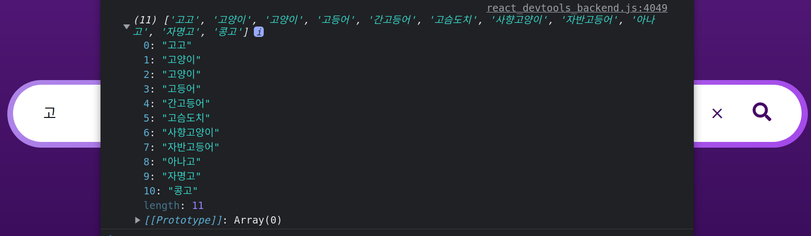
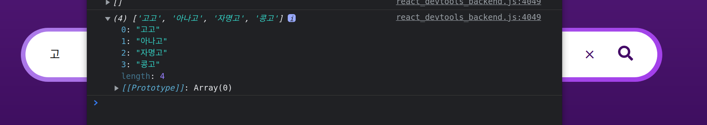
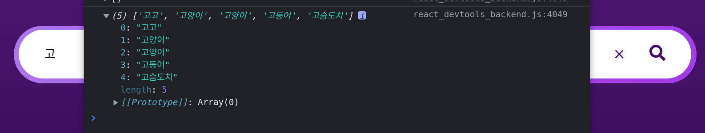
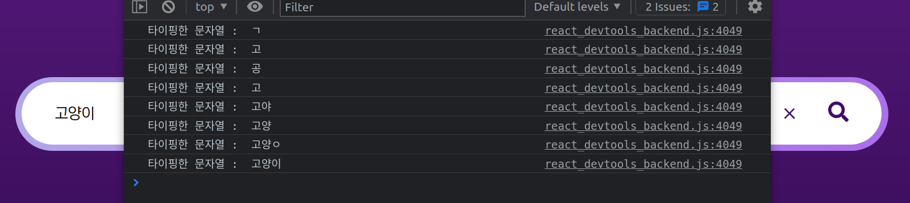

# 목표

검색어 자동완성을 위해, 유저가 인풋태그에 한 글자만 입력한 경우, 서버는 이 때 클라이언트로부터 요청을 받는다.

서버는 query로 받은 한 글자가 포함된 모든 레코드를 탐색하고, 이 때의 결과를 응답한다.

클라이언트는 응답받은 객체를 유저에게 자동완성기능으로 사용할 수 있다.

# 로직

1. 유저가 `input` tag에 글자를 타이핑한다.
2. 타이핑이 완료됐을 때, 클라이언트는 서버로 이 타이핑된 문자열을 query 담아 보낸다.
3. 요청받은 서버는 DB에서 이 문자열이 포함된 모든 레코드를 탐색한다.
4. 탐색 결과를 객체로 클라이언트에게 응답한다.
5. 유저는 타이핑한 문자열이 포함된 모든 데이터를 확인한다.

위와 같은 순서로 진행된다.

# 구현

### Front-End

<br>

```js
const [word, setWord] = useState('')

useEffect(() => {
  const getAutoComp = async (word) => {
    if (word !== '') {
      let getResult = await axios.get(`${url}/word?query=${word}`)
      console.log(getResult.data.data)
    }
  }
  getAutoComp(word)
}, [word])

return (
  <input
    id='reqInput'
    onChange={(event) => setWord(event.target.value)}
    value={word}
  ></input>
)
```

인풋 태그에 `onChange`를 할당하고, 그 때 이벤트의 `value`를 word State에 업데이트한다.

그렇게 되면 `useEffect`의 종속 배열인 `word`가 업데이트되면서 `getAutoComp` 함수가 실행된다.

### Back-End

<br>

```js
const { word } = require('../../models')

module.exports = {
  get: async (req, res) => {
    const sequelize = require('sequelize')
    const Op = sequelize.Op
    const wordSplit = req.query.query
    const authCompWords = await word.findAll({
      where: { wordName: { [Op.like]: '%' + wordSplit + '%' } },
    })
    const returnData = authCompWords.map((el) => el.wordName)
    res.status(200).json({
      data: returnData,
    })
  },
}
```

클라이언트의 요청을 처리하는 서버는 간단하다. `query`로 받아온 문자열을 DB에서 탐색하기만 하면 된다.

이 때, 사용되는 것이 `Sequelize.Op` 이다.

`Sequelize.Op`는 <a href="https://sequelize.org/master/manual/model-querying-basics.html#applying-where-clauses" target="_blank" rel="noopener">Sequelize가 제공하는 연산자</a>이다.

제공하는 연산자는 `and, or, equal, like` 등 다양하다.

유사검색을 위해 `like` 연산자를 사용했고, 사용 방법은 위 코드처럼 간단하다.

DB에서 검색을 원하는 테이블에서 검색을 원하는 필드의 값을 탐색할 때, `Op.like` 조건절을 추가하는 것이다.

위 코드로 보면, `wordSplit` 이라는 문자열 앞 뒤에 `%`를 붙였다.

`%`가 붙은 위치에 따라 탐색 결과가 달라진다.

- 앞 뒤 모두 붙은 경우 : `'%' + wordSplit + '%'`
  `wordSplit` 문자열이 포함된 모든 레코드를 가져온다.
- 앞에 붙은 경우 : `'%' + wordSplit`
  `wordSplit` 앞에 어떤 문자열이 붙어도 탐색한다. 그러나 `wordSplit` 뒤에 문자열이 존재한다면, 탐색하지 않는다.
- 뒤에 붙은 경우 : `wordSplit + '%'`
  `wordSplit` 뒤에 어떤 문자열이 붙어도 탐색한다. 그러나 `wordSplit` 앞에 문자열이 존재한다면, 탐색하지 않는다.

이제 실행 결과를 보면 다음과 같다.

# 결과

### 앞 뒤 모두 붙은 경우

<figure>

<figcaption>Fig 1. 앞 뒤 모두 붙은 경우</figcaption>
</figure>

`고` 라고 인풋 태그에 입력했을 때 서버로부터 받아온 결과이다.

**`고`가 포함된 모든 단어**를 가져온 모습이다.

### 앞에 붙은 경우

<figure>

<figcaption>Fig 2. 앞에 붙은 경우</figcaption>
</figure>

`고`라고 입력했을 때, `고` 앞에 붙은 문자열은 어떤 문자열이든 상관없이 탐색한다는 것을 알 수 있다.

그러나, `고`뒤에 어떤 문자열이 붙는 경우 탐색하지 않는다.

**한 마디로, `고` 로 끝나는 모든 문자열을 탐색**한다.

### 뒤에 붙은 경우

<figure>

<figcaption>Fig 3. 뒤에 붙은 경우</figcaption>
</figure>

`고`라고 입력했을 때, `고` 뒤에 붙은 문자열은 상관없이 **`고`로 시작하는 모든 문자열을 탐색**한다.

단, `고` 앞에 어떤 문자열이 포함되어 있다면 탐색하지 않는다.

# 생각해볼만한 것들

유사 검색을 사용하면 검색어 자동완성 기능을 구현할 수 있다.

그러나, 이제 여기서 생각해봐야 할 **문제**가 생긴다.

유저가 `input` 태그에 어떤 문자열을 타이핑할 때마다 서버로 요청이 가는 것을 알 수 있다.

<figure>

<figcaption>Fig 4. onChange 응답</figcaption>
</figure>

예를 들어, `고양이`라고 `input` 태그에 타이핑을 했을 때 나타나는 응답은 위와 같다.

`onChange`함수가 **8번** 실행되었다는 뜻이며, 이는 즉 **서버로 요청이 8번이 간 것**을 의미한다.

이렇게 되면 웹 앱을 배포했을 때, 유저가 타이핑을 할 때마다 서버로 요청이 들어오므로 서버에 불필요한 요청을 하게 된다.

이 때, 서버의 부담을 줄이고 조금 더 효율적인 검색을 위한 프로그래밍 방법론이 있다.

<a href="https://mniyunsu.github.io/js-throttle/" target="_blank" rel="noopener">스로틀링과 디바운싱</a>이다.

### Reference

- <a href="https://sequelize.org/master/manual/model-querying-basics.html#applying-where-clauses" target="_blank" rel="noopener">Sequelize가 제공하는 연산자</a>
- <a href="https://mniyunsu.github.io/js-throttle/" target="_blank" rel="noopener">스로틀링과 디바운싱</a>
