# 첫 오픈소스 기여

처음으로 오픈소스<sup id="user">[[1]](#user-ref)</sup>에 기여해보았다. 비록 단순한 번역이지만, 처음으로 기여했음에 굉장히 뿌듯했다!

### Stats

내가 기여한 앱은 MacOS의 <a href="https://github.com/exelban/stats" target="_blank" rel="noopener">Stats</a> 라는 앱이다.

맥북의 RAM, CPU, 팬 속도 등을 탐지하여 메뉴 바에서 쉽게 확인할 수 있는 앱이다. 정말 유용하게 쓰고있었는데, 최근에 M1 Pro 및 M1 Max 를 위한 업데이트가 있었다.

새로운 기능들이 추가가 되었고, 기존에 영어로 표기되어있던 부분들을 한글로 바꿔보고싶었다.

```cli
brew install --cask stats
```

위 명령어로 설치할 수 있으며, 가장 좋은건 **무료**라는 것이다.

단순 번역 작업이었기 때문에 코드에서 어려운 부분은 없었다.

기여한 내용은 다음과 같다.

<figure>
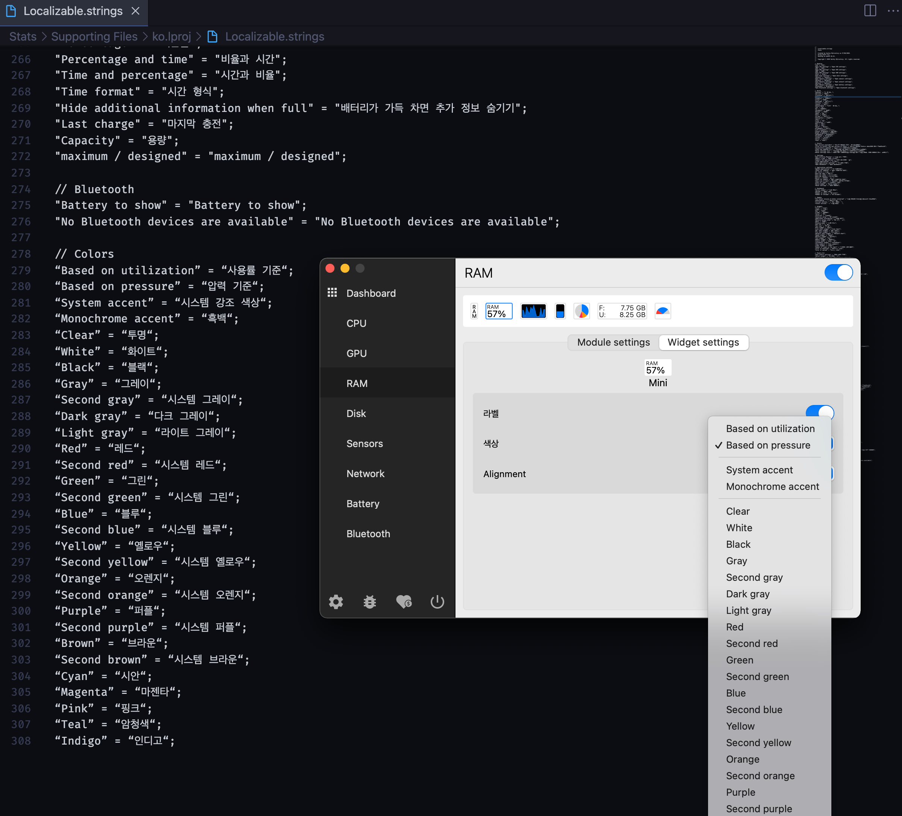
<figcaption>Fig 1. getRemainderWitMinus 실행 결과</figcaption>
</figure>

<figure>
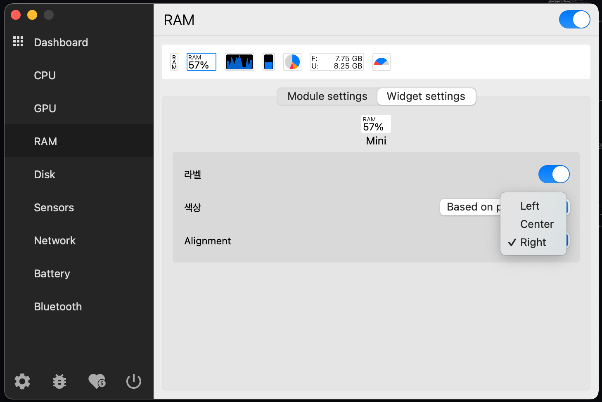
<figcaption>Fig 1. getRemainderWitMinus 실행 결과</figcaption>
</figure>

<figure>
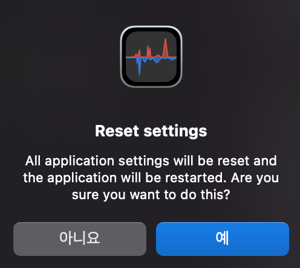
<figcaption>Fig 1. getRemainderWitMinus 실행 결과</figcaption>
</figure>

<figure>
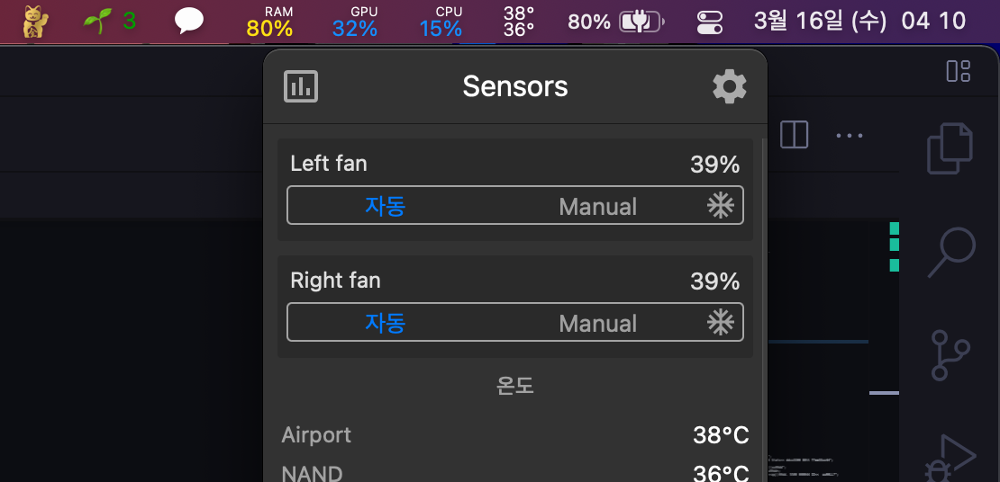
<figcaption>Fig 1. getRemainderWitMinus 실행 결과</figcaption>
</figure>

<figure>
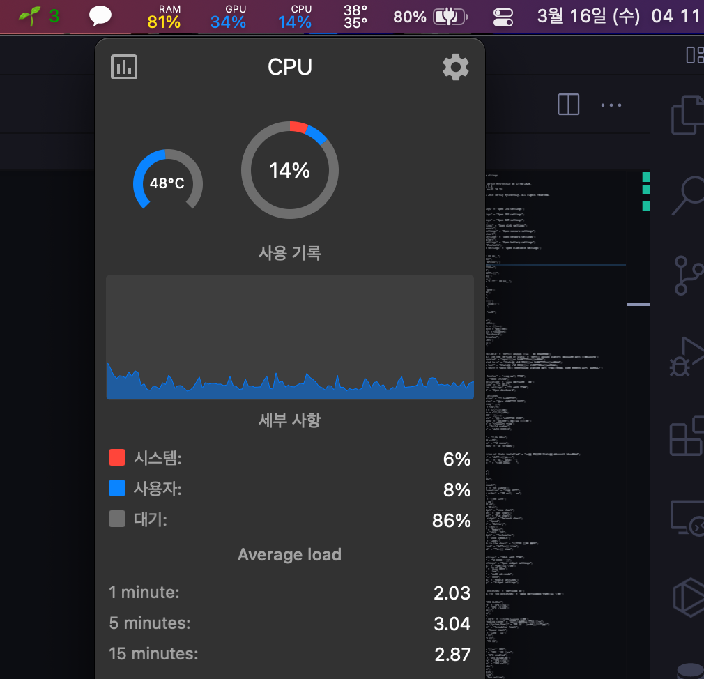
<figcaption>Fig 1. getRemainderWitMinus 실행 결과</figcaption>
</figure>

<figure>

<figcaption>Fig 1. getRemainderWitMinus 실행 결과</figcaption>
</figure>

<figure>
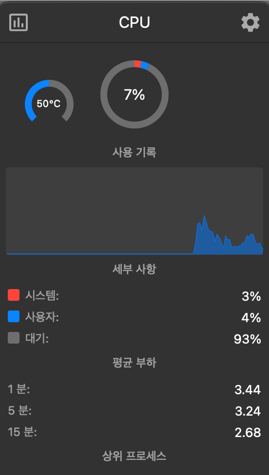
<figcaption>Fig 1. getRemainderWitMinus 실행 결과</figcaption>
</figure>

<figure>
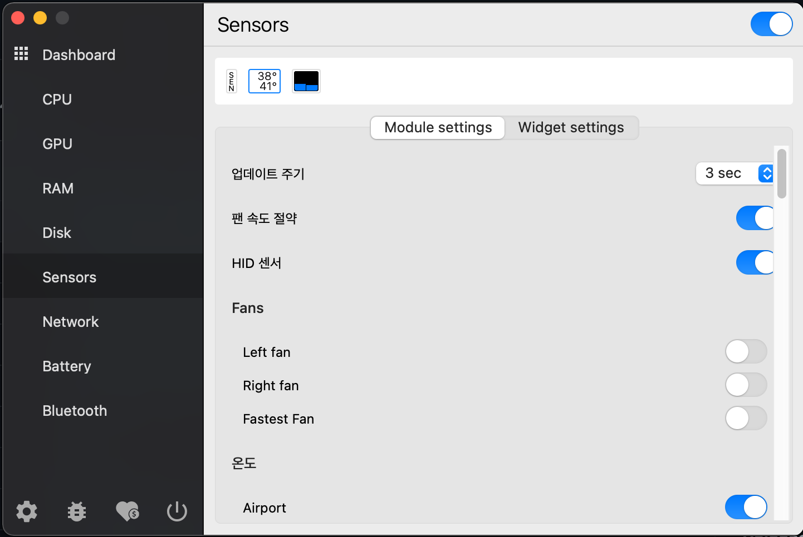
<figcaption>Fig 1. getRemainderWitMinus 실행 결과</figcaption>
</figure>

<figure>
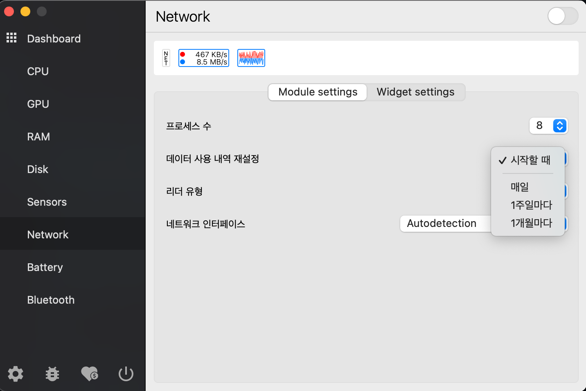
<figcaption>Fig 1. getRemainderWitMinus 실행 결과</figcaption>
</figure>

<figure>
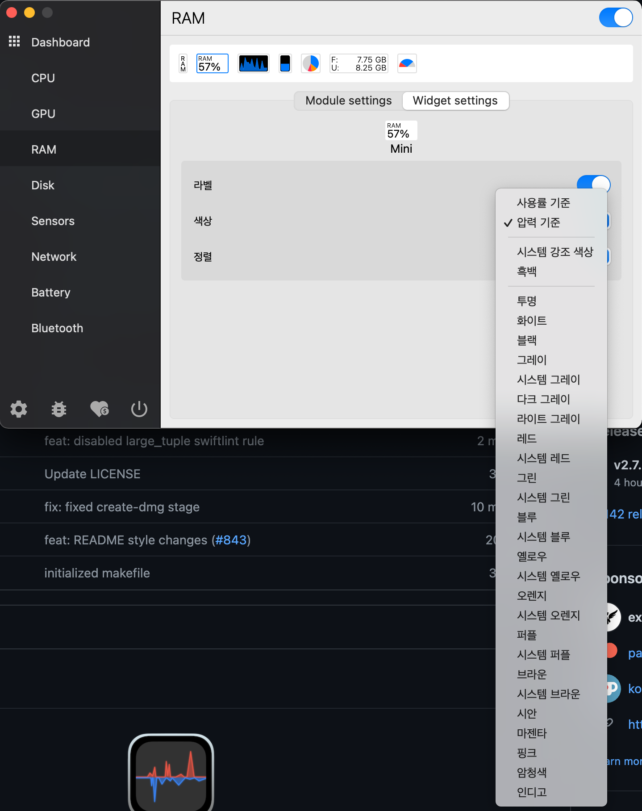
<figcaption>Fig 1. getRemainderWitMinus 실행 결과</figcaption>
</figure>

<figure>
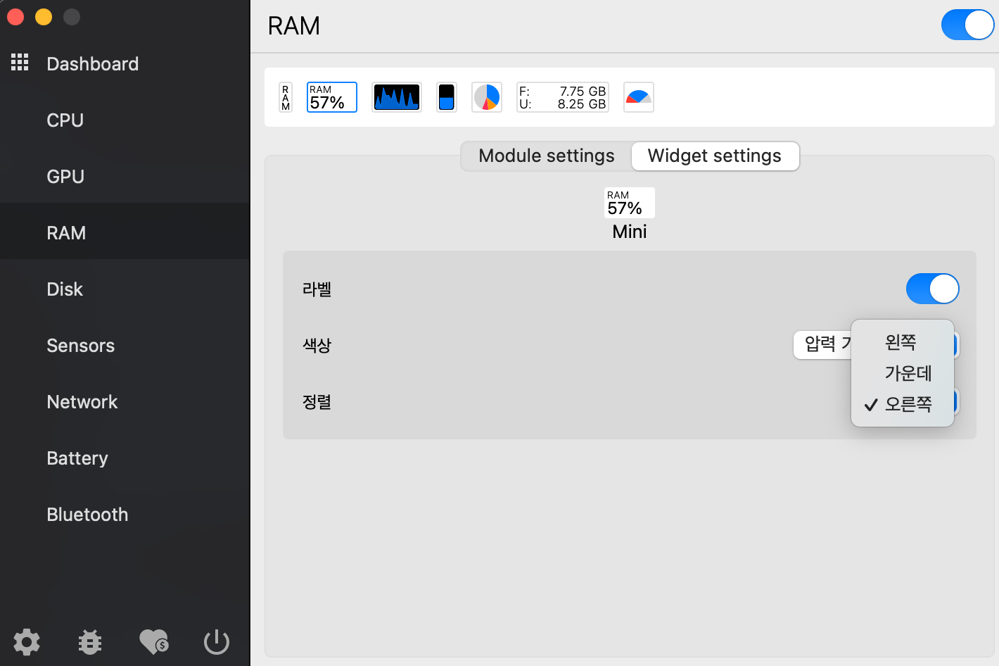
<figcaption>Fig 1. getRemainderWitMinus 실행 결과</figcaption>
</figure>

<figure>
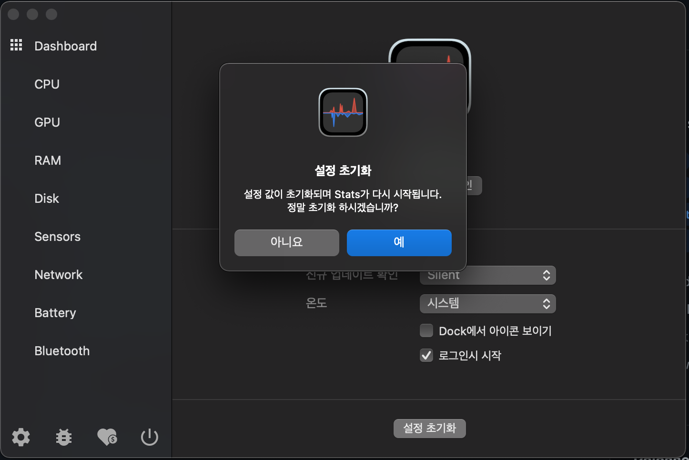
<figcaption>Fig 1. getRemainderWitMinus 실행 결과</figcaption>
</figure>

<figure>
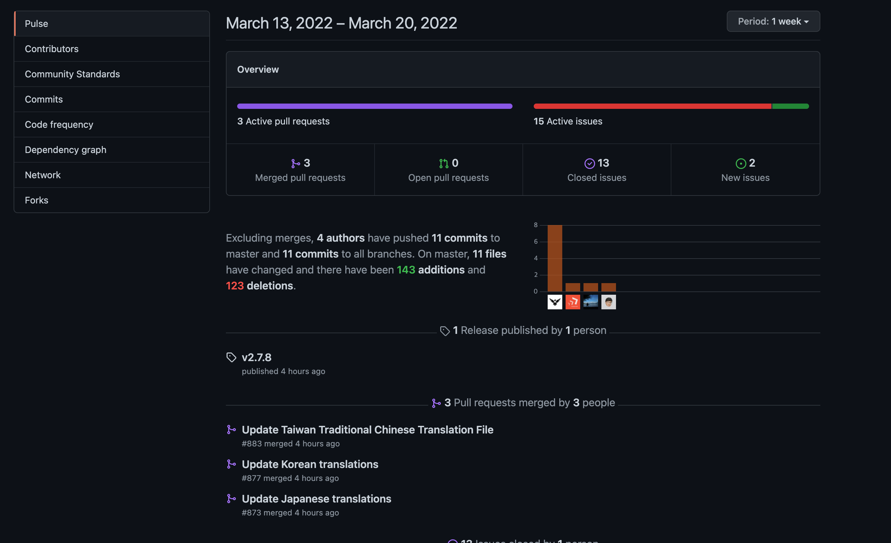
<figcaption>Fig 1. getRemainderWitMinus 실행 결과</figcaption>
</figure>

`while`반복문을 순환할 때 마다 `number1` 과 `number2`의 뺄셈을 반복하며,
더 이상 반복을 수행할 수 없을 때의 값이 나머지 값이 된다.

### Notes

<small id="user-ref"><sup>[[1]](#user)</sup>오픈소스란 원래 오픈소스 소프트웨어(Open Source Software, OSS)를 뜻하는 용어이다. 오픈소스 소프트웨어는 공개적으로 액세스할 수 있게 설계되어 누구나 자유롭게 확인, 수정, 배포할 수 있는 코드이다.</small>

### Reference

- <a href="https://github.com/exelban/stats" target="_blank" rel="noopener">나눗셈(Division)</a>
