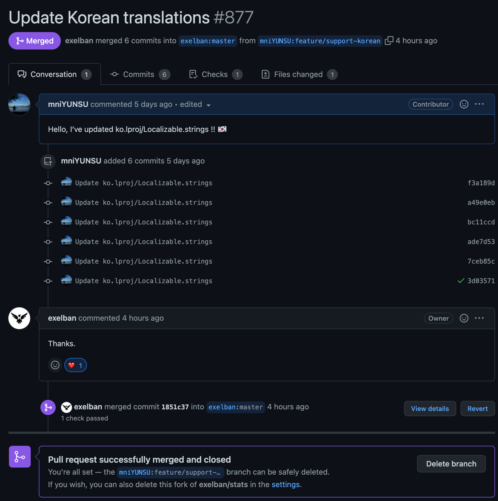

# 첫 오픈소스 기여

처음으로 오픈소스<sup id="user">[[1]](#user-ref)</sup>에 기여해보았다. 비록 단순한 번역이지만, 처음으로 기여했음에 굉장히 뿌듯했다!

### Stats

내가 기여한 앱은 MacOS의 <a href="https://github.com/exelban/stats" target="_blank" rel="noopener">Stats</a> 라는 앱이다.

맥북의 RAM, CPU, 팬 속도 등을 탐지하여 메뉴 바에서 쉽게 확인할 수 있는 앱이다. 정말 유용하게 쓰고있었는데, 최근에 M1 Pro 및 M1 Max 를 위한 업데이트가 있었다.

새로운 기능들이 추가가 되었고, 기존에 영어로 표기되어있던 부분들을 한글로 바꿔보고 싶었다.

```cli
brew install --cask stats
```

위 명령어로 설치할 수 있으며, 가장 좋은건 **무료**라는 것이다.

단순 번역 작업이었기 때문에 코드에서 어려운 부분은 없었다.

<figure>

<figcaption>Fig 1. 번역 전의 색상 프로파일</figcaption>
</figure>

<figure>

<figcaption>Fig 2. 번역 전의 정렬 선택 기능</figcaption>
</figure>

<figure>

<figcaption>Fig 3. 설정 값을 재설정하기 전에 나타나는 문구</figcaption>
</figure>

<figure>

<figcaption>Fig 4. 온도 값을 확인할 수 있는 대시보드</figcaption>
</figure>

<figure>

<figcaption>Fig 5. CPU를 확인할 수 있는 대시보드</figcaption>
</figure>

<br>

기여한 내용은 다음과 같다.

1. <a href="https://github.com/exelban/stats" target="_blank" rel="noopener">Stats</a> Repository를 Fork하여 내 저장소로 가져온다.
2. 번역을 완료한 후, 내 저장소에 푸시한다.
3. 풀 리퀘스트를 날린다.

아주 간단하다. 여기까지가 내가 했던 일이다. 이제 풀 리퀘스트를 <a href="https://github.com/exelban/stats" target="_blank" rel="noopener">Stats</a>의 개발자가 검증하고, master 브랜치에 머지하게 되면 다음 업데이트에서 내가 기여한 내용을 확인할 수 있다!

<br>

<figure>

<figcaption>Fig 6. 풀 리퀘스트를 날리고, master 브랜치에 merge되었다.</figcaption>
</figure>

<figure>

<figcaption>Fig 7. 내가 번역한 부분을 업데이트 후 확인할 수 있다.</figcaption>
</figure>

<figure>

<figcaption>Fig 8. 기존 영어에서 한국어로 번역되었다.</figcaption>
</figure>

<figure>


<figcaption>Fig 9. 정렬 및 시간도 한국어로 번역되었다.</figcaption>
</figure>

<figure>

<figcaption>Fig 10. 색상 프로파일도 한국어로 번역되었다.</figcaption>
</figure>

<figure>

<figcaption>Fig 11. 설정값 재설정 안내 문구도 번역되었다.</figcaption>
</figure>

<figure>

<figcaption>Fig 12. 내가 기여자들 중 한 명이다!</figcaption>
</figure>

복잡한 로직이 포함된 코드도 아니고 단순한 번역이었던 첫 오픈소스 기여였다. 그럼에도 불구하고 개발자가 고맙다는 댓글을 달아주고, 업데이트 후 내가 수정한 내용들을 직접 앱에서 보면서 묘한 뿌듯함을 느꼈다.

앞으로 내가 관심을 갖고있고, 유용하게 사용하는 앱이 오픈소스 프로젝트라면 적극적으로 기여해보고 싶다고 느꼈다!

### Notes

<small id="user-ref"><sup>[[1]](#user)</sup>오픈소스란 원래 오픈소스 소프트웨어(Open Source Software, OSS)를 뜻하는 용어이다. 오픈소스 소프트웨어는 공개적으로 액세스할 수 있게 설계되어 누구나 자유롭게 확인, 수정, 배포할 수 있는 코드이다.</small>
