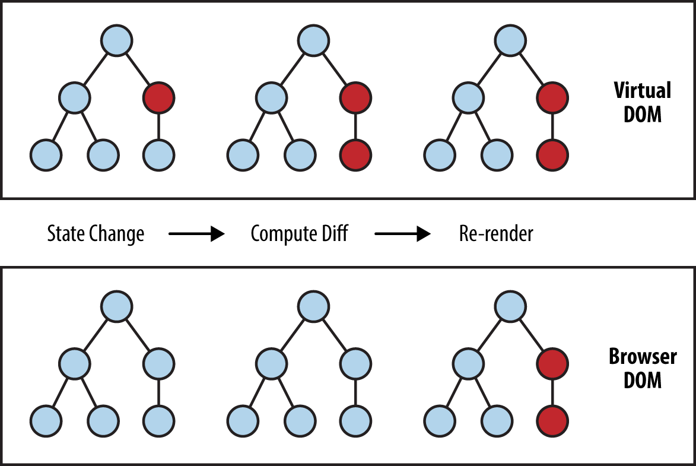

# React는 어떻게 동작할까?

React는 SPA(Single Page Application)으로, 사용자와의 인터렉션이 발생했을 때 화면의 깜빡임 없이 변경되는 부분만 부드럽게 바뀌어 화면에 표시해주는 프레임워크다.

React가 화면의 변경 사항만 바꿀 수 있게 하는 핵심 기술은 `Virtual DOM`이다.

기본적으로 DOM에 변경 사항이 생기면 다음과 같은 과정을 통해 화면에 표시된다.

1. HTML Parser
2. DOM Tree
3. CSSOM
4. Render Tree
5. Painting
6. Display

위와 같은 6단계를 거쳐 최상위 엘리먼트부터 변경이 있는 DOM까지 다시 렌더링한다.

반면, `Virtual DOM`을 사용하면, 변화가 생긴 컴포넌트와 그 자손에 대해서만 `Virtual DOM`을 생성한다. 생성 후 변화전 `Virtual DOM`과 비교를 수행한다. 비교를 통해 변경된 부분만 다음과 같은 과정으로 화면에 표시한다.

1. DOM Tree
2. CSSOM
3. Render Tree
4. Painting
5. Display

따라서, React는 실제 DOM이 아니라 `Virtual DOM`을 조작하는 것으로 성능 개선과 화면 깜빡임 없는 나이스한 사용자 경험을 제공할 수 있다.

<figure>

<figcaption>Fig 1. Virtual DOM</figcaption>
</figure>

React는 위 설명처럼 직접 DOM을 조작하지 않고, `Virtual DOM`을 생성하여 브라우저가 이를 렌더링한다. 이 `Virtual DOM`을 React 엘리먼트라고 하는데, React 엘리먼트는 HTML 엘리먼트와 비슷하지만, 실제론 **자바스크립트 객체**이다.

React에서 모든 컴포넌트들은 `div#root`라는 최상위 엘리먼트의 자손이다. 즉, `Virtual DOM`은 `div#root`의 자손들에만 적용되며, `div#root`의 부모인 `body` 엘리먼트에 대해선 해당 사항이 없다.

# 리렌더링이 발생되는 시점은?

React는 아래와 같은 경우에 리렌더링이 발생한다.

1. Props 변경
2. State 변경
3. 부모 컴포넌트가 렌더링 됐을 때

React는 상태나 속성 값이 변하면 리렌더링을 통해 화면에 표시한다. 이 변화 과정에서 화면의 깜빡임 없이 변경된 부분만 변경되는 것이며, 이 것이 `Virtual DOM` 덕분이다. 리렌더링이 발생할 때, React는 `Virtual DOM`을 생성하고 이 `Virtual DOM`과 `Real DOM`을 비교해 변경된 사항만을 감지하여 해당 내용을 `Real DOM`에서 수정 후 새로운 화면을 렌더링하는 것이다.

추가적으로, State를 변경해야할 때, 기존 State의 값을 변경해선 안된다. State를 변경할 땐 `setState`를 사용해야 한다.

만약 State를 직접 조작하는 경우, **State를 직접 변경하지 말라**는 에러 메세지가 뜨게 된다. State를 직접 변경한다면 리렌더링이 되지 않기 때문에 위와 같은 에러 메세지가 뜨는 것이다.

즉, State 값을 직접 바꾸는 것은 리렌더링이 되지 않아 화면에 표시가 되지 않으므로, `setState()`를 사용해 State를 **통째로** 바꿔야한다.
