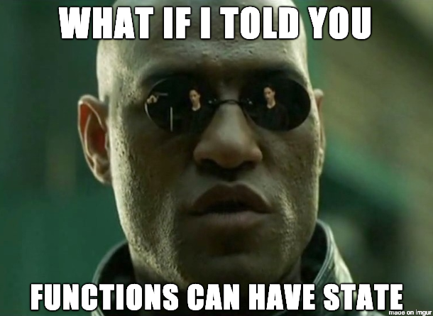

# HOOKS

<figure>

<figcaption>Fig 1. 피터팬과 후크선장</figcaption>
</figure>

리액트는 출시 후 발생했던 다양한 문제들을 해결해왔다.
`Hooks`의 경우, 리액트로 컴포넌트를 작성하고, 유지하면서 발생했던 문제들을 쉽게 해결하기 위해 출시된 기술이다.

<figure>

<figcaption>Fig 2. 리액트와 모피어스</figcaption>
</figure>

`Hooks`을 사용함으로써 리액트의 지향점인 **함수형 컴포넌트**로 `State`를 관리할 수 있게 되었다.

**컴포넌트 기반 개발**이 가능해지면서 **테스트 및 유지보수**가 이전보다 편리해졌고, 사용하기 쉬우며(?) 가독성이 좋은 코드를 만들 수 있게 되었다.

또한 같은 목적의 일을 수행하는 경우, 이전에 사용하던 컴포넌트를 **재사용**하기도 쉬워졌다.

## State

리액트 16.8 버전부터 `Hooks`이 추가되면서, 클래스 컴포넌트에서만 사용할 수 있었던 `State`를 **함수형 컴포넌트에서도** 사용할 수 있게 되었다.
`State`는 **컴포넌트 내부에서 변할 수 있는 값**이다. 부모로부터 `Props`를 통해 전달받지 않은 값이며, `State`가 적용되는 **컴포넌트에서만 유의미**하다.
만약, 하나의 `State`를 기반으로 여러개의 컴포넌트에 영향을 주려면 그 **여러 컴포넌트를 공통으로 소유하는 상위 컴포넌트**에 `State`를 위치해야한다.

`State`는 `useState`를 컴포넌트 내에서 호출하는 것으로 사용할 수 있다.

```js
import React, { useState } from 'react';
```

`useState`를 사용하기 위해 새로운 `State`를 선언할 때, **첫번째 요소**를 현재 `State`, 두번째 요소에 `State`를 **갱신하는 함수**를 배열로 **구조 분해 할당**하여 사용한다.

```js
const [isChecked, setIsChecked] = useState(false);
```

위에서 `useState`가 반환하는 배열의 첫번째 요소인 `isChecked`가 현재 `State`, 두번째 요소인 `setIsChecked`가 `State`를 갱신하는 함수이다.

<iframe src="https://codesandbox.io/embed/muddy-dust-9q1z4?fontsize=14&hidenavigation=1&theme=dark"
     style="width:100%; height:500px; border:0; border-radius: 4px; overflow:hidden;"
     title="muddy-dust-9q1z4"
     allow="accelerometer; ambient-light-sensor; camera; encrypted-media; geolocation; gyroscope; hid; microphone; midi; payment; usb; vr; xr-spatial-tracking"
     sandbox="allow-forms allow-modals allow-popups allow-presentation allow-same-origin allow-scripts"
   ></iframe>

위 예제 처럼 어떤 특정 조건에 따라 렌더링 여부를 결정해야 할 때, `if` 조건문 대신 삼항 연산자를 사용할 수 있다.
삼항 연산자의 문법은 `{ 조건 ? true일 경우 : false일 경우 }` 와 같이 사용한다.

우리 말로 풀어보자면

`이 조건이 참이야? 참이면 이걸 출력할게. 참이 아니라 거짓이면 이걸 출력할게`
로 풀 수 있을 것 같다.

## Lifting State Up

리액트의 데이터 흐름은 **단방향**이다. 하지만, **역방향 데이터 흐름**이 필요할 때가 있다. **상위 컴포넌트**의 `State`가 **하위 컴포넌트에 의해 변하는 경우**이다.

예를 들면, 우리가 블로그를 포스팅할 때이다.

블로그의 홈이 있고, 이 홈에선 자신이 작성한 글들을 보여준다. 이 공간을 상위 컴포넌트라고 가정한다면, 새 글을 포스팅하기 위해 작성 내용을 적는 공간은 블로그 홈의 하위 컴포넌트가 된다.

하위 컴포넌트에서 글을 작성하고 포스팅을 하게 되면, 상위 컴포넌트인 블로그 홈에서 새로 포스팅된 글 까지 보여줘야한다. 즉, **상위 컴포넌트**의 `State`인 **블로그 글 목록을 변화**시켜야한다.

**하위 컴포넌트에서** 발생한 이벤트로, **상위 컴포넌트**의 `State`를 변경해야할 상황이다.

이를 해결하는 키워드가 **`State` 끌어올리기 (Lifting State Up)**이다.

사용하는 방법은 `State`를 **갱신하는 함수**를 하위 컴포넌트에 `Props`로 전달해서 해결할 수 있다. Callback 함수 사용과 비슷하다.

**단방향 데이터 흐름**이라는 원칙에 따라, 하위 컴포넌트는 상위 컴포넌트로부터 전달받은 데이터의 형태 혹은 타입이 **무엇인지만** 알 수 있다.

데이터가 `State`로부터 왔는지, 하드 코딩으로 입력한 내용인지 알지 못한다.

그렇기 때문에 하위 컴포넌트에서의 어떤 이벤트로 인해 상위 컴포넌트의 `State`가 바뀌는 것은 **역방향 데이터 흐름**이다. 이를 리액트가 어떻게 해결하는지 제시하고 있다.

> 상위 컴포넌트의 **State**를 **변경하는 함수** 그 자체를 하위 컴포넌트로 전달하고, **이 함수를 하위 컴포넌트가 실행**한다.

이는 단방향 데이터 흐름 원칙에 부합하는 해결 방법이다.

<iframe src="https://codesandbox.io/embed/bold-frog-5rqh0?fontsize=14&hidenavigation=1&theme=dark"
     style="width:100%; height:500px; border:0; border-radius: 4px; overflow:hidden;"
     title="bold-frog-5rqh0"
     allow="accelerometer; ambient-light-sensor; camera; encrypted-media; geolocation; gyroscope; hid; microphone; midi; payment; usb; vr; xr-spatial-tracking"
     sandbox="allow-forms allow-modals allow-popups allow-presentation allow-same-origin allow-scripts"
   ></iframe>

위와 같이 예시를 만들어 보았다.

앞서 이야기 했던 블로그 예시처럼, 기존에 작성되어있던 글들을 상위 컴포넌트가 렌더링한다.

하위 컴포넌트인 글 작성 공간에서 어떤 이벤트가 발생했을 때, 위 예제에선 **새 글 쓰기** 이벤트가 실행되었을 때 이 글을 상위 컴포넌트에도 전달을 해줘야한다.

**단방향 데이터 흐름 원칙**에 위배되지 않기 위해, 상위 컴포넌트에서 글 목록의 `State`를 갱신하는 함수를 선언하고, 그 함수를 `Props`로 하위 컴포넌트에 전달한다.

하위 컴포넌트에서 이벤트(**새 글 쓰기**) 발생 시, 하위 컴포넌트가 `Props`로 전달받은 글 목록 `State` 갱신 함수를 실행하는 것으로 상위 컴포넌트는 갱신된 글 목록 `State`를 렌더링한다.

## Effect

함수 내에서 어떤 구현이 함수 외부에 영향을 끼치는 경우, 해당 함수는 **Side Effect가 있다**고 말한다.

```js
let foo = 'hello';

function bar() {
  foo = 'world';
}

bar(); // foo === 'world'
```

위 예시처럼, `bar`라는 함수를 실행하면, `bar`함수 외부에 있는 변수 `foo`를 변화시킨다. 즉, 외부에 영향을 끼친 것으로, `Side Effect`가 발생됐다.

외부에 영향을 끼치지 않고, **함수의 입력만이** 함수의 결과에 영향을 주는 함수는 `순수 함수`이다. 순수 함수는 `Side Effect`가 없다. 순수 함수의 특징은 어떤 전달 인자가 주어진 경우, 항상 똑같은 값이 반환된다. 한 마디로, `예측 가능한 함수`이다.

```js
function upper(str) {
  return str.toUpperCase();
  // toUpperCase 메소드는 원본을 수정하지 않습니다 (Immutable)
}
upper('hello'); // 'HELLO'
```

리액트의 **함수형 컴포넌트**는 입력 인자로 `Props`가 들어온다. 출력은 `JSX Element`로 나간다. 이는 순수 함수로 작동된다.

```js
function SinglePost({ writer, body, createdAt }) {
  // 입력인자로 Pros 객체가 들어옵니다.
  return (
    <div>
      <div>{writer}</div>
      <div>{createdAt}</div>
      <div>{body}</div>
    </div>
  );
  // JSX Element가 반환됩니다.
}
```

그러나, AJAX 요청, 타이머 API 등 리액트와 상관없는 API를 사용할 경우 `Side Effect`가 발생한다.

이 `Side Effect`를 다루기 위해 리액트는 `Effect Hooks`을 제공한다.

`useEffect(함수, 배열)` 와 같이 사용할 수 있다.
`useEffect`는 컴포넌트 내에서 `Side Effect`를 실행할 수 있게 하는 `Hooks`이다.

`useEffect`의 첫번째 인자는 **함수**이다. 이 함수는 `Side Effect`를 **실행**하는 함수이다.

첫 번째 인자로 들어온 함수는 다음과 같은 조건으로 실행된다.

- 컴포넌트 생성 후 처음 화면에 표시될 때
- 컴포넌트에 새로운 `Props`가 전달될 때
- 컴포넌트의 `State`가 갱신될 때

`useEffect`를 사용할 때 주의할 점은

- **최상위 컴포넌트**에서만 `useEffect`를 호출한다.
- 리액트 함수 내에서 `useEffect`를 호출한다.

가 있다.

`useEffect`의 두번째 인자는 **배열**이다. 이 배열은 조건을 담고 있다. **어떤 값의 변경이 일어날 때**, `useEffect`를 실행한다고 생각하면 될 것 같다.
배열의 값은 위 `어떤 값`의 목록이 들어가게 된다. 이를 **종속성 배열**이라 부른다.

즉, `useEffect`에 두번째 인자가 있을 때, **두번째 인자(배열)의 값이 변경될 때에만** `useEffect`의 첫번째 인자인 함수가 실행된다.

만약, `useEffect(함수, 빈 배열)` **빈 배열**을 종속성 배열로 지정한다면?

이 땐 컴포넌트가 **처음 생성될 때만** `useEffect` 함수가 실행된다. 예를 들어, 처음 단 한번, 외부 API를 통해 리소스를 받아오고 더이상 API 호출이 필요하지 않을 때 사용할 수 있다.

<iframe src="https://codesandbox.io/embed/adoring-feather-xxtjz?fontsize=14&hidenavigation=1&theme=dark"
     style="width:100%; height:500px; border:0; border-radius: 4px; overflow:hidden;"
     title="adoring-feather-xxtjz"
     allow="accelerometer; ambient-light-sensor; camera; encrypted-media; geolocation; gyroscope; hid; microphone; midi; payment; usb; vr; xr-spatial-tracking"
     sandbox="allow-forms allow-modals allow-popups allow-presentation allow-same-origin allow-scripts"
   ></iframe>

위 예제처럼 인풋 태그에서 `onChange` 이벤트로 `filter State`의 변화가 생겼을 때, `useEffect`를 실행하여 노래 목록을 갱신하는 함수를 실행한다.

이벤트 발생으로 `filter State`의 변화 이외에, 외부의 노래 목록을 갱신하고자 할 때, 이는 `Side Effect`이며, `Side Effect`를 실행하기 위해 `useEffect`를 사용할 수 있다.
