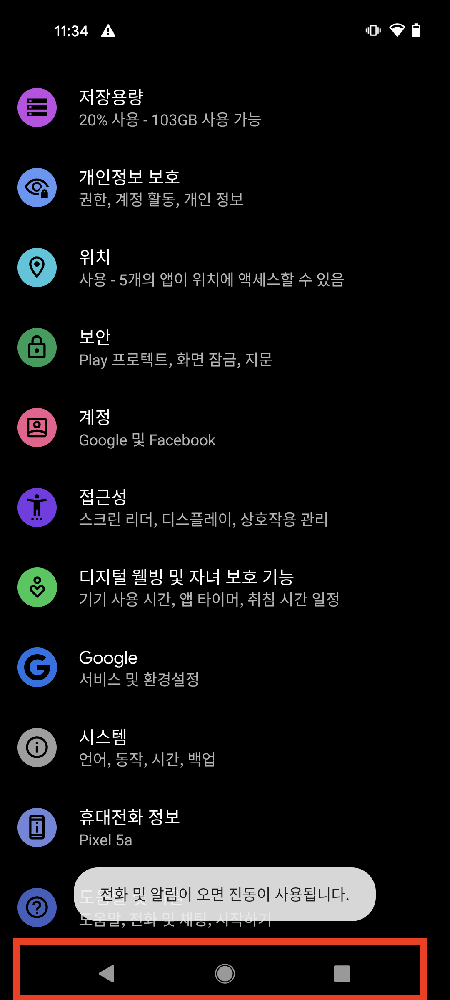

# 개요

React Native 로 iOS 와 Android 앱을 병행하여 개발하는 경우 두 운영체제간 차이점 때문에 마주치게 되는 문제가 있다.

바로 Android 에선 디바이스에 백 버튼이 있다는 것이다.

<figure>

<figcaption>Fig 1. 안드로이드 하단 기본 버튼</figcaption>
</figure>

나는 안드로이드 디바이스를 써본 적이 없었고, 앱 개발을 하기 시작하면서 앱 개발을 위해 안드로이드 기기를 처음 만져보았다.

팀 내 안드로이드 기기를 사용하는 선배로부터 안드로이드 유저에게 하단 백 버튼은 휴대폰 사용 중 가장 많이 누르는 버튼이라는 것을 알게 되었다.

iOS 유저에게는 좌우 스와이프나 좌상단에 위치한 백 버튼이 익숙한데, 안드로이드 유저에게는 백 버튼이 더 편하다는 것이다.

그래서 원활한 사용자 경험을 위해 이를 고려하여 앱을 개발해야 한다.

이를 고려하지 않고 iOS 환경만 고려하여 개발한다면 다음과 같은 문제가 발생한다.

앱의 네비게이션 스택이 없을 때 백 버튼을 누르게 된다면 앱이 종료되거나 개발한 네비게이션 로직과 충돌하여 에러가 발생해 엡이 강제 종료 될 수 있다.

이를 <a href="https://reactnative.dev/docs/backhandler" target="_blank" rel="noopener">React Native BackHandler</a> 를 통해 수정할 수 있다.

# BackHandler

React Native 가 제공하는 Back Handler API는 안드로이드 디바이스의 뒤로가기 기능이 목적인 물리적 백 버튼을 감지한다. 안드로이드 디바이스만 동작하는 API 이며, 백버튼 동작을 감지하여 기존 로직을 막고 새로운 로직을 추가할 수 있다.

기본적으로 BackHandler 에 등록한 이벤트는 등록한 순서의 역순으로 호출된다.

이벤트는 콜백 함수 형태로 등록할 수 있으며, 콜백함수는 `true` 또는 `false` 를 리턴해야 한다. `true` 를 리턴하는 것으로 커스터마이징 된 로직을 실행할 수 있으며, `false` 를 리턴하는 경우 안드로이드 디바이스의 기본 백 버튼 로직을 수행한다.

```ts
React.useEffect(() => {
  const onAndroidBackPress = () => {
    if (navigation.canGoBack() === false) {
      Alert.alert('Your App', '앱을 종료하시겠습니까?', [
        {
          text: '취소',
          onPress: () => null
        },
        { text: '확인', onPress: () => BackHandler.exitApp() }
      ]);
    } else {
      navigation.goBack();
    }
    return true; // prevent default behavior (exit app)
  };

  const backHandler = BackHandler.addEventListener(
    'hardwareBackPress',
    onAndroidBackPress
  );

  return () => backHandler.remove();
}, []);
```

위 로직을 루트 프로젝트의 `App.tsx` 에 추가하여 기본적인 안드로이드 백 버튼 로직을 추가했다.

React Native 앱의 네비게이션 스택이 존재하는 경우 일반적인 `goBack()` 액션을 수행한다.

네비게이션 스택이 없는 경우 (앱이 홈 화면에 있을 때) 안드로이드 사용자가 백 버튼을 누르면 기본 로직은 앱이 그대로 꺼지게 된다. 이는 좋지 않은 사용자 경험이기 때문에 알림 창을 띄워 종료 여부를 묻는다.

`확인` 버튼을 누르면 BackHandler API 가 제공하는 앱 종료 액션을 수행하고, `취소` 버튼을 누르면 `null` 을 리턴한다.

추가적인 로직이 필요한 경우 콜백 함수를 수정하는 것으로 안드로이드 디바이스의 백 버튼 로직을 커스터마이징 할 수 있다.

### References

- <a href="https://reactnative.dev/docs/backhandler" target="_blank" rel="noopener">React Native BackHandler</a>
