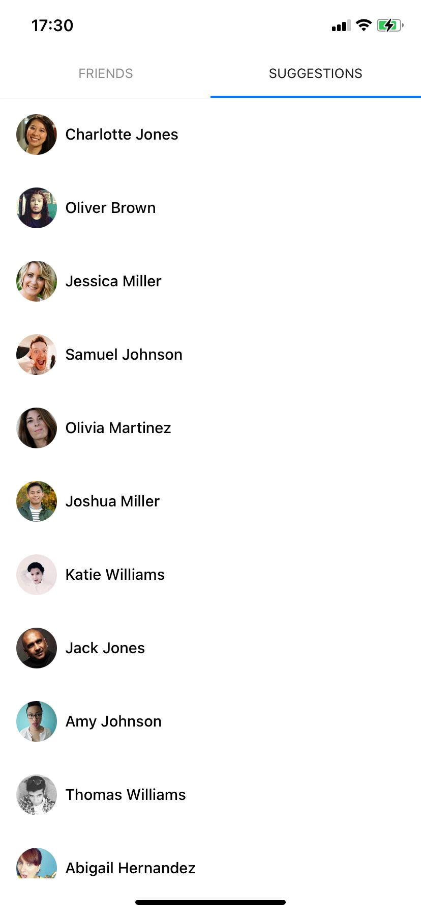
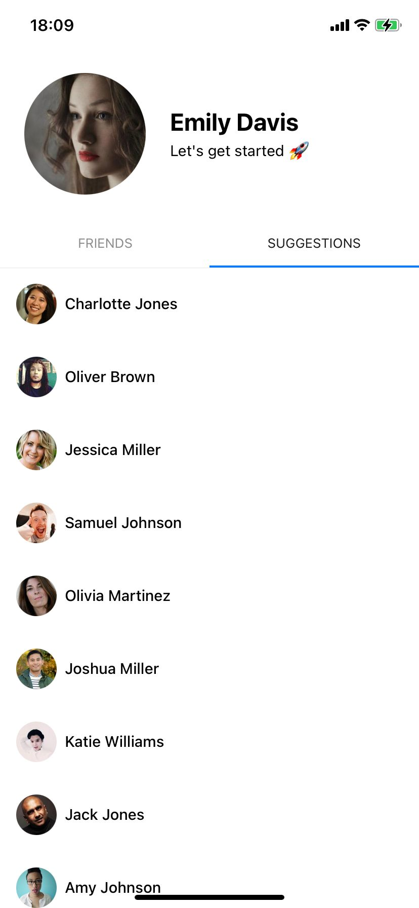
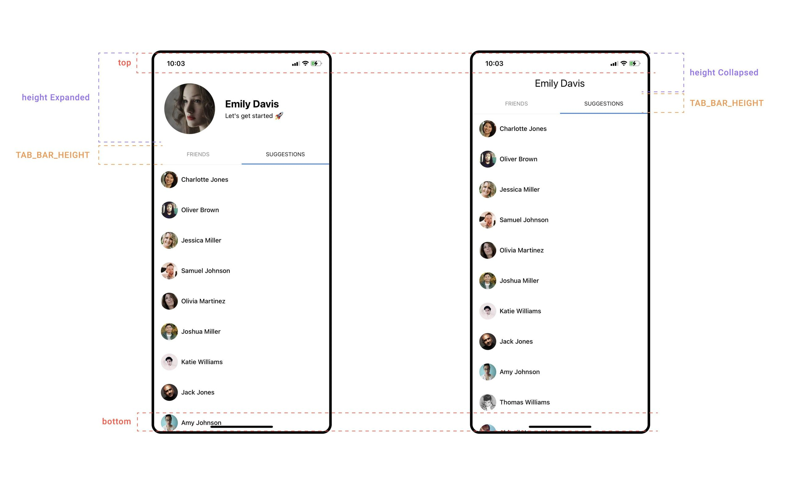
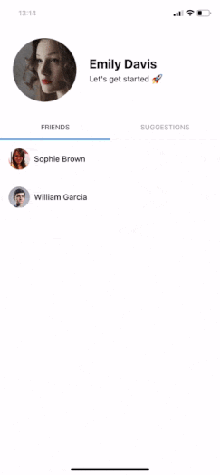

> **개발 중 찾은 블로그 글을 복습하며 번역한 내용입니다.** <br> <a href="https://stormotion.io/blog/how-to-create-collapsing-tab-header-using-react-native" target="_blank" rel="noopener">원문 블로그 글 - How to Create a Collapsing Tab Header Using React Native</a>

<br>

접히는 헤더 (Collapsing Header)와 스와이프를 통해 탭을 이동하는 기능은 모바일 UI 요소들 중에서 **가장 일반적인** 기능 중 하나이다. 예를 들면 트위터나 인스타그램 같은 소셜 미디어에서 프로필 화면에 널리 쓰이는 것이 있다.

<figure>

<figcaption>Fig 1. 예시로 든 트위터 프로필 페이지</figcaption>
</figure>

<br>

이 포스트에선 접히는 헤더와 다중 스와이프 가능한 탭을 React Native를 통해 하나하나 만들어볼 것이다. 이는 <a href="https://docs.swmansion.com/react-native-reanimated/" target="_blank" rel="noopener">React Native Reanimated</a> 와 <a href="https://reactnavigation.org/" target="_blank" rel="noopener">React Navigation</a> 라이브러리를 사용하여 구현할 수 있다.

# 접히는 탭 (Collapsible Tab)을 만들기 위한 시작점

최종적으로 목표한 기능을 만들기 위한 시작점은 단순한 탭 스크린을 만드는 것이다. <a href="https://reactnavigation.org/docs/material-top-tab-navigator/" target="_blank" rel="noopener">Material Top Tab Navigator</a>을 통해 간단하게 2개의 탭을 만들 수 있다. 각각의 탭은 목업 데이터가 포함된 <a href="https://reactnative.dev/docs/flatlist" target="_blank" rel="noopener">FlatList</a>로 구성되어 있다.

`ConnectionList` 는 자식 컴포넌트 에게 <a href="https://reactjs.org/docs/forwarding-refs.html" target="_blank" rel="noopener">참조(Reference) 를 전달</a>하기 위한 수단일 뿐, 특별한 내용은 없다. 추후에 이 기술이 필요하므로 미리 준비하자.

```tsx
...
type Props = Omit<FlatListProps<Connection>, "renderItem">;
const ConnectionList = forwardRef<FlatList, Props>((props, ref) => {
 const keyExtractor = useCallback((_, index) => index.toString(), []);
 const renderItem = useCallback<ListRenderItem<Connection>>(
   ({ item }) => <ConnectionItem connection={item} />,
   []
 );

 return (
   <FlatList
     ref={ref}
     style={styles.container}
     renderItem={renderItem}
     keyExtractor={keyExtractor}
     {...props}
   />
 );
});

const styles = StyleSheet.create({
 container: {
   flex: 1,
 },
});

export default memo(ConnectionList);
```

<br>

두 개의 탭으로 구성된 간단한 프로필 컴포넌트이다. 이는 추후 접히는 탭(Collapsible Tabs)의 캔버스가 될 것이다.

```tsx
...
const Profile: FC = () => {
 const renderFriends = useCallback(
   () => <ConnectionList data={FRIENDS} />,
   []
 );

 const renderSuggestions = useCallback(
   () => <ConnectionList data={SUGGESTIONS} />,
   []
 );

 return (
   <SafeAreaView style={styles.container}>
     <Tab.Navigator>
       <Tab.Screen name="Friends">{renederFriends}</Tab.Screen>
       <Tab.Screen name="Suggestions">{renderSuggestions}</Tab.Screen>
     </Tab.Navigator>
   </SafeAreaView>
 );
};

const styles = StyleSheet.create({
 container: {
   flex: 1,
   backgroundColor: "white",
 },
});

export default memo(Profile);
```

<br>

첫 번째 단계를 완료하고 위의 컴포넌트를 렌더링하면 우리가 보는 화면이다.

<figure>

<figcaption>Fig 2. 두 개의 탭으로 구성된 간단한 프로필 컴포넌트</figcaption>
</figure>

<br>

# Simple Static Header

헤더가 접히는 듯한 애니메이션을 적용하기 위해선 헤더를 화면(Screen)위에 위치해야 한다. 또한 리스트와 탭 컴포넌트에 대응되는 Offset를 추가해야 한다.

```tsx
...
 return (
   <View style={styles.container}>
     <Tab.Navigator>
       <Tab.Screen name="Friends">{renderFriends}</Tab.Screen>
       <Tab.Screen name="Suggestions">{renderSuggestions}</Tab.Screen>
     </Tab.Navigator>
     <Animated.View style={styles.headerContainer}>
       <Header
         name="Emily Davis"
         bio="Let's get started 🚀"
         photo={"https://picsum.photos/id/1027/300/300"}
       />
     </Animated.View>
   </View>
 );
};

const styles = StyleSheet.create({
...
 headerContainer: {
   top: 0,
   left: 0,
   right: 0,
   position: "absolute",
 },
});
...
```

<br>

정확한 Offset을 제공하기 위해 헤더의 정확한 높이를 알아야 한다. 렌더링 전에 이미 높이를 알고 있다면 따로 해결할 부분은 없지만, 이 기능은 그런 케이스가 아니다. 따라서 <a href="https://reactnative.dev/docs/view#onlayout" target="_blank" rel="noopener">onLayout</a>이 유용할 수 있다.

```tsx
...
 const [headerHeight, setHeaderHeight] = useState(0);
 const handleHeaderLayout = useCallback<NonNullable<ViewProps["onLayout"]>>(
   (event) => setHeaderHeight(event.nativeEvent.layout.height),
   []
 );

 ...
 <Animated.View
   style={styles.headerContainer}
   onLayout={handleHeaderLayout}>
...
```

<br>

이 Offset을 탭 바 컴포넌트와 목업 데이터를 감싸는 리스트의 컨테이너에 추가해야 한다. React Navigation은 <a href="https://reactnavigation.org/docs/material-top-tab-navigator/#tabbar" target="_blank" rel="noopener">tabBar</a> prop을 사용하는 것으로 탭 바 모양을 쉽게 커스터마이즈할 수 있는 방법을 제공한다.

그리고 `SafeAreaView` 컨테이너를 일반적인 `View` 로 교체한다. Fig.2 에서 처럼 리스트 아이템이 잘리는 것을 방지하기 위해 수동으로 Inset을 두기 편하기 때문이다.

```tsx
...
 const { top, bottom } = useSafeAreaInsets();

 const contentContainerStyle = useMemo<StyleProp<ViewStyle>>(
   () => ({
     paddingTop: headerHeight + TAB_BAR_HEIGHT,
     paddingBottom: bottom,
   }),
   [headerHeight, bottom]
 );

 const sharedProps = useMemo<Partial<FlatListProps<Connection>>>(
   () => ({
     contentContainerStyle,
     scrollIndicatorInsets: { top: headerHeight },
   }),
   [contentContainerStyle]
 );

 const renderFriends = useCallback(
   () => <ConnectionList data={FRIENDS} {...sharedProps} />,
   [sharedProps]
 );

 const renderSuggestions = useCallback(
   () => <ConnectionList data={SUGGESTIONS} {...sharedProps} />,
   [sharedProps]
 );

 const tabBarStyle = useMemo<StyleProp<ViewStyle>>(
   () => [styles.tabBarContainer, { top: headerHeight }],
   [headerHeight]
 );

 const renderTabBar = useCallback<
   (props: MaterialTopTabBarProps) => React.ReactElement
 >(
   (props) => (
     <Animated.View style={tabBarStyle}>
       <TabBar {...props} />
     </Animated.View>
   ),
   [tabBarStyle, headerHeight]
 );

 const headerContainerStyle = useMemo<StyleProp<ViewStyle>>(
   () => [styles.headerContainer, { paddingTop: top }],
   [headerHeight]
 );

 return (
   <View style={styles.container}>
     <Tab.Navigator tabBar={renderTabBar}>
       <Tab.Screen name="Friends">{renderFriends}</Tab.Screen>
       <Tab.Screen name="Suggestions">{renderSuggestions}</Tab.Screen>
     </Tab.Navigator>
     <Animated.View onLayout={handleHeaderLayout} style={headerContainerStyle}>
       <Header
         name="Emily Davis"
         bio="Let's get started 🚀"
         photo={"https://picsum.photos/id/1027/300/300"}
       />
     </Animated.View>
   </View>
 );
};
...
```

<br>

자, 이제 됐다. 그러나 생각해야할 점이 있다. **첫 번째 렌더링은 어떻게 할까?** 우리는 아직 헤더의 높이를 모른다. 그리고 `onLayout` 콜백 함수는 아직 호출되지 않았다. **정확하지 않은 헤더 높이로 인해 발생할 수 있는 갑작스러운 스와이프 액션**을 방지하기 위해 우린 조금 더 창의적이어야 한다.

이 아이디어는 절대적인 한 스크린을 렌더하는 대신 상대적인 렌더링(Relative Rendering)을 사용한다. 컴포넌트들은 추가적인 도움 없이 정렬되어 있다. 헤더의 높이를 아는 순간, 우린 절대 정렬(Absolute Alignment)를 사용하여 다시 렌더링할 것이다. 컴포넌트 트리는 수정되지만, 실제 사용자는 인식하지 못한다.

```tsx
...
 const rendered = headerHeight > 0;

 ...
 const contentContainerStyle = useMemo<StyleProp<ViewStyle>>(
   () => ({
     paddingTop: rendered ? headerHeight + TAB_BAR_HEIGHT : 0,
     paddingBottom: bottom,
   }),
   [rendered, headerHeight, bottom]
 );

 ...
 const tabBarStyle = useMemo<StyleProp<ViewStyle>>(
   () => [
     rendered ? styles.tabBarContainer : undefined,
     { top: rendered ? headerHeight : undefined },
   ],
   [rendered, headerHeight]
 );

 ...
 const headerContainerStyle = useMemo<StyleProp<ViewStyle>>(
   () => [rendered ? styles.headerContainer : undefined, { paddingTop: top }],
   [rendered, headerHeight]
 );
...
```

<br>

<figure>

<figcaption>Fig 3. Static 헤더와 두 개의 탭으로 이루어진 화면</figcaption>
</figure>

<br>

# 헤더 애니메이션 (Animating the Header)

Static 헤더를 만들었으니, 이제 애니메이션을 추가할 차례다.

React Native Reanimated 는 최근에 새로운 필수 애니메이션 API를 제공하는 <a href="https://docs.swmansion.com/react-native-reanimated/docs/#library-overview" target="_blank" rel="noopener">V2로 업그레이드</a> 되었다.

애니메이션의 포인트는 **사용자가 스크롤링을 할 때 헤더를 접고, 헤더를 상단에 고정하여 메인 컨텐츠를 위한 공간을 더 많이 만드는 것**이다.

애니메이션을 적용하기 전에, **헤더를 접기 위한 스크롤 길이를 확인**할 간단한 방법을 적용해야 한다.

```tsx
...
export type HeaderConfig = {
 heightExpanded: number;
 heightCollapsed: number;
};
...
 const { top, bottom } = useSafeAreaInsets();
 const [headerHeight, setHeaderHeight] = useState(0);
 const defaultHeaderHeight = top + HEADER_HEIGHT;

 const headerConfig = useMemo<HeaderConfig>(
   () => ({
     heightCollapsed: defaultHeaderHeight,
     heightExpanded: headerHeight,
   }),
   []
 );

 const { heightCollapsed, heightExpanded } = headerConfig;
 const headerHeightDiff = heightExpanded - heightCollapsed;
...
```

<br>

여기에서 `headerHeightDiff`는 우리가 사용해야 하는 스크롤 거리와 정확히 일치한다.

React Native Reanimated를 통해 애니메이션 스크롤 값을 알아내는 것이 훨씬 쉬워졌다.

```tsx
...
 const friendsScrollValue = useSharedValue(0);
 const friendsScrollHandler = useAnimatedScrollHandler(
   (event) => (friendsScrollValue.value = event.contentOffset.y)
 );

 const suggestionsScrollValue = useSharedValue(0);
 const suggestionsScrollHandler = useAnimatedScrollHandler(
   (event) => (suggestionsScrollValue.value = event.contentOffset.y)
 );
...
```

<br>

이제 현재 보여지는 리스트의 애니메이션 스크롤 위치를 반영하기 위한 몇 가지 변수를 만들어야 한다. 안타깝게도, `Tab Navigator`는 현재 탭의 변경 내용을 읽을 수 있는 방법을 제공하지 않는다. 그러나, 커스텀 탭 바를 통해 약간의 트릭으로 이를 알아낼 수 있다.

```tsx
...
type Props = MaterialTopTabBarProps & {
 onIndexChange?: (index: number) => void;
};

const TabBar: FC<Props> = ({ onIndexChange, ...props }) => {
 const { index } = props.state;
 useEffect(() => {
   onIndexChange?.(index);
 }, [onIndexChange, index]);

 return <MaterialTopTabBar {...props} />;
};

export default TabBar;
```

<br>

```tsx
 ...
 const [tabIndex, setTabIndex] = useState(0);

 ...
 const renderTabBar = useCallback<
   (props: MaterialTopTabBarProps) => React.ReactElement
 >(
   (props) => (
     <Animated.View style={tabBarStyle}>
       <TabBar onIndexChange={setTabIndex} {...props} />
     </Animated.View>
   ),
   [tabBarStyle, headerHeight, rendered]
 );
...
```

<br>

마침내, 이번 단계에서 우리는 애니메이션 헤더를 만들 수 있다.

```tsx
...
const сurrentScrollValue = useDerivedValue(
   () =>
     tabIndex === 0 ? friendsScrollValue.value : suggestionsScrollValue.value,
   [tabIndex]
 );

 const translateY = useDerivedValue(
   () => -Math.min(сurrentScrollValue.value, headerHeightDiff)
 );

 const tabBarAnimatedStyle = useAnimatedStyle(() => ({
   transform: [{ translateY: translateY.value }],
 }));

 const headerAnimatedStyle = useAnimatedStyle(() => ({
   transform: [{ translateY: translateY.value }],
 }));

...
```

<br>

<figure>

<figcaption>Fig 4. 접히는 애니메이션 헤더 </figcaption>
</figure>

<br>

위에서 보듯, 접히는 애니메이션은 작동한다. 그러나 우리가 원했던 애니메이션이 아니다. 헤더의 나머지 부분이 표시되고 잘려 보인다. 이제 다음 목표는 헤더가 접힐 때 프로필 이름만 표시하는 것이다.

```tsx
...
const headerAnimatedStyle = useAnimatedStyle(() => ({
   transform: [{ translateY: translateY.value }],
   opacity: interpolate(
     translateY.value,
     [-headerDiff, 0],
     [Visibility.Hidden, Visibility.Visible]
   ),
 }));

...
const collapsedOverlayAnimatedStyle = useAnimatedStyle(() => ({
   opacity: interpolate(
     translateY.value,
     [-headerDiff, OVERLAY_VISIBILITY_OFFSET - headerDiff, 0],
     [Visibility.Visible, Visibility.Hidden, Visibility.Hidden]
   ),
 }));

 const collapsedOverlayStyle = useMemo<StyleProp<ViewStyle>>(
   () => [
     styles.collapsedOverlay,
     collapsedOverlayAnimatedStyle,
     { height: heightCollapsed, paddingTop: top },
   ],
   [collapsedOverlayAnimatedStyle, heightCollapsed]
 );

...
return (
   <View style={styles.container}>
     <Tab.Navigator tabBar={renderTabBar}>
       <Tab.Screen name="Friends">{renderFriends}</Tab.Screen>
       <Tab.Screen name="Suggestions">{renderSuggestions}</Tab.Screen>
     </Tab.Navigator>
     <Animated.View onLayout={handleHeaderLayout} style={headerContainerStyle}>
       <Header
         name="Emily Davis"
         bio="Let's get started 🚀"
         photo={"https://picsum.photos/id/1027/300/300"}
       />
     </Animated.View>
     <Animated.View style={collapsedOverlayStyle}>
       <HeaderOverlay name="Emily Davis" />
     </Animated.View>
   </View>
 );
};

const styles = StyleSheet.create({
 ...
 collapsedOverlay: {
   position: "absolute",
   top: 0,
   left: 0,
   right: 0,
   backgroundColor: "white",
   alignItems: "center",
   justifyContent: "center",
   zIndex: 2,
 }
 ...
 });
...
```

<br>

훨씬 좋아 보인다!

<figure>

<figcaption>Fig 5. 프로필 이름만 보이는 애니메이션 헤더 </figcaption>
</figure>

<br>

접히는 애니메이션을 만드는 데 사용된 길이 값 등 치수에 대한 자세한 내용은 아래와 같다.

<figure>

<figcaption>Fig 6. Collapsing Tab Header Dimensions</figcaption>
</figure>

<br>

# 스크롤 동기화 (Scroll Syncing)

지금까지 만든 화면은 보기엔 꽤 좋아 보인다. 하지만 우리는 두 개 이상의 리스트를 원했기 때문에 완벽하게 준비되지 않았다. 탭이 두 개 이상이면, 두 **탭 간 헤더 위치를 동기화** 해야 한다. 그렇지 않으면 탭을 전환하는 동안 헤더가 튀어나온다.

<figure>

<figcaption>Fig 7. 탭 전환 시 튀어나오는 헤더</figcaption>
</figure>

<br>

현재 탭과 스크롤을 동기화하기 위해 현재 표시되지 않은 리스트에 정확한 Offset을 수동으로 설정하는 것이 좋다.

각 리스트의 참조와 각 리스트의 현재 위치에 대한 정보를 저장하기 위해 사용할 엔티티를 만들어야 한다. 이름은 `ScrollPairs` 이다.

```tsx
...
export type ScrollPair = {
 list: RefObject<FlatList>;
 position: Animated.SharedValue<number>;
};

...
 const friendsRef = useRef<FlatList>(null);
 const suggestionsRef = useRef<FlatList>(null);

 ...
 const scrollPairs = useMemo<ScrollPair[]>(
   () => [
     { list: friendsRef, position: friendsScrollValue },
     { list: suggestionsRef, position: suggestionsScrollValue },
   ],
   [friendsRef, friendsScrollValue, suggestionsRef, suggestionsScrollValue]
 );
...
```

<br>

이전에 만들어 둔 컴포넌트에 참조 전달 (Reference Forwarding)이 유용한 부분이다. 스크롤 쌍으로 묶인 목록은 모든 리스트를 살펴보고 헤더 위치를 동기화 하는데 도움이 된다.

이 간단한 훅이 스크롤 동기화의 핵심 해결책이다. 동기화 함수에서 모든 스크롤 쌍의 리스트를 반복하고, 현재 목록의 Offset에 따라 스크롤 Offset을 조정한다.

```tsx
...
const useScrollSync =(
 scrollPairs: ScrollPair[],
 headerConfig: HeaderConfig
) => {
  const sync: NonNullable<FlatListProps<any>["onMomentumScrollEnd"]> = (event) =>
 {
  const { y } = event.nativeEvent.contentOffset;
  const { heightCollapsed, heightExpanded } = headerConfig;
  const headerHeightDiff = heightExpanded - heightCollapsed;

  for (const { list, position } of scrollPairs) {
    const scrollPosition = position.value ?? 0;
    if (scrollPosition > headerHeightDiff && y > headerHeightDiff) {
      continue;
     }

    list.current?.scrollToOffset({
      offset : Math.min(y, headerDiff),
      animated:false,
     });
   }
 };

  return { sync };
};
...
```

<br>

리스트에 훅을 적용할 땐 <a href="https://reactnative.dev/docs/scrollview#onmomentumscrollend" target="_blank" rel="noopener">onMomentumScrollEnd</a> 와 <a href="https://reactnative.dev/docs/scrollview#onscrollenddrag" target="_blank" rel="noopener">onScrollEndDrag</a> 콜백을 사용해 가능한 모든 스크롤 케이스를 대응하는 것이 좋다.

```tsx
...
 const { sync } = useScrollSync(scrollPairs, headerConfig);
 const sharedProps = useMemo<Partial<FlatListProps<Connection>>>(
   () => ({
     contentContainerStyle,
     onMomentumScrollEnd: sync,
     onScrollEndDrag: sync,
     scrollEventThrottle: 16,
     scrollIndicatorInsets: { top: heightExpanded },
   }),
   [contentContainerStyle, sync]
 );
...
```

<br>

이제 마지막이지만 결코 작지 않은 기능이다.

`Friends` 탭은 리스트의 아이템이 적다. 이 리스트는 너무 짧아서 헤더를 접기 위해 충분히 긴 스크롤링을 수행할 수 없다. 따라서 <a href="https://reactnative.dev/docs/scrollview#contentcontainerstyle" target="_blank" rel="noopener">contentContainerStyle</a> prop 에 만족하는 `minHeight`를 추가해야 한다.

```tsx
...
 const { height: screenHeight } = useWindowDimensions();

 ...
 const contentContainerStyle = useMemo<StyleProp<ViewStyle>>(
   () => ({
     paddingTop: rendered ? headerHeight + TAB_BAR_HEIGHT : 0,
     paddingBottom: bottom,
     minHeight: screenHeight + headerDiff,
   }),
   [rendered, headerHeight, bottom]
 );
...

```

<br>

화면은 준비됐다. 이 단계별 가이드가 도움이 되었기를 바란다.

<figure>

<figcaption>Fig 8. 완성된 화면</figcaption>
</figure>

<br>

전체 소스 코드는 <a href="https://github.com/Stormotion-Mobile/react-native-collapsing-tab-header" target="_blank" rel="noopener">Github Repository</a>에서 확인할 수 있다.

---

<br>
<br>

개발하면서 이 기능을 구현하는 게 큰 어려움이었는데, 가려운 곳을 한번에 긁어준 글이었다. 서투른 영어 실력이지만 기록해두고 싶어 번역하여 포스팅을 하게 되었다.

<br>

### References

- <a href="https://stormotion.io/blog/how-to-create-collapsing-tab-header-using-react-native" target="_blank" rel="noopener">원문 블로그 글 - How to Create a Collapsing Tab Header Using React Native</a>
- <a href="https://docs.swmansion.com/react-native-reanimated/" target="_blank" rel="noopener">React Native Reanimated</a>
- <a href="https://reactnavigation.org/" target="_blank" rel="noopener">React Navigation</a>
- <a href="https://reactnavigation.org/docs/material-top-tab-navigator/" target="_blank" rel="noopener">Material Top Tab Navigator</a>
- <a href="https://reactnative.dev/docs/flatlist" target="_blank" rel="noopener">FlatList</a>
- <a href="https://reactjs.org/docs/forwarding-refs.html" target="_blank" rel="noopener">Reference Forwarding</a>
- <a href="https://reactnative.dev/docs/view#onlayout" target="_blank" rel="noopener">onLayout</a>
- <a href="https://docs.swmansion.com/react-native-reanimated/docs/#library-overview" target="_blank" rel="noopener">React Native Reanimated V2</a>
- <a href="https://reactnative.dev/docs/scrollview#onmomentumscrollend" target="_blank" rel="noopener">onMomentumScrollEnd</a>
- <a href="https://reactnative.dev/docs/scrollview#onscrollenddrag" target="_blank" rel="noopener">onScrollEndDrag</a>
- <a href="https://reactnative.dev/docs/scrollview#contentcontainerstyle" target="_blank" rel="noopener">contentContainerStyle</a>
- <a href="https://github.com/Stormotion-Mobile/react-native-collapsing-tab-header" target="_blank" rel="noopener">원문 작성자의 Github Repository</a>
