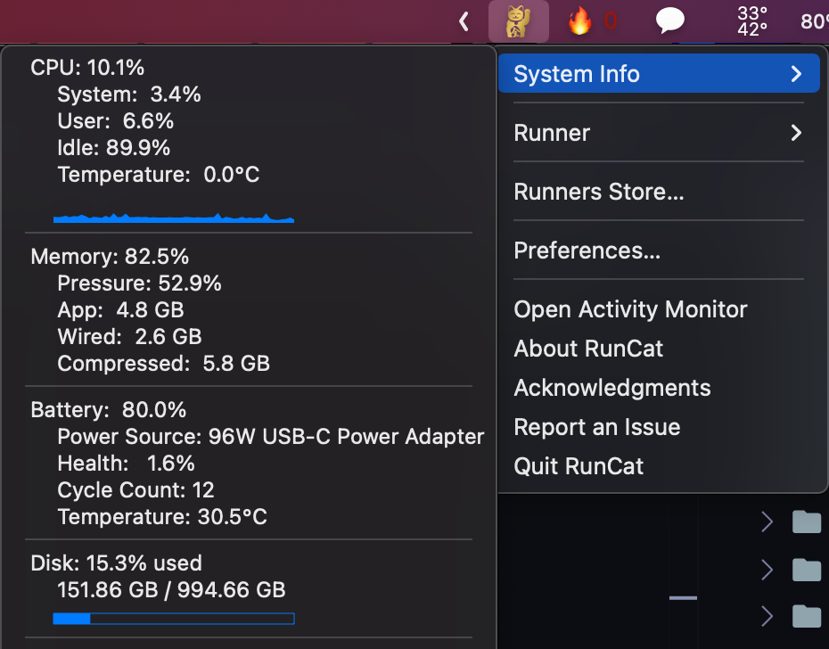
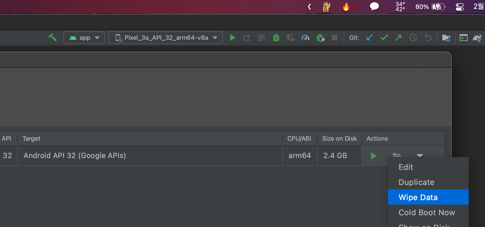

# 배경

리액트 네이티브로 프로젝트를 수행하던 중 안드로이드 스튜디오에서 앱을 확인하기 위해 빌드하던 중 위와 같은 에러를 마주했다.

내 컴퓨터의 저장 공간이 부족해서 그런가? 했는데, 저장 공간은 충분하다고 생각했다. 구글링 끝에 해결 방법을 찾았다.

<figure>

<figcaption>Fig 1. 저장 공간은 충분하다...</figcaption>
</figure>

원인은 실제 하드 웨어 공간이 아닌, 안드로이드 스튜디오에서 사용하는 저장소 공간이 부족하여 발생한 것이었다. 해결 방법은 안드로이드 스튜디오의 저장 공간을 지운 후, 다시 빌드하면 된다.

<figure>

<figcaption>Fig 2. TOOLS 의 AVD Manager 진입</figcaption>
</figure>

<figure>

<figcaption>Fig 3. Wipe Data를 통해 저장 공간 지우기</figcaption>
</figure>

위 과정을 통해 에러를 해결했다.

리액트 네이티브를 첫 직장에서 처음 접하게 되었는데, 리액트와 비슷한 점이 굉장히 많아 편하기도 하지만 반대로 어렵기도 하다. 꾸준히 공부하면서 블로깅으로 기록해야할 것 같다.
