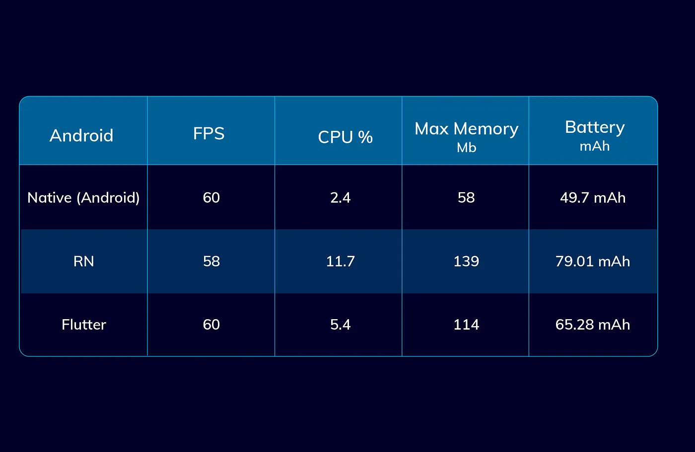
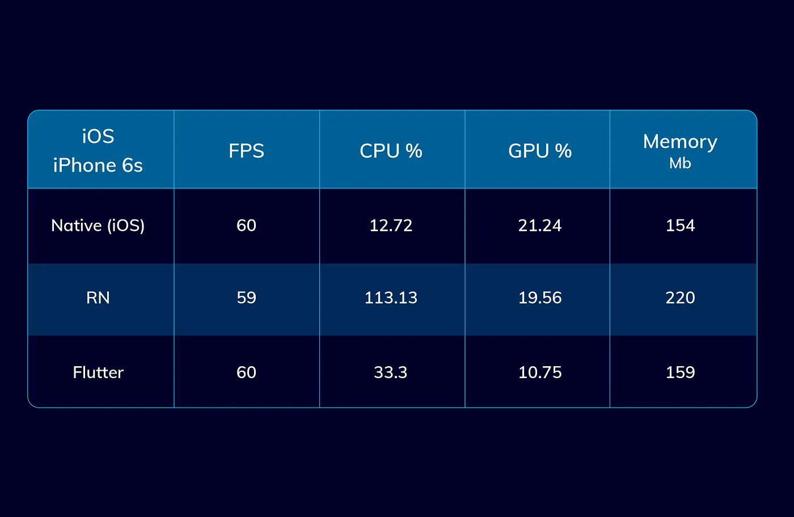
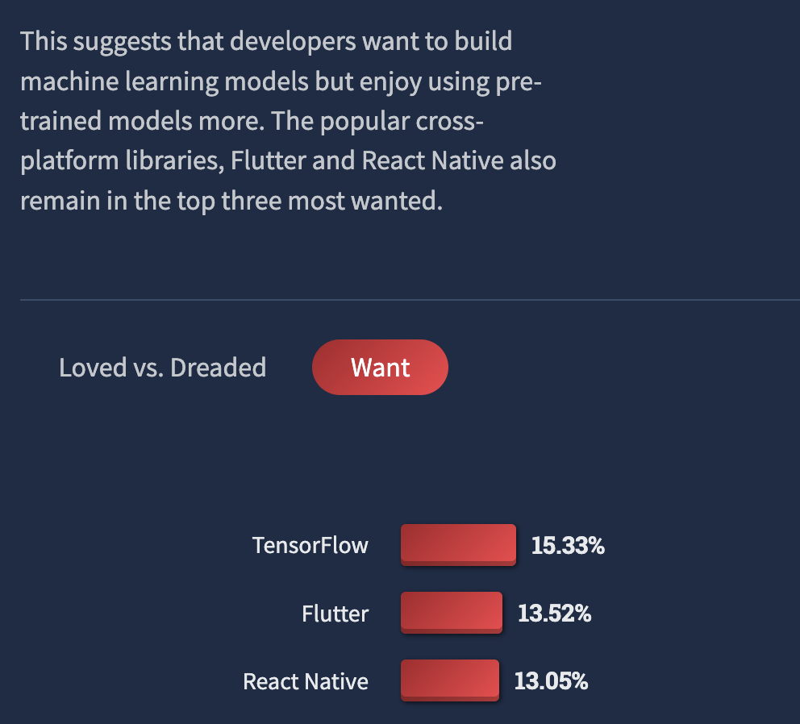

# 개요

개발자로서 1년 넘는 시간 동안 리액트 네이티브를 사용해 앱 개발을 해왔다.

리액트가 익숙했던 나는 어렵지 않게 배울 수 있었고 현업에 금방 적용했다.

그러나 최근에 느낀 점은 리액트 네이티브 앱 개발자라면 **당연히 알아야 할 리액트 네이티브의 기본**을 놓치고 기능 구현에만 힘써왔던 것 같다.

그래서 리액트 네이티브의 기본을 정리해두고자 포스팅을 하게 되었다.

# React Native

리액트 네이티브는 Facebook이 만든 React 를 사용해 iOS 와 Android 두 플랫폼의 앱을 개발할 수 있는 오픈소스 프레임워크다.

가장 큰 장점으로 **Javascript 를 이용한 개발**을 할 수 있다는 것과 **React 컴포넌트를 재사용**할 수 있다는 것이다.

앱 개발시 고려되는 크로스 플랫폼 앱 개발 프레임워크로는 **리액트 네이티브**와 **플러터**가 있다.

### RN vs Flutter

리액트 네이티브와 플러터와의 선택은 지금까지도 자주 이야깃거리로 나오고 있다. 리액트 네이티브와 플러터, 그리고 네이티브 앱 간의 <a href="https://medium.com/swlh/flutter-vs-react-native-vs-native-deep-performance-comparison-990b90c11433" target="_blank" rel="noopener">성능 벤치마크</a> 결과는 이미 여러 곳에서 확인할 수 있다.

<figure>

<figcaption>Fig 1. Android</figcaption>
</figure>

 

<figure>

<figcaption>Fig 2. iOS</figcaption>
</figure>

성능 벤치마크 기준은 각 프레임워크의 앱들에서 무거운 애니메이션과 많은 CPU 연산이 필요한 작업들을 수행했을 때의 결과이다.

전체적으로 리액트 네이티브보다 플러터의 성능이 우수하다.

성능 차이가 나는 기본적인 이유는 리액트 네이티브는 **Native Bridge**를 통해야만 Native Side 와 통신을 할 수 있다.

네이티브 브릿지를 통해 자바스크립트 코드를 실행할 수 있는데, 이 브릿지에서 로직의 경중에 따라 **병목현상**이 발생할 수 있다. 플러터는 브릿지를 통하지 않고 **실제 네이티브 코드로 컴파일** 되기 때문에 이러한 병목현상이 발생하지 않아 전반적으로 플러터가 성능이 우수한 것이다.

<figure>

<figcaption>Fig 3. 2022년의 RN vs Flutter</figcaption>
</figure>

실제로 이전까진 RN 의 사용 빈도가 압도적이었다면 스택 오버플로우에서 진행한 <a href="https://survey.stackoverflow.co/2022/#technology-most-loved-dreaded-and-wanted" target="_blank" rel="noopener">2022년 개발자 설문조사</a> 에선 오히려 플러터가 이를 앞질렀다. 확실히 플러터는 급격하게 그 커뮤니티가 성장하고 있다.

### RN 을 사용하는 이유?

그렇다고 해서 크로스 플랫폼 앱 개발을 위한 프레임워크는 플러터가 무조건 옳다는 것은 아니다. **정답은 없다**.

성능 상으론 리액트 네이티브보다 플러터가 우수하다. 그러나 앱에 복잡한 연산이나 비즈니스 로직이 많지 않고 무거운 애니메이션이 적은, 그러니까 많은 CPU 연산을 필요로 하지 않는 앱이라면 플러터와 리액트 네이티브 간 성능 차는 크게 없을 것이다.

결국 어떤 개발 도구를 사용할 지 결정하는 것은 **개발자의 선택**이며 현재 갖춰진 환경에 적합한 도구를 선택해야 한다. 개발 팀과 환경이 자바스크립트에 기반을 두고 있으며 새로운 기술 도입을 위한 개발 기간이 부족하다면 리액트 네이티브를 선택해야만 한다.

그렇다고 해서 리액트 네이티브가 플러터 도입이 어려운 경우에만 선택해야만 하는 그런 프레임워크는 **절대** 아니다.

리액트 네이티브는 굉장히 **강력한 강점**을 갖고 있다.

가장 먼저 리액트 네이티브는 **웹 프론트엔드 영역에서 가장 큰 영역을 차지하는** 리액트를 사용한다. 때문에 방대한 커뮤니티를 갖고 있고, 다양한 자료들을 인터넷에서 확인할 수 있다.

이미 형성된 이러한 리액트 개발 커뮤니티에서 획득할 수 있는 다양한 정보들은 플러터에서 제공하는 공식 문서들을 뛰어넘는 큰 강점이 될 수 있다.

또한 자바스크립트를 기반으로 한 다양한 라이브러리들이 존재한다. 물론 이 라이브러리 선택에 있어서 우수한 라이브러리를 선택해야 하는 것은 개발자의 몫이다. 그럼에도 이러한 커뮤니티가 방대하기 때문에 원하는 목적의 기능을 가진 라이브러리를 선택하여 사용할 수 있다는 것은 또 하나의 강점이다.

그리고 리액트 네이티브는 <a href="https://reactnative.dev/blog/2023/01/12/version-071" target="_blank" rel="noopener">현재 0.71 버전</a>이 최신 버전이다. **타입스크립트**가 기본 언어가 되며, 보다 편안한 스타일링을 위한 속성 추가, 새로운 아키텍처 및 개발자의 개발 경험 향상과 같은 꾸준한 업데이트를 수행하고 있다.

점진적으로 리액트 네이티브는 브릿지를 사용하는 것으로 인해 발생하는 성능 이슈를 개선하기 위해 새로운 아키텍처를 업데이트 할 것이며, 앞서 이야기 했던 플러터와의 비교 우위에서 떨어지는 부분들은 개선될 것이다.

아직 0.71 버전인데, **1.0 버전**이 나올 때가 개인적으로 많이 기대가 된다.

리액트 네이티브는 **Native Bridge**를 통해야만 앱을 작동시킬 수 있다고 앞서 간략하게 이야기를 했는데, 다음 포스팅에선 리액트 네이티브의 작동 원리를 조금 더 세세하게 정리해보려 한다.

### References

- <a href="https://medium.com/swlh/flutter-vs-react-native-vs-native-deep-performance-comparison-990b90c11433" target="_blank" rel="noopener">Flutter vs React Native vs Native: Deep Performance Comparison</a>
- <a href="https://survey.stackoverflow.co/2022/#technology-most-loved-dreaded-and-wanted" target="_blank" rel="noopener">2022 Developer Survey - Stack Overflow</a>
- <a href="https://reactnative.dev/blog/2023/01/12/version-071" target="_blank" rel="noopener">React Native 0.71 Updates</a>
