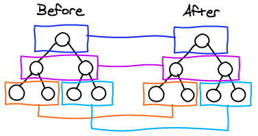
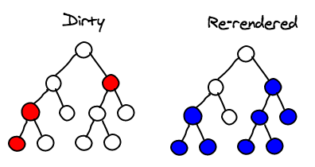

# 개요

React Native는 **Native Bridge**를 통해야만 앱을 작동시킬 수 있다고 <a href="https://mniyunsu.github.io/react-native-funda" target="_blank" rel="noopener">이전 글</a>에서 간략하게 이야기를 했다. 조금 더 자세히 이 개념을 알기 위해 **React Native의 작동 원리**를 정리하기 위해 포스팅을 했다.

# React Native의 Thread

<a href="https://mniyunsu.github.io/react-native-funda" target="_blank" rel="noopener">이전 글</a>에서 React Native와 Flutter 간의 성능 차이의 원인은 **Native Bridge 의 유무**라고 정리했다. 그 전에 알아두어야 할 것은 **React Native 앱의 실행되는 과정**이다.

React Native 앱은 Javascript 기반의 크로스 플랫폼 개발 도구로서, 크게 두 가지 부분으로 구성되어 있다. **Native** 영역과 **Javascript** 영역이다.

모바일 앱은 Android와 iOS 라는 두 플랫폼으로 분류되어 있다. 두 플랫폼은 각각 정해진 프로그래밍 언어를 기반으로 앱을 작동한다. Android는 Java와 Kotlin이며, iOS 는 Objective-C 와 Swift이다.

**React Native는 Javascript를 기반으로 하는데 어떻게 두 플랫폼에 모바일 앱을 배포할 수 있을까?** 그것은 React Native 앱은 위에서 말한 Native 영역, 그러니까 Android는 Java / Kotlin, iOS 는 Objective-C / Swift 환경을 Main Thread로 사용하여 앱을 실행 및 로드하고 **Javascript를 실행하기 위한 환경**을 구성하기 때문이다.

Javascript를 실행하기 위한 환경에 대해 이야기 하기 전에 먼저 React Native 에서 사용하는 **Thread** 를 짚고 넘어가야 한다.

### UI Thread

**Main Thread**로서 어플리케이션이 실행되자마자 실행된다. 앱을 로드하고 앱의 UI 를 렌더한다.
즉, Android / iOS 의 UI 렌더링에 사용되는 Main Thread이다.

본격적으로 React Native 앱을 실행하기 위해 개발자가 작성한 Javascript 코드를 하나의 번들(`main.bundle.js`)로 만들고, 이를 로드한다. Main Thread는 이 번들을 Javascript Thread로 보낸다.

Javascript Thread로 보내는 이유는 번들 실행 로직이 무거운 작업일 경우 Main Thread에 문제를 일으키지 않기 위함이다.

Javascript Thread에서 매 이벤트 루프 마다 Javascript의 변경 사항을 판단하여 이 변경 사항을 **Native Bridge**를 통해 받아 이 UI 를 화면에 표시한다. 또한 사용자가 기기에 직접 내리는 UI 이벤트 (`onPress`와 같은 이벤트 들) 명령을 받아 Native Bridge를 통해 Javascript Thread로 보내준다.

### Javascript Thread

Javascript Thread는 Main Thread로부터 받은 **Javascript 번들을 실행**한다.

즉, Javascript 로직이 실행되는 Thread이다. Javascript 엔진을 통해 Javascript 코드가 실행되는 곳이다. 각종 비즈니스 로직을 포함하고 있고, 사용자와 인터랙션 하기 위한 React 코드들이 실행되는 환경이다.

Javascript Thread엔 이벤트 루프가 존재하는데, 이벤트 루프가 종료될 때 마다 Main Thread로 **Javascript 변경 사항**을 전달한다. 이 전달되는 변경 사항은 화면에 보이는 뷰와 같은 컴포넌트를 어떻게 표시할지 와 같은 정보들이다.

React Native는 React의 **Diffing 알고리즘**을 활용해 이벤트 루프 종료 마다 UI 의 변경된 부분만, 그러니까 최소한의 변경사항 만 Main Thread로 전달한다.

##### Diffing Algorithm

React 에서의 UI 컴포넌트들은 실제 DOM의 노드가 아닌 **Virtual DOM**이다. React는 이 가상 DOM을 활용해 최소한의 변경 사항을 파악하여 그 부분만 리렌더링한다. 이 때 사용하는 알고리즘이 Diffing 알고리즘이다.

React 환경에서 컴포넌트의 특정 상태가 변경된 경우, React는 상태가 변경된 컴포넌트를 **Dirty** 하다 판단한다.React에서 이 Dirty 컴포넌트를 찾는 방법은 기존 트리와 업데이트 될 트리의 레벨 별 트리를 비교하는 것으로 찾는다.

 <figure>
 <figcaption>Fig 1. 컴포넌트의 레벨 별 비교</figcaption></figure>

그래서 매 이벤트 루프 마다 이 Dirty 한 컴포넌트를 확인하고 상태 값만 변했다면 그 값만 업데이트하고 컴포넌트가 변경되었다면 현재 노드를 포함한 자식 노드들의 가상 DOM을 렌더링하여 기존 가상 DOM을 대체한다.

 <figure>
 <figcaption>Fig 2. 가상 DOM 업데이트 방식</figcaption></figure>

이 과정이 실제 DOM 이었다면 매우 무거운 작업이겠지만 가상 DOM이기 때문에 그 작업이 크지 않다. 또한 이 컴포넌트의 업데이트가 루트 컴포넌트에서 진행되지 않고 일부 컴포넌트에서만 진행된다. 즉 **'지역성'**을 띄고 있어 실제로 Dirty 컴포넌트의 비교 횟수가 많지 않다.

그럼에도 하위 컴포넌트들의 리렌더링을 방지하고자 한다면 그 컴포넌트를 메모이제이션하는 것으로 성능 최적화를 수행할 수 있다.

 

### Shadow Thread

Javascript Thread가 실행되면서 React는 가상 DOM 을 생성하고 위에서 말한 Diffing 알고리즘을 통해 변경 사항을 Native Bridge를 경유하여 Shadow Thread로 전달한다.

이 Shadow Thread는 변경 사항에 맞는 **화면의 레이아웃을 계산**한다. 계산이 끝난 레이아웃의 파라미터 또는 객체를 Main Thread로 보내는 역할을 수행한다.

 
 

# Native Bridge

React Native 앱은 위와 같은 Thread를 통해 앱을 화면에 표시하게 된다. 즉, Javascript Thread에서 Javascript의 변경 사항을 Main Thread와 주고받는 통신이 필연적이다.

이 때 Main Thread와 Javascript Thread의 통신은 **Native Bridge**를 통해 이뤄진다.

각 Thread에서 Native Bridge를 통해 전달되는 정보는 **JSON** 객체로 변환되어 전달되게 된다.

다시 말해, React Native 어플리케이션에서 가장 중요한 부분이 이 Native Bridge이다. 이 부분에서 **병목 현상**이 가장 많이 발생하며, 우수한 성능의 앱을 위해선 Native Bridge를 건너는 횟수를 최소한으로 하도록 개발해야 한다.

### 병목 현상

iOS 디바이스는 프로모션 디스플레이의 경우 1초 당 120 프레임을 화면에 표시할 수 있으며, 그 외에는 60 프레임을 표시할 수 있다. Android 디바이스도 120 프레임이 대부분이다.

즉, 화면에 1 프레임을 표시하기 위해선 최대 1/120초(8.33ms) 또는 1/60초(16.67ms) 가 필요하다는 뜻이다.

React Native 앱은 8.33ms 또는 16.67ms 안에 하나의 프레임을 생성해야만 사용자가 화면을 봤을 때 끊기지 않는 애니메이션을 볼 수 있다. 이 시간 안에 작업을 처리하지 못하는 경우 뚝뚝 끊기는 애니메이션을 보게 된다. 병목 현상이 발생한 것이다.

다시 말해, Javascript Thread의 한 이벤트 루프가 이 시간 안에 작업을 처리하지 못하면 Native Bridge에 병목 현상이 생기게 된다. 이를 Native Bridge의 **데드라인**이라고 부른다.

 
 

# React Native 앱 실행 과정

React Native의 작동 원리의 근간이 되는 Thread와 Native Bridge를 정리했다.

이를 종합하여 React Native 앱의 실행 과정은 다음과 같다.

##### 1. 앱이 시작되며 Main Thread가 실행된다.

##### 2. Main Thread는 Javascript Thread를 실행하고 Javascript 번들을 로드한다.

##### 3. Javascript Thread가 실행되며 React는 가상 DOM 을 생성한다.

##### 4. React의 Diffing 알고리즘을 통해 변경 사항을 Native Bridge를 통해 Shadow Thread로 전달한다.

##### 5. Shadow Thread는 변경 사항으로부터 화면의 레이아웃을 계산한다. 계산된 레이아웃 객체를 Native Bridge를 통해 Main Thread로 보낸다.

##### 6. Main Thread가 화면에 UI 를 표시한다.

##### 7. 사용자로부터 발생한 UI 이벤트가 Native Bridge를 통해 Javascript Thread로 보내진다.

##### 8. UI 이벤트의 Javascript 로직을 Javascript Thread에서 실행한다.

##### 9. React는 가상 DOM 을 생성하며 변경 사항을 Native Bridge를 통해 Shadow Thread로 전달한다.

##### 10. 5~9 과정을 반복한다.

 

# 미래의 React Native

React Native는 현재 0.71 이 최신 버전이며, 꾸준히 업데이트되고 있다.

Flutter와 비교하여 React Native는 이 Native Bridge를 존재로 인해 성능 하락이 현저히 나타나고 있다.

이 <a href="https://dev.to/wjimmycook/how-the-react-native-bridge-works-and-how-it-will-change-in-the-near-future-4ekc" target="_blank" rel="noopener">포스트</a>에 따르면 React Native를 개발하고 있는 페이스북도 Native Bridge를 사용하는 것으로 발생하는 성능 하락을 인지하고 있다. 업데이트를 통해 React Native에 새로운 아키텍처를 적용하는 것으로 최종적으론 **Native Bridge를 제거**할 것이라는 계획을 갖고있다는 것을 알게 되었다.

조금 더 들여보자면, 페이스북은 **Javascript Interface(JSI)** 라는 것을 구현하고 있고, 이는 Javascript 코드와 Javascript 엔진 사이에 위치하여 결국 Javascript 엔진을 제거할 것이라는 것이다.

또한 이 JSI 를 사용하는 것으로 Native Bridge를 통한 Javascript 사이드와 Native 사이드의 통신에 더이상 JSON 메시지를 보낼 필요가 없어지게 되어 Native Bridge도 사용되지 않을 것이다.

React Native는 크로스 플랫폼 앱 개발 프레임워크로서 개발자의 편의성, 어플리케이션의 성능 최적화 개선에 확실한 비전을 갖고 꾸준히 업데이트되고 있다.

그렇기 때문에 버전 넘버링이 올라가면서 생기는 변화들이 무궁무진할 것 같고, 이러한 변화에 대응하기 위해 꾸준히 새로운 정보들을 탐색하는 마음가짐을 가져야할 것 같다.

 

### References

- <a href="https://mniyunsu.github.io/react-native-funda" target="_blank" rel="noopener">React Native vs Flutter</a>
- <a href="https://reactnative.dev/docs/performance" target="_blank" rel="noopener">React Native Performance Overview</a>
- <a href="https://velog.io/@koreanhole/React-Native%EC%97%90-%EB%8C%80%ED%95%B4%EC%84%9C" target="_blank" rel="noopener">React Native에 대해서</a>
- <a href="https://dev.to/wjimmycook/how-the-react-native-bridge-works-and-how-it-will-change-in-the-near-future-4ekc" target="_blank" rel="noopener">How the React Native bridge works and how it will change in the near future</a>
