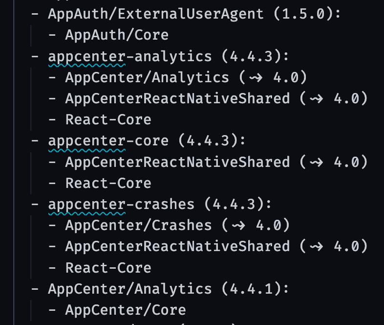

# 개요

React Native에서 iOS 앱을 개발하면서 `pod install` 와 `pod update`의 차이를 알지 못하고 남발하면서 개발해왔다.

차이점을 몰랐을 때 앱을 빌드하는 과정은 아래와 같았다.

1. 작업할 브랜치를 생성한다.
2. `npm install` 후 `cd ios`
3. `pod update` 후 빌드한다.

이 방법으로 계속 빌드를 해왔었다. 그러다 어느날 빌드 과정에서 에러가 발생했다.

`node_modules` 를 지워보기도 하고, 새로 프로젝트를 클론받기도 했지만 해결되지 않았다.

# CocoaPods

React Native를 처음 접하게 되었고, 모바일 개발 환경을 하나하나 알아가는 과정에서 Xcode도 알게 되었다.

그러면서 자연스럽게 `CocoaPods`<sup id="user">[[1]](#user-ref)</sup>에 대해 알게됐고 `Podfile`의 존재 이유를 알았다.

iOS 환경에서 앱을 개발하기 위해 패키지 관리자로 `CocoaPods`를 사용하며, `Podfile`을 생성할 수 있다.

생성된 `Podfile`을 설치하는 것으로 `프로젝트.xcworkspace` 과 `Podfile.lock` 라는 이름의 파일이 생성된다.

`.xcworkspace` 파일은 **Xcode**를 통해 열 수 있고, `Podfile`에 기재한 Pods가 설치되어 있다.

# Podfile.lock

<figure>

<figcaption>Fig 1. Podfile.lock 에 기재된 Pods</figcaption>
</figure>

`pod install` 로 생성된 `Podfile.lock` 엔 개발 환경에서 설치한 다양한 Pods의 버전이 적혀있다.

`Podfile.lock` 파일은 설치된 모든 Pod 라이브러리들의 버전을 **snapshot 처럼 기록해 관리하는 파일**이다.

`pod install`을 하게 되면, `Podfile`에 적힌 Pod들은 **`Podfile.lock`에 적힌 버전으로 install**이 된다.

팀 단위로 Project를 진행할 때 **서로의 Pods Version Sync를 맞춰주는 중요한 역할**을 한다.

만약 `Podfile`에 버전을 작성하지 않고 `pod install` 을 실행하게 되면 **가장 최신의 버전**으로 설치된다.

최신 버전이 아니라 **원하는 버전의 Pod**만 설치하기 위해선 `Podfile`에 Pod의 버전을 아래와 같이 명시해야 한다.

<br>

```pod
'> 0.1' // 0.1 초과 version 중 latest version
'>= 0.1' // 0.1 이상 version 중 latest version
'< 0.1' // 0.1 미만 version 중 latest version
'<= 0.1' // 0.1 이하 version 중 latest version
'= 0.1' // 0.1 version (생략가능)
'~> 0.1.2' // 0.1.2 <= latest version < 0.2.0
'~> 0.1' // 0.1 <= latest version < 1.0
'~> 0' // 0 <= latest version < 1.0
```

<br>

# pod install & pod update

서론이 길었지만, `pod install` 과 `pod update` 의 차이는 아래와 같다.

### $ pod install

- `Podfile`에 적힌 Pod을 **`Podfile.lock`의 version에 맞춰** 설치한다. 새로운 버전이 나왔는지는 체크하지 않는다.
- 최초 설치 시에는 **`Podfile.lock` 파일이 없기 때문에** `Podfile`에 명시되어 있는대로 설치한다.
- `Podfile`을 수정하면 **반드시 pod update가 아닌 `pod install`**을 실행해야 한다.

### $ pod update ({PodName})

- `Podfile.lock`에 적힌 버전을 고려하지 않고, **`Podfile`에 작성한 버전 조건에 맞춰 최신 버전으로 업데이트** 한다.
- 업데이트되면 자동으로 `Podfile.lock`도 수정된다.
- **version을 업데이트 해야하는 상황 외에는 쓰지 않는다**.

### Notes

<small id="user-ref"><sup>[[1]](#user)</sup>**CocoaPods**는 Swift와 Objectivc-C Cocoa 프로젝트를 위한 **Dependency Manager(의존성 관리자, 패키지 관리자)**이다. 2020년 12월 기준, 79,000개 이상의 라이브러리들이 3백만 개의 앱들에서 사용되고 있다. 공식 사이트 설명에 의하면, 코코아팟을 통해 프로젝트를 우아하게 확장할 수 있다고 한다.</small>
