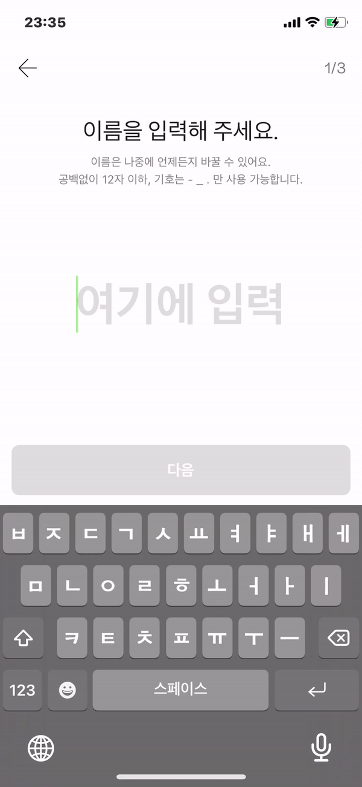

# 개요

한 줄 짜리 `TextInput`에 반응형으로 폰트를 적용해야 한다. 문자를 입력할 때 그 문자열의 길이가 화면에 보이는 넓이를 벗어나게 되면 그에 따라 글자 크기가 반응하여 작아져야 한다.

로직은 다음과 같다.

글자 크기의 최대, 최소값을 초기값으로 정한다. 반응형으로 변하는 글자의 크기는 최대 값과 최소 값을 넘어설 수 없다.

사용자가 글자를 입력할 때마다 화면의 넓이와 문자열을 나눈 값을 넓이 비율 변수에 할당한다. 그 비율과 글자 크기의 최대, 최소값을 비교하여 가장 큰 값을 글자 크기 변수에 할당한다. 그 글자 크기를 사용자가 글자를 입력할 때마다 적용한다.

# 구현

<br>

```jsx
import React, { useEffect, useState } from 'react'
import { View, TextInput, Platform, Dimensions } from 'react-native'

const Example = ({}) => {
  const maxSize = 48
  const minSize = 25

  const [value, setValue] = useState('')
  const [customWidth, setCustomWidth] = useState(Dimensions.get('window').width)
  const [letterToWidthRatio, setWidthRatio] = useState(
    value.length / customWidth
  )
  const [fontSize, setFontSize] = useState(maxSize)

  useEffect(() => {
    // Do your calculation here
    setWidthRatio(customWidth / Math.max(value.length, 1))
  }, [value, customWidth])

  useEffect(() => {
    const size = Math.max(Math.min(letterToWidthRatio, maxSize), minSize)
    setFontSize(size)
  }, [customWidth, value, letterToWidthRatio])

  return (
    <View style={'your style'}>
      <TextInput
        style={['your style', { fontSize: fontSize }]}
        underlineColorAndroid='transparent'
        textAlign={'center'}
        value={value}
        placeholder={'여기에 입력'}
        placeholderTextColor={'your style'}
        selectionColor={'your style'}
        onLayout={({ nativeEvent: { layout } }) => {
          setCustomWidth(layout.width)
        }}
        onChangeText={(value) => {
          setValue(value)
        }}
      />
    </View>
  )
}

export default Example
```

<br>

# 결과 화면

<br>

<figure>

<figcaption>Fig 1. 결과 화면</figcaption>
</figure>

<br>
