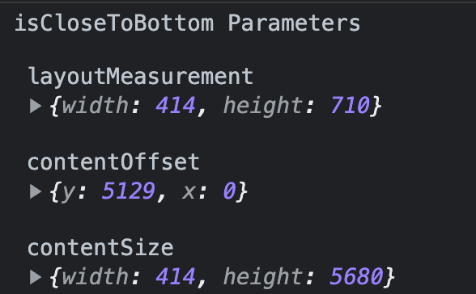
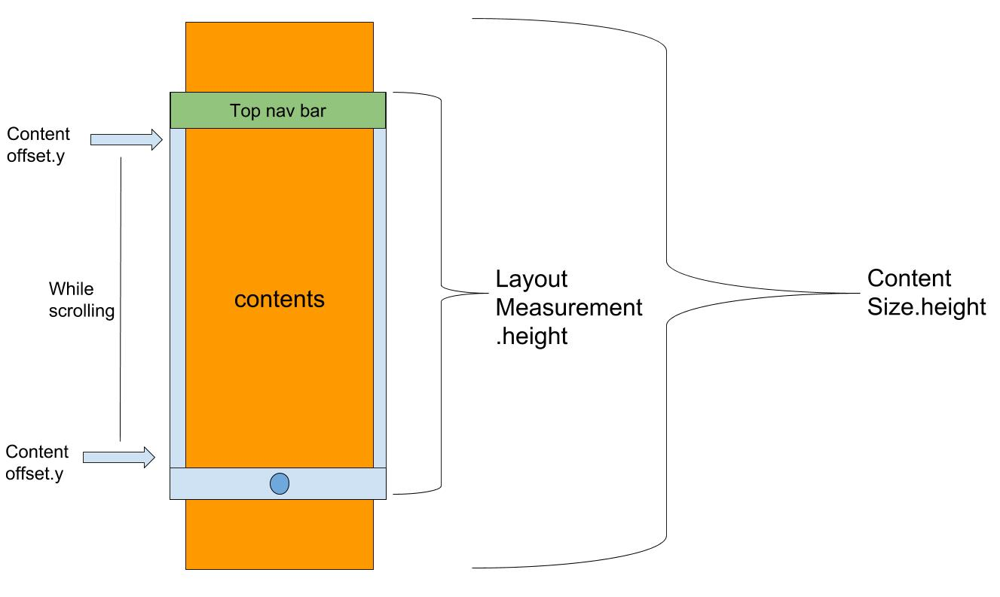

# 문제점

프로젝트 진행 중, 기존에 작성되어 있던 코드에 문제가 있었다.

앱의 검색 기능에서 무한 스크롤링을 적용하는 것이 목표였지만, 여러 문제로 인해 무한 스크롤링 기능 없이 배포되어 있었다.
그래서 무한 스크롤링을 이 기회에 적용해보기로 했다.

<figure>

<figcaption>Fig 1. 기존 배포된 버전</figcaption>
<figcaption>무한 스크롤링 기능은 없고, 30개의 책들만 보여진다.</figcaption>
</figure>

기존 버전에선 책 검색 모달에 무한 스크롤링이 적용되지 않았다. 그저 30개의 책만 서버로 부터 응답받아 보여줄 뿐이었다.

모달 컨테이너는 `<ScrollView>` 로 구성되어 있고, 책 리스트는 `<FlatList>`로 코딩되어 있었다.

```jsx
<ScrollView>
  <>...</>
    <>...</>
      <FlatList>
        { 책 리스트를 보여줄 FlatList }
      </FlatList>
    <>...</>
  <>...</>
</ScrollView>
```

무한 스크롤링을 위해 `<FlatList>`에 `onEndReached` props를 전달하려 했지만, 왜인지 `onEndReached`는 모달이 렌더링 될 때만 실행되고 작동하지 않았다.

검색을 통해 알아낸 것은 **`<ScrollView>` 내부의 `<FlatList>` 가 존재하면, 즉 `<FlatList>`의 부모가 `<ScrollView>`이면 `onEndReached`를 호출하지 않는다**는 것 이었다. - <a href="https://stackoverflow.com/questions/64370769/react-native-onendreached-for-flatlist-not-working-in-scrollview" target="_blank" rel="noopener">stackoverflow</a>

즉, `<FlatList>`에 **무한 스크롤링을 적용할 것이라면 스크롤 가능한 컴포넌트를 부모로 둬선 안된다**고 이해했다.

그러나 프로덕트에 이 모달을 재사용하는 부분이 너무 많았고, `<ScrollView>`로 감싸진 모달 컨테이너를 전체적으로 바꾸기엔 무리가 있었다. 그래서 기존 구성은 최대한 유지하면서 무한 스크롤링을 적용했다. 이 과정에서 많은 삽질이 있었다...💦

# 해결 방안

`<FlatList>`의 `onEndReached`는 `<FlatList>`를 스크롤링 시 컴포넌트의 가장 아래 부분에 닿으면 호출되는 props이다. `<ScrollView>`에도 이 로직을 적용하면 되겠다고 생각했다.

하지만, `<ScrollView>`엔 `onEndReached` props가 **없다**.

그래서 `<ScrollView>`에서 스크롤링할 때 그 위치가 `<ScrollView>`의 가장 아랫부분인 경우를 판단하는 함수를 만들었고, 이 함수를 `<ScrollView>`의 **스크롤링이 끝났을 때 실행**하도록 만들었다.

```jsx
const isCloseToBottom = ({ layoutMeasurement, contentOffset, contentSize }) => {
  const paddingToBottom = 34
  return (
    layoutMeasurement.height + contentOffset.y >=
    contentSize.height - paddingToBottom
  )
}
```

`<ScrollView>`의 최하단으로 스크롤링 했는지 판단하는 함수이다. 세 가지의 매개변수를 받았는데, 각 매개 변수는 아래와 같다.

<figure>

<figcaption>Fig 2. 세 가지의 매개변수</figcaption>
</figure>

|        변수         |           의미            |
| :-----------------: | :-----------------------: |
| `layoutMeasurement` | 현재 보여지는 화면의 크기 |
|   `contentOffset`   |      현재 스크롤 값       |
|    `contentSize`    |    전체 페이지의 크기     |

매개 변수로 받은 이 값들 중, 세로 스크롤링을 위한 값, 즉 높이 속성은 `layoutMeasurement.height` , `contentOffset.y` , `contentSize.height` 이다.

각 값이 가지는 영역은 아래 그림과 같다.

<figure>

<figcaption>Fig 3. 세 변수가 차지하는 공간</figcaption>
</figure>

즉, `<ScrollView>`의 최하단 스크롤링 조건에 부합하는 경우는 전체 `<ScrollView>`의 높이보다 **현재 스크롤 값과 현재 보여지는 화면의 높이 값을 더한 값**이 크거나 같으면 된다.

그런데 모바일 기기 별로 `layoutMeasurement.height` 와 `contentOffset.y` 를 더한 값 자체가 `contentSize.height` 보다 작을 수 있는데, 이를 적절한 `paddingToBottom`으로 보정한다.

이제 이 함수를 `<ScrollView>` 에서 **유저가 스크롤링을 마쳤을 때 (손가락으로 화면을 끌었다가 화면에서 뗄 때)** 실행하고, 그 때 위치가 `<ScrollView>`의 최하단이라면 책 리스트를 서버로 요청하면 된다.

```jsx
<ScrollView
  onScrollEndDrag={({nativeEvent}) => {
    if (isCloseToBottom(nativeEvent)) {
      { 서버로 책 리스트를 추가로 요청하는 함수 실행 }
    }
  }}>
  <>...</>
    <FlatList>
      { 책 리스트를 보여줄 FlatList }
    </FlatList>
  <>...</>
</ScrollView>
```

위 방식으로 `<ScrollView>` 내부의 `<FlatList>` 무한 스크롤링을 구현했다.

<figure>

<figcaption>Fig 4. 편-안한 무한 스크롤링</figcaption>
</figure>

### References

- <a href="https://stackoverflow.com/questions/64370769/react-native-onendreached-for-flatlist-not-working-in-scrollview" target="_blank" rel="noopener">OnEndReached for FlatList not working in ScrollView - stackoverflow</a>
- <a href="https://reactnative.dev/docs/flatlist" target="_blank" rel="noopener">FlatList - React Native 공식 문서</a>
- <a href="https://stackoverflow.com/questions/41056761/detect-scrollview-has-reached-the-end" target="_blank" rel="noopener">Detect ScrollView has reached the end - stackoverflow</a>
