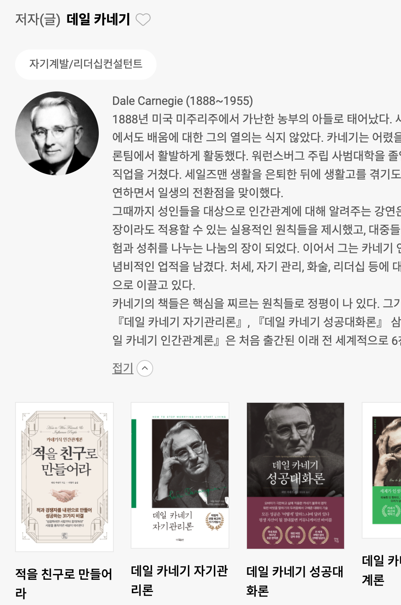
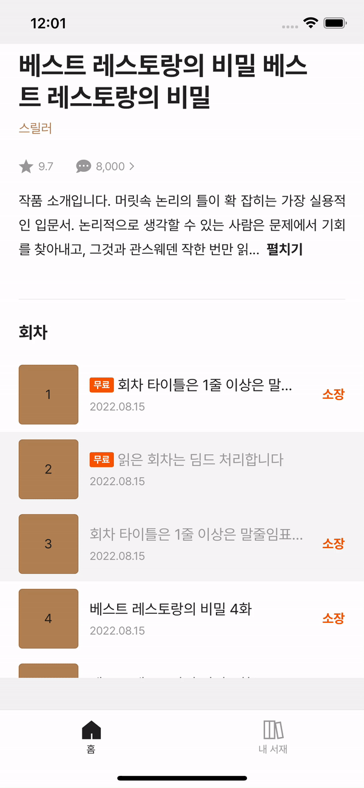

# 개요

모바일 또는 웹을 보다보면 여러 텍스트 표시 영역이 있다. 그 중에서 텍스트 영역에 포함된 텍스트가 긴 경우, 보다 나은 사용자 경험을 위해 텍스트 일부를 가린 채 보여주는 경우가 있다. 가려진 텍스트를 `펼치기` 버튼으로 전체 텍스트를 확인할 수 있고, 이를 축소할 수 있다.

<figure>

<br>

<figcaption>Fig 1. 텍스트 영역 확대 및 축소 UI</figcaption>
</figure>

이를 React Native 로 간단하게 만들 수 있다.

# Code

### CollapsingText/index.tsx

텍스트 펼치기 / 접기 기능의 핵심을 수행하는 컴포넌트를 만들어야 한다.

```jsx
import React from 'react';
import { Text } from 'react-native';

interface Props {
  truncatedText: string;
  fullText: string;
}

const CollapsingText = ({ truncatedText, fullText }: Props) => {
  const [more, setMore] = React.useState(false);

  return (
    <Text>
      {!more ? `${truncatedText}...  ` : fullText}
      <Text onPress={() => setMore(!more)}>{more ? '접기' : '펼치기'}</Text>
    </Text>
  );
};

export default CollapsingText;
```

`CollapsingText` 컴포넌트로 전달한 Props 로 축소된 텍스트와 전체 텍스트를 State 를 통해 화면에 표현한다.

간략히 말하자면 `펼치기` 상태가 기본값으로 설정되어 있다. 그래서 Props 로 받은 전체 텍스트와 축소 텍스트 중 축소 텍스트를 먼저 보여주게 된다. `펼치기` 버튼을 누르면 `CollapsingText` 컴포넌트의 펼치기 / 접기 상태가 전환되며, 전체 텍스트가 보이고 버튼 또한 `접기` 버튼으로 변경된다.

이 컴포넌트를 텍스트 펼치기 / 접기 기능이 필요한 텍스트 영역에 적용하면 된다.

### DetailText.tsx

```jsx
import React, { useEffect } from 'react';
import { Pressable, View } from 'react-native';
import { SafeAreaView } from 'react-native-safe-area-context';
import CollapsingText from '@/CollapsingText';

const DetailText = () => {
  const [truncatedText, setTruncatedText] = React.useState('');

  const indtroText =
    '작품 소개입니다. 머릿속 논리의 틀이 확 잡히는 가장 실용적인 입문서. 논리적으로 생각할 수 있는 사람은 문제에서 기회를 찾아내고, 그것과 관련된 스웨덴 작업이다. 한 번만 읽어도 머릿속 논리의 틀이 확 잡히는 가장 실용적인 입문서. 논리적으로 생각할 수 있는 사람은 문제에서 기회를 찾아내고, 그것과 관련된 스웨덴 작업이다.';

  return (
    <SafeAreaView>
      <View>
        {truncatedText.length > 1 ? (
          <CollapsingText truncatedText={truncatedText} fullText={indtroText} />
        ) : (
          <Text
            onTextLayout={(event) => {
              const { lines } = event.nativeEvent;
              if (lines.length > 3) {
                let text = lines
                  .splice(0, 3)
                  .map((line) => line.text)
                  .join('');
                setTruncatedText(text.substring(0, text.length - 9));
              }
            }}
          >
            {indtroText ? indtroText : ''}
          </Text>
        )}
      </View>
    </SafeAreaView>
  );
};

export default DetailText;
```

텍스트가 화면의 몇 줄 이상이 될 때부터 텍스트 축소가 필요하다. 그렇기 때문에 축소된 텍스트 값 `truncatedText` 의 초기 값은 빈 스트링 값이다.

축소된 텍스트 값이 존재하면 그 축소된 텍스트와 전체 텍스트를 `CollapsingText` 컴포넌트의 Props 로 전달하여 이 컴포넌트를 화면에 표시한다.

축소된 텍스트 값이 존재하지 않는 경우라면 텍스트가 축소할 만큼 많지 않거나, 페이지가 최초에 렌더링 되었을 때일 것이다. `truncatedText` 의 초기 값이 빈 스트링 `''` 이기 때문이다.

그래서 초기 렌더링 될 땐 일반적인 React Native 의 `<Text>` 를 사용한다. 이 `<Text>` 에는 `onTextLayout` 이라는 Props 가 존재한다.

이 Props 의 매개 변수에는 `nativeEvent` 가 존재하며, 그 내부에 `lines` 라는 변수가 존재한다. 이 변수는 텍스트 영역의 화면 상에 보이는 텍스트 줄 수 마다 할당된 텍스트를 배열로 갖고 있다.

그래서 위 코드를 보면 텍스트 줄 수가 3을 초과할 때 **펼치기 / 축소** 를 사용할 것이므로, 0번째 줄(**텍스트로 치면 첫 번째 줄**) 부터 3번째 줄 까지 잘라내어 이 텍스트를 하나의 스트링으로 합친다. 그렇게 만들어진 텍스트를 `setTruncatedText` 를 통해 할당한다. **펼치기 / 축소** 버튼이 다음 줄로 넘어가는 것을 방지하고자 축소된 텍스트의 일부를 잘라내어 할당했다.

# 결과 화면

<figure>

<figcaption>Fig 2. 결과 화면</figcaption>
</figure>

### References

- <a href="https://reactnative.dev/docs/text#ontextlayout" target="_blank" rel="noopener">React Native Text - onTextLayout</a>
