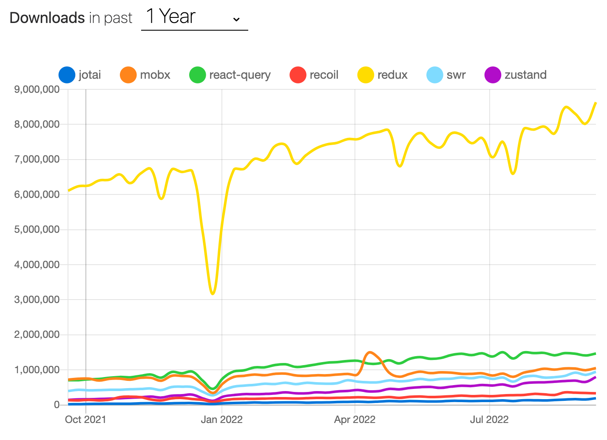
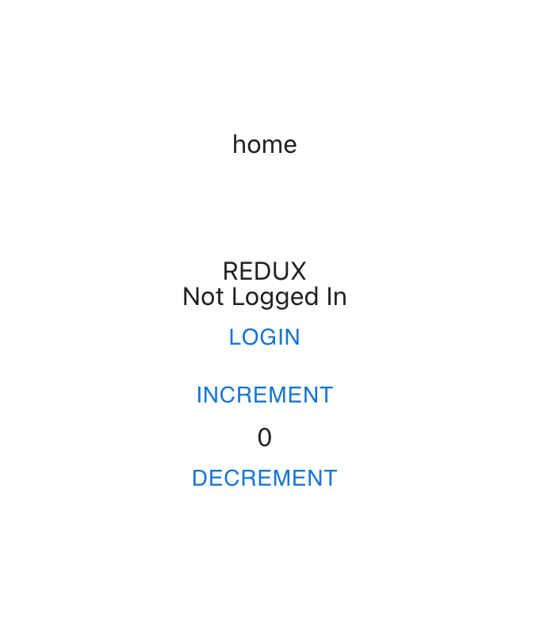
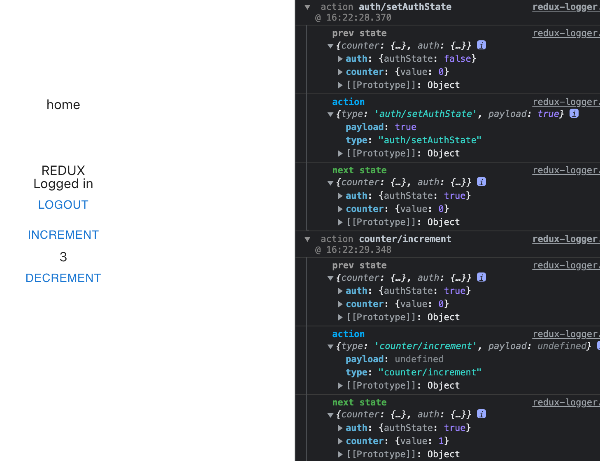
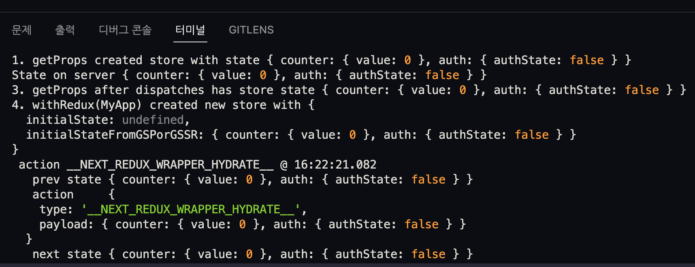

# 개요

<a href="https://ko.redux.js.org/introduction/getting-started/" target="_blank" rel="noopener">Redux</a>는 리액트 생태계에서 상태 관리 라이브러리 중 가장 유명한 라이브러리이다.

<figure>

<figcaption>Fig 1. <a href="https://npmtrends.com/jotai-vs-mobx-vs-react-query-vs-recoil-vs-redux-vs-swr-vs-zustand" target="_blank" rel="noopener">다양한 상태 관리 라이브러리들의 최근 1년 간 다운로드 횟수</a></figcaption>
</figure>

요즘은 리액트의 <a href="https://ko.reactjs.org/docs/context.html" target="_blank" rel="noopener">Context API</a>, <a href="https://recoiljs.org/ko/" target="_blank" rel="noopener">Recoil</a>, <a href="https://github.com/pmndrs/zustand" target="_blank" rel="noopener">Zustand</a> 등 다양한 리액트 상태 관리 라이브러리가 있지만, **Redux** 가 여전히 가장 신뢰성있고 널리 쓰이는 도구이다.

위와 같은 이유로 인해 Next.js 를 사용하는 많은 프로젝트들도 Redux 를 사용하고자 한다. 그러나 Next.js 에서 Redux 를 사용하기 위해선 단순 설치만으론 안된다. 프로젝트 시작을 위한 몇 가지 설정이 필요하다.

# Next.js 에서 Redux 를 사용하는 이유

Redux 는 리액트 기반 프로젝트에서 꼭 필요한 라이브러리는 아니다. 사용해야할 특정한 목적이 있다.

### 상태 공유

리액트 프로젝트에서 데이터는 위에서 아래로만 흐른다.

일반적으로 트리 구조의 컴포넌트에서 상위 컴포넌트에 선언된 상태를 하위 컴포넌트에 전달할 수 있는데, 만약 이 하위 컴포넌트가 상태가 선언된 컴포넌트에서 가깝지 않다면 상태를 전달하는 데에 어려움이 반드시 따른다.

그래서 이러한 불편을 줄이기 위해 하나의 큰 저장소에 상태를 두어 그 저장소에서 원하는 상태 값을 꺼내 쓰는 것이 효율적일 수 있다. Redux 를 사용하는 첫 번째 이유가 될 수 있다.

### Redux는 신뢰성이 높다.

Redux는 리액트 상태 관리 라이브러리로서 가장 오래되었다. (약 11 년 전 만들어 짐.)

또한 리액트 프로젝트를 만드는 대부분의 사람들이 Redux 를 알고 있다. 현업의 많은 프로젝트에선 개발 속도가 우선 순위인 경우가 많다. 많은 리액트 개발자들은 Redux 를 알고 있고, 익숙하다. 익히는 데 시간이 드는 다른 라이브러리보다 금방 적용하는 것을 기업은 더 선호할 것이다.

# Next.js 에 Redux 를 사용한 샘플 앱 빌드

Next.js 와 Redux 를 활용해 샘플 앱을 빌드해보았다.

사용자의 로그인 / 로그아웃 상태와 카운터의 증감으로 현재 카운트를 트래킹한다.

<figure>

</figure>

이를 위해 일반적인 Redux 를 사용할 수 있지만, Redux Toolkit 를 사용했다.

Redux 는 수많은 레거시 프로젝트에서 사용되고 있지만, Redux Toolkit 은 Redux 의 불편한 점인 수많은 보일러 플레이트 코드를 줄이고 성능을 향상시킨다.

### Install Dependencies

Next.js 프로젝트를 만들고, 아래 패키지들을 설치한다.

```shell
yarn add @reduxjs/toolkit
yarn add next-redux-wrapper
yarn add react-redux

# 아래는 선택 사항
yarn add redux-logger
yarn add @types/redux-logger
```

<a href="https://www.npmjs.com/package/redux-logger" target="_blank" rel="noopener">Redux Logger</a>는 개발 버전 프로젝트의 웹 개발자 도구에서 Redux Action 을 확인하는데 쓰인다.

Next.js 는 `getStaticProps` 또는 `getServerSideProps` 를 사용하여 서버 사이드 렌더링을 수행해야 하는 페이지도 존재할 수 있다. 그 때 서버 단에서 Redux Store 에 접근해 상태를 가져오거나, 업데이트 해야하는 경우가 생긴다.

그러나 일반적인 Redux Store 는 클라이언트 단에 존재하기 때문에 서버 단에서 `dispatch` 를 통한 Store 접근은 에러를 발생시킨다. 그래서 이를 위해 서버 단에도 Redux Store 를 생성하여 클라이언트의 Store 와 같은 상태를 갖도록 해야 한다.

이를 위해 <a href="https://github.com/kirill-konshin/next-redux-wrapper" target="_blank" rel="noopener">Next Redux Wrapper</a> 를 사용한다.

이제 스토어와 리듀서를 만들고 적용하면 된다.

### store.ts

```ts
import {
  combineReducers,
  configureStore,
  PayloadAction,
  ThunkAction,
  Action
} from '@reduxjs/toolkit';
import { createWrapper, HYDRATE } from 'next-redux-wrapper';
import counterReducer from './features/counterSlice';
import { authSlice } from './features/authSlice';
import logger from 'redux-logger';

const reducer = (state: any, action: PayloadAction<any>) => {
  return combineReducers({
    counter: counterReducer,
    [authSlice.name]: authSlice.reducer
  })(state, action);
};

const makeStore = () =>
  configureStore({
    reducer,
    middleware: (getDefaultMiddleware) => getDefaultMiddleware().concat(logger)
  });

const store = makeStore();

export const wrapper = createWrapper<AppStore>(makeStore, {
  debug: process.env.NODE_ENV === 'development'
});
export type AppStore = ReturnType<typeof makeStore>;
export type RootState = ReturnType<typeof store.getState>;
export type AppDispatch = typeof store.dispatch;
export type AppThunk<ReturnType = void> = ThunkAction<
  ReturnType,
  RootState,
  unknown,
  Action
>;
```

<br>

### authSlice.ts

이제 로그인과 로그아웃 상태를 핸들링 할 이른바 `slice` 를 만든다.

`slice` 를 공식 문서는 다음과 같이 정의한다.

**앱의 단일 기능에 대한 Redux Reducer 와 Action 로직의 모음**

기존 Redux 의 리듀서를 생성하던 방식에 액션 타입을 자동으로 설정하고, 상태 관리를 위한 `immer` 를 내장하는 등 편의 기능을 제공한다.

```ts
import { HYDRATE } from 'next-redux-wrapper';
import { createSlice } from '@reduxjs/toolkit';
import { RootState } from '../store';

// Type for our state
export interface AuthState {
  authState: boolean;
}
// Initial state
const initialState: AuthState = {
  authState: false
};
// Actual Slice
export const authSlice = createSlice({
  name: 'auth',
  initialState,
  reducers: {
    // Action to set the authentication status
    setAuthState(state, action) {
      state.authState = action.payload;
    }
  },

  /** 페이지 이동 시 상태 초기화가 필요한 경우 추가해야 함 */
  extraReducers: {
    [HYDRATE]: (state, action) => {
      return {
        ...state
        // ...action.payload.auth
      };
    }
  }
});

export const { setAuthState } = authSlice.actions;
export const selectAuthState = (state: RootState) => state.auth.authState;
export default authSlice.reducer;
```

여기서 기존 Redux Toolkit 의 사용 방식과 조금 다른 점이 있다.

```ts
  extraReducers: {
    [HYDRATE]: (state, action) => {
      return {
        ...state
        // ...action.payload.auth
      };
    }
  }
```

이 부분인데, 이는 Next.js 의 서버 단에서 웹 브라우저인 클라이언트 단으로 넘어오면서 발생하는 Hydration 으로 인해 추가된 로직이다.

Hydration 을 간단히 말하자면 Next.js 는 서버 단에서 HTML 문서가 생성되고, 이 HTML 문서를 웹 브라우저가 보여주게 된다. 웹 브라우저에 렌더링 된 Next.js 프로젝트는 그 때부터 리액트 프로젝트와 같은 기능을 하게 되는데, 이를 Hydration 이라 한다.

이 Hydration 이 발생했을 때의 Reducer 에 별도로 처리할 로직을 만든 것이다. 또한 일반적인 방식인 Store 를 export 하는 것이 아니라, Wrapper 를 생성하여 export 한다.

### counterSlice.ts

카운터 액션과 리듀서 역할을 할 slice 를 만든다.

```ts
import { HYDRATE } from 'next-redux-wrapper';
import { createSlice } from '@reduxjs/toolkit';

interface CounterState {
  value: number;
}

const initialState: CounterState = {
  value: 0
};

const counterSlice = createSlice({
  name: 'counter',
  initialState,
  reducers: {
    increment: (state) => {
      state.value += 1;
    },
    decrement: (state) => {
      state.value -= 1;
    }
  },

  /** 페이지 이동 시 상태 초기화가 필요한 경우 추가해야 함 */
  extraReducers: {
    [HYDRATE]: (state, action) => {
      return {
        ...state
        // ...action.payload.counter
      };
    }
  }
});

const { actions, reducer: counterReducer } = counterSlice;

export const { increment, decrement } = actions;

export default counterReducer;
```

<br>

### reduxHook.ts

루트 디렉토리에 `hooks` 폴더를 만들어 아래와 같이 작성한다.

```ts
import { useDispatch, useSelector } from 'react-redux';
import type { TypedUseSelectorHook } from 'react-redux';
import type { RootState, AppDispatch } from '../store/store';

/** useDispatch는 thunkAction에 대해서 타입에러를 발생시키므로 커스터 마이징해서 사용합니다. */
export const useAppDispatch: () => AppDispatch = useDispatch;
/** useSelector를 사용할 경우, 매번 state의 타입을 지정해줘야 하기 때문에 커스터 마이징해서 사용합니다. */
export const useAppSelector: TypedUseSelectorHook<RootState> = useSelector;
```

`useAppDispatch` 와 `useAppSelector` 를 사용하는 이유는 Redux 공식 문서에서 권장하는 방식으로, 매번 state 의 타입을 지정해야하는 경우와, 불필요한 타입 에러를 없엔다.

### \_app.tsx

이번에는 `_app.tsx` 를 변경한다.

```tsx
import type { AppProps } from 'next/app';
import Head from 'next/head';
import { ThemeProvider } from 'styled-components';
import { GlobalStyle } from 'styles/global-style';
import { theme } from 'styles/theme';
import { wrapper } from 'store/store';

function MyApp({ Component, pageProps }: AppProps) {
  return (
    <ThemeProvider theme={theme}>
      <GlobalStyle />
      <Component {...pageProps} />
    </ThemeProvider>
  );
}

export default wrapper.withRedux(MyApp);
```

`store.ts` 에서 생성한 Wrapper 를 가져와 `wrapper.withRedux()` 로 `MyApp` 을 감싼다.

### index.tsx

Redux 가 잘 작동하는지 확인하기 위한 컴포넌트를 작성한다.

```tsx
import { wrapper } from 'store/store';
import { useAppDispatch, useAppSelector } from 'hooks/reduxHook';
import { decrement, increment } from 'store/features/counterSlice';
import { selectAuthState, setAuthState } from 'store/features/authSlice';
import { NextPage } from 'next';

const Home = function () {
  const { value: count } = useAppSelector((state) => state.counter);
  const dispatch = useAppDispatch();
  const authState = useAppSelector(selectAuthState);

  return (
    <div>
      <div>home</div>
      <div>REDUX</div>
      <div>{authState ? 'Logged in' : 'Not Logged In'}</div>
      <button
        onClick={() => {
          authState
            ? dispatch(setAuthState(false))
            : dispatch(setAuthState(true));
        }}
      >
        {authState ? 'Logout' : 'LogIn'}
      </button>

      <button onClick={() => dispatch(increment())}>increment</button>
      <span>{count}</span>
      <button onClick={() => dispatch(decrement())}>decrement</button>
    </div>
  );
};

export const getServerSideProps = wrapper.getServerSideProps(
  (store) =>
    async ({ params }) => {
      // 초기 상태를 설정할 수 있고, 커스텀 로직을 추가할 수 있다.
      // 서버 단에서 Redux 액션을 수행할 수 있다.
      store.dispatch(increment());
      store.dispatch(setAuthState(false));
      console.log('State on server', store.getState());
      return {
        props: {}
      };
    }
);

export default Home;
```

이제 `getServerSideProps` 를 통해 서버 단에서도 Store 에 접근할 수 있으며, 이를 통해 상태를 초기화하거나, 서버 단에서 `dispatch` 를 실행할 수 있다.

# 빌드 결과

```shell
yarn dev
```

<figure>

</figure>

`redux-logger` 패키지를 설치했다면 웹 개발자 도구에서 액션을 확인할 수 있다. 크롬 익스텐션인 Redux Devtools 로도 디버깅할 수 있다.

<figure>

</figure>

또한 서버 단에서 수행되는 액션 로직들을 확인할 수 있다.

### References

- <a href="https://ko.redux.js.org/introduction/getting-started/" target="_blank" rel="noopener">Redux 공식 문서 (한글)</a>
- <a href="https://ridicorp.com/story/how-to-use-redux-in-ridi/" target="_blank" rel="noopener">리덕스 잘 쓰고 계시나요? - RIDI</a>
- <a href="https://ko.reactjs.org/docs/context.html" target="_blank" rel="noopener">React Context API</a>
- <a href="https://recoiljs.org/ko/" target="_blank" rel="noopener">Recoil</a>
- <a href="https://github.com/pmndrs/zustand" target="_blank" rel="noopener">Zustand</a>
- <a href="https://npmtrends.com/jotai-vs-mobx-vs-react-query-vs-recoil-vs-redux-vs-swr-vs-zustand" target="_blank" rel="noopener">다양한 상태 관리 라이브러리들의 다운로드 횟수</a>
- <a href="https://www.npmjs.com/package/redux-logger" target="_blank" rel="noopener">Redux Logger</a>
- <a href="https://github.com/kirill-konshin/next-redux-wrapper" target="_blank" rel="noopener">Next Redux Wrapper</a>
